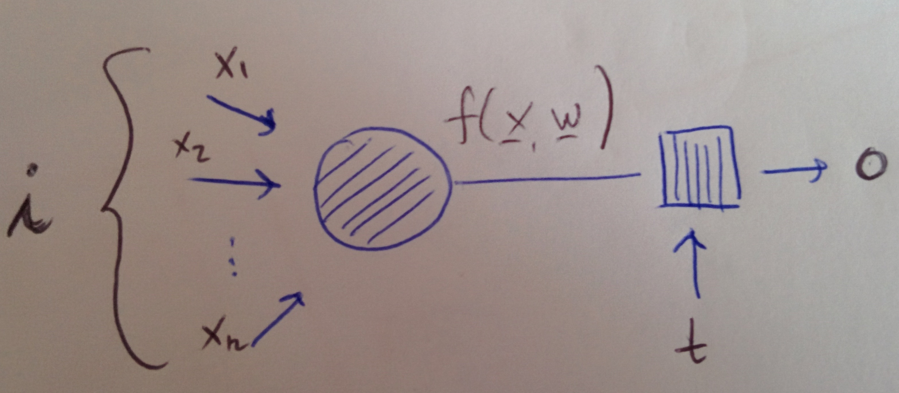

# Artificial Neural Networks in a nutshell

## The gist of what they are

An artificial neural network \(often shortened as ANN\) is, well, an attempt at artificially representing the network of neurons in the brain and their functioning with software. It consists of neural units \(_artificial neurons_\), each capable of receiving input and producing output based on rules, and which are connected together.

The fun thing about ANNs, and the whole point of them, is the fact that they mimic "learning". Inputs to the network are weighted and the learning mechanism consists in an iterative self-adjustment of said weights in such a way to achieve optimal correspondence to the desired result on training data. This way, the network is meant to emulate the synapses of the brain in their capability to carry information to one neuron to another.

### A bit on the biological link

The biological metaphor of these algorithms to actual neural networks in the brain is more of an inspiration than a grounded reality. ANNs were conceived with the idea to mimic how the human brain works but in reality they are a far shout from actually doing this comprehensively, and also, we don't know the human brain well enough yet anyway. In fact, it is actually confusing to say that neural networks "mimick the brain", as the brain doesn't really work as they do. On this, the discussion in the opening chapter of [Chollet's book](artificial-neural-networks-in-a-nutshell.md#references) is a very good one.

Following [the first reference](artificial-neural-networks-in-a-nutshell.md#references), we can say that, in general:

* real neurons are slower than artificial ones, but there's really plenty and the way they communicate is non-trivial
* real networks use energy very efficiently
* real networks can do several highly complex operations at a time

## Artificial neurons and how they work

 

This here in this figure is the generic and schematic model of an artificial neuron. Several input data $$(x_1, \ldots, x_n)$$are streamed into the neuron and a _transfer function_ \(which we indicate with$$f$$, note that it can also be called _activation function_\) combines them with weights $$(w_1, w_2, \ldots, w_n)$$\(usually in a linear combination\) to determine what the neuron computes. Then an _output function_ spits an output of the neuron based on a threshold$$t$$the neuron is equipped with.

See the page on the sigmoid neuron for a more precise definition of the typical activations and transfers, with sigmoid neurons.



## A network of neurons

To build a network of neurons, what you have to do is put several of them together in a way that they can communicate. Neurons are grouped into _layers_, groups that are at the same level, so that communication is passed from one layer of neurons to the other. In a network, there is

* an _input_ layer: the one at the start of the communication process
* an _output_ layer: the one that spits the final result at the end of the process
* one or more _hidden_ layers: the layers in between that constitute the intermediate steps

Each layer can be composed of however many neurons you wish. This means that if there are $$n$$ neurons at a given stage, each neuron in the following stage will receive $$n$$ inputs.

In much the same way as the transfer function uses a combination of weighted inputs into a neuron, the input to any neuron in a certain layer is a weighted sum of all outputs of the neurons of the previous layer.

The way learning is evaluted is through a _loss function_ of the network, which is a way of telling whether it's output matches the ground truth.

### Types of ANNs and pills of history

This here is no more than a super-quick and very high-level intro to several types of neural networks, the details of which are explored elsewhere in this chapter. You can find a more comprehensive outline of the different types of networks in the [Neural Network zoo](artificial-neural-networks-in-a-nutshell.md#references), with great and coloured illustrations by F Van Veen. The article also reports some important papers about the mentioned networks.

Note that the categories of networks listed here are not necessarily mutually exclusive, because they may describe different properties of the network. For example, feedforward networks can be deep or not deep.

### **Feedforward networks**

In a feedforward network, communication flows in a horizontal way, meaning the output of neurons in a certain layer is passed to neurons in the next layer horizontally, there is no going backwards. The figure helps clarifying the situation: here you have 3 neurons in the input layer, one in the output layer and 4 in the \(single\) hidden layer.

Feedforward networks of artificial neurons were conceived straight with the birth of the perceptron \(see page\), so in the 1950s. In a feedforward network, there is no dinamicity allowed.



### **Recurrent networks**

Recurrent networks have loops, so the output of a neuron can be fed back to the neuron itself, allowing for the dynamicity which is missing in the feed-forward model. These types of networks are implemented in such a way that there is the time factor embedded in, meaning neurons fire only within a specific window of time, allowing for feedback communication to not be propagated instantaneously \(which would be difficult to control\). These types of networks have a concept of _memory_ and there's several types of them.

Recurrent networks were born in the 1980s. They are particularly suited for problems which involve the temporal component, like those dealing with natural language.

### **Deep \(and shallow\) networks**

Deep neural networks are those beasts performing _deep learning_, this \(relatively\) new trend in machine learning/artificial intelligence which is starting to tackle very complicated problems with impressive results. Being deep for a network means nothing more than having several hidden layers, allowing for enormous complexity. Networks that are not deep are called _shallow_.

Deep Learning as a thing \(a field\) is not a new concept, it dates its birth back from the 1980s, but their big resurgence has been in the year 2006 when they have been finally shown to be capable to learn in an efficient way. Before then research on deep architectures hadn't reached the point where these tools could be put to use for any practical reason, due to time complexity and overall lack of efficiency.

### **Convolutional networks**

Convolutional networks are deep and feedforward. In the convolutional layers of these networks not every neuron is connected to every other neuron and a the output is obtained via a convolution operation on the input data. Convolutional networks are well suited for tasks related to vision, that is, where the input data consists of images: for these sorts of tasks, in most typical case, a "normal" feedforward networks would have to perform too many operations and be too large to be of any practical use, while the use of convolutions saves complexity.

The inspiration for these categories of networks came from the vision systems of the biological world, and this is why they have been designed specifically for machine vision tasks. An image gets passed to the network in batches of input data: at the very start, the first batch of $$n$$ pixels gets in, then a counter is shifted by one pixel and the second batch of $$n$$ pixels goes in. This mechanism is loosely borrowed from what the neurons in the visual cortex do. They only deal with a certain part of the visual field at once, that is, with a pixel and its neighbours.

The first convolutional networks date from the 1990s \(even though the concepts are decades older\) but they became ubiquitous in the 2010s with the many visual applications they serve nowadays. In fact, they are particularly suited for image tasks as exhibit a natural ability to capture spatial structures.

## Training a network

The training process of a network is not different from the general training process of supervised algorithms: you want to minimise a cost function that gives a comprehensive measurement of the mistakes \(differences between predicted points and real points\). You do this via gradient descent \(see page\), which minimises the error function, that is to say the difference between the expected value of the output and the value the network outputs.



Neural network are equipped with a mechanism called backpropagation \(see page\), which acts during gradient descent and allows the weights to be adjusted continuously in order to iteratively improve the accuracy of the results \(minimising the loss function\). This is the what the _optimiser_ of the network is tasked with. What backpropagation does in practice is computing the derivatives of the cost function with respect to the weights and propagating them from the last layer back to the first one. Each weight gets modified iteratively by an amount which is proportional to the derivative of the cost function with respect to it, which is what gradient descend uses.



Weights, at the very starting stage of training, get initialised at random.

## Universality

It can be shown \(well, it's been mathematically proven, see [Cybenko's paper](artificial-neural-networks-in-a-nutshell.md#references)\) that neural networks can be "taught" to approximate any continuous function: the more neurons, the better the approximation achieved.

## References

1. [The biological inspiration for ANNs](http://read.pudn.com/downloads164/doc/747044/L01.pdf), lecture from a course in Machine Learning by A. Papliński
2. M Nielsen, [**Neural networks and deep learning**](http://neuralnetworksanddeeplearning.com), _Determination Press_, 2015
3. [The neural network zoo](http://www.asimovinstitute.org/neural-network-zoo/), an article + illustration by F Van Veen at the Asimov Institute
4. [Comparison of artificial neural networks and human brains on solving number series](http://www.cogsys.wiai.uni-bamberg.de/teaching/ws1112/km/practice/ANNs.pdf), from a lecture at the University of Bamberg
5. G Cybenko, [**Approximation by superposition of sigmoidal function**](http://www.dartmouth.edu/~gvc/Cybenko_MCSS.pdf), _Math Control Signal System_, 2, 1989
6. F Chollet, **Deep Learning with Python**, _Manning_, 2017

