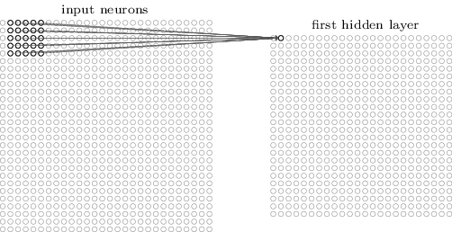

# Convolutional neural networks

Convolutional neural networks \(aka _CNNs_\) are networks such that they are not fully connected: not every neuron is connected to every other one. They are usually built as deep networks \(see page\). These types of networks are particularly suited for working on _images_ data as you can map regions of the image to specific neurons. Their architecture is indeed specifically designed to deal with image input data, and in fact neurons are arranges to follow the geometrical distributions of images data: there are the width and height dimensions, plus the one for the colour channel. The reason to build convolutional networks \(whose specifics follow here\) to deal with images is that "regular" fully connected nets would not replicate the geometry of the input data and would, more importantly, need too many parameters to be trained with success in a typical case.



CNNs learn to recognise subsequent hierarchical levels of shapes in the image, eventually managing to distinguish between, say, [the image of a dog and that of a cat](convolutional-neural-networks.md#references).

The name _convolution_ is somehow borrowed from the main [mathematical operation](https://en.wikipedia.org/wiki/Convolution) they rely upon, which is based on the multiplication between parameters \(weights/bias\) and input vectors in the activation function. CNNs' architectures are built as sequences of convolutional layer followed by pooling layer \(see below\), plus a fully connected layer at the end. There are variations as to what can go in between and so to how many convolutional layers are stacked and how they are alternated with other types or layers. The final fully connected layer is the one responsible for the final result.

## Snippets of history

For a bit of history, have a read at the seminal paper by [LeCun et. al](convolutional-neural-networks.md#snippets-of-history) and watch [this video ](https://www.youtube.com/watch?v=FwFduRA_L6Q)about the first CNN \(_LeNet_, by LeCun\) trained to recognise handwritten digits back n 1993, it's quite funny. This network has been utilised by the USA postal system to automatically read ZIP codes, in the 1990s!

Also, [this page](convolutional-neural-networks.md#references) collects a chronology of all the networks built to classify images, on various standard dataset, such as MNIST of CIFAR. The reality is, since deep learning became a thing at scale starting from the middle of the 2000's, we are assisting to a breakthrough in the history of science and technology in general, because these days CNNs are allowing for the realisation of tasks making for a new "summer of AI", which many people more qualified than be believe is this time here to stay.

## A short and non-comprehensive overview of the features of CNNs

### Local Receptive Fields

In a typical convolutional structure, input neurons take the pixels of the image and hidden neurons are such that each of them only communicates to a portion of the input neurons, namely a region of the input image. Regions of the image do overlap in the sense that different hidden neurons see some of the same input neurons as the regions shift. This is the concept of _local receptive fields_, brilliantly illustrated in chapter 6 of Nielsen's book \[1\], where the following images are taken. Specifically, these images illustrate the concept via the example of a 28X28 input image \(it's the classic example of the handwritten digits recognition from the [MNIST dataset](http://yann.lecun.com/exdb/mnist/)\) and a 24X24 first hidden layer where each neuron deals with a region 5X5 \(_filter_, or _receptive field_\). Note that the output of a layer with the filter is called _feature map_.

The following images are from Nielsen's book.

The first neuron in the hidden layer deals with a local region of the input image.

The second neuron in the hidden layer deals with a shifted \(by one neuron\) region of the input image.

###  Shared weights \(and biases\)

In a CNN, the parameters \(weights/biases\) are shared by all neurons in the same hidden layer and this implies that all these neurons recognise \(learn\) the same feature, for example, vertical bars, at their respective location of interest. This makes for the translational invariance of CNNs and drastically reduces the potential number of parameters they'd have to learn otherwise.

Because detecting one feature is not enough, multiple feature maps are assembled at the same level, so that each convolutional layer of neurons can detect multiple different features. Again, feature maps are the result of the application of the localisation into receptive fields and correspond to having the same shared parameters. See the following figure.

 In the image, 20 feature maps the network has learned, each devoted to a feature. Each map is a matrix 5X5 of weights: the darker the colour, the heavier the weight there, which implies a stronger response of the network on the input image region at that location. The maps clearly shows the network has learned graphical patterns, for example in the third one on the top row, there is a vertical bar top right. What features a CNN actually learn isn't a trivial thing to ascertain, as in, the networks learns to recognise patterns on its own, but it's non trivial to imagine which ones beforehand. That's their power.

### Pooling layers

CNNs are completed by the presence of pooling layers beyond the convolutional ones, right after those. Pooling layers have the function of reducing the information/dimensionality the preceding convolutional layer outputs. In a max-pooling layer with 2X2 receptive field for instance \(a usual suspect\), the output of the convolutional layer is shrunk into a smaller matrix where each 2X2 region of pixels is reduces to one pixel with their maximum.

Pooling is applied to each of the output feature maps. This procedure greatly reduces dimensionality and then the number of parameters, keeping only the relevant information and discarding precision.

Max-pooling is a very common type of pooling but there are other ones, like average-pooling, where the average gets spit instead of the maximum, or $$L_2$$-pooling, where the square root of the sum of squares is spit.

## References

1.  [Building a cat detector using Convolutional Neural Networks](https://medium.com/@curiousily/tensorflow-for-hackers-part-iii-convolutional-neural-networks-c077618e590b), V Valkov on Medium
2.  [**Convolutional Neural Netoworks for visual recognition**](http://cs231n.github.io/convolutional-networks/), Stanford CS class by A Karpathy and F F Li
3. Convolutional Network demo from 1993, [video](https://www.youtube.com/watch?v=FwFduRA_L6Q) from Bell Labs
4. R Benenson, [What is the class of this image?](http://rodrigob.github.io/are_we_there_yet/build/classification_datasets_results.html)
5. M Nielsen, [**Neural Networks and Deep Learning**](http://neuralnetworksanddeeplearning.com/chap6.html), chapter 6
6.  Y LeCun, L Bottou, Y Bengio, P Haffner, [**Gradient-based learning applied to document recognition**](http://yann.lecun.com/exdb/publis/pdf/lecun-98.pdf), _Proc. of the IEEE_, 1998

