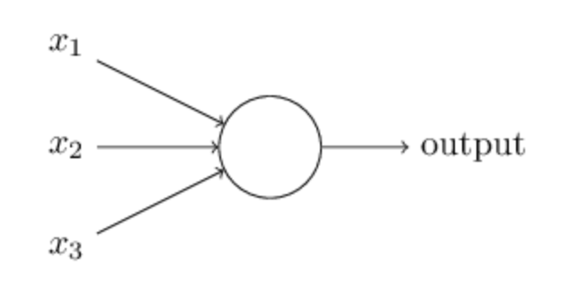
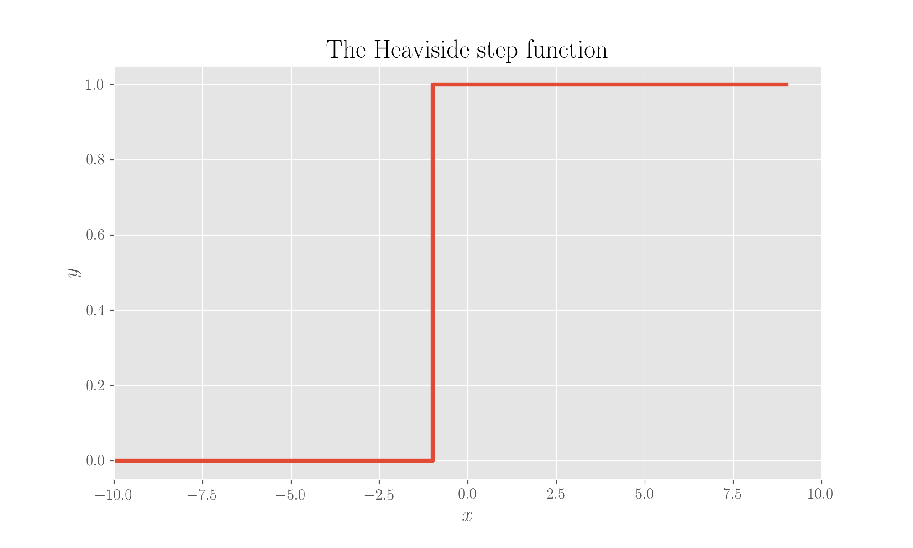

# The Perceptron

For the code in this page, you will need these imports:

```python
import numpy as np
from matplotlib import pyplot as plt
```

The perceptron is \(one of?\) the very first algorithms for artificial neural networks, it was developed in 1957 at a [Cornell lab](https://en.wikipedia.org/wiki/Calspan) funded by the US Navy, by Rosenblatt, a psychologist who was a pioneer in the field of Artificial Intelligence, and published in [this paper](the-perceptron.md#references). It was immediately advertised with lots of fanfare and great expectations \(the NY Times at that time published an [article](the-perceptron.md#references), boldly describing it as a machine which could think and learn on its own\), and then the interest in it declined due to the unfeasability of many tasks it was supposed to tackle. Have a look a [this page](the-perceptron.md#references) for a nice outline of the history of this algorithm.

## How it works



The way a perceptron works is rather simple, yet quite ingenious. You have the representation of a neuron as per figure, where a series of binary input values$$(x_1, x_2, \ldots, x_n)$$come in and an output is out. Inputs can be weighted differently, so that weights $$(w_1, w_2, \ldots, w_n)$$ are given. The output will depend on inputs and weights, the inputs being the values which determine a decision, the weights the how important each value is.

The neuron is equipped with a threshold value$$t$$, or alternatively a bias value$$b=-t$$, such that the output$$o$$follows rules

$$
o = \begin{cases}
0 \ \text{ if } \ w \cdot x + b \leq 0\\
1 \ \text{ if } \ w \cdot x + b > 0
\end{cases}
$$

which is to say that the neuron "fires" when the dot product of input and weights plus its bias pass 0 \(or alternatively when the dot product of weights and inputs passes threshold\), a representation of what happens to real neurons when stimulated and producing electrical activity. The bias values makes things such that the larger it is, the easier it will be for the neuron to fire.

So the perceptron is pretty much an artificial neuron with the output function given by the Heaviside step \(see page\), displayed in figure.



```python
x = np.arange(-10, 10, 1)
y = []
for item in x:
    value = 0 if item < 0 else 1
    y.append(value)

plt.step(x, y)
plt.xlim(-10, 10)
plt.xlabel('$x$')
plt.ylabel('$y$')
plt.title('The Heaviside step function')
plt.show();
```



## An example: a NAND gate

You can represent a NAND gate with a perceptron. A NAND gate has truth table \(X and Y being the inputs, o the output\):

| X | Y | o |
| :---: | :---: | :---: |
| 0 | 0 | 1 |
| 0 | 1 | 1 |
| 1 | 0 | 1 |
| 1 | 1 | 0 |

You can quickly obtain it with a perceptron, for example \(again from \[Nielsen's book\]\) with weights $$w_1=w_2=-2$$ and bias $$b=3$$. I've done it a [repo](the-perceptron.md#references) about NNs.

## References

1.  F Rosenblatt, Frank, _Principles of neurodynamics, perceptrons and the theory of brain mechanisms_, No. VG-1196-G-8. **Cornell Aeronautical Lab**, 1961
2.  The New York Times historical [article](http://www.nytimes.com/1958/07/08/archives/new-navy-device-learns-by-doing-psychologist-shows-embryo-of.html) on the perceptron
3.  A fabulous [article](http://fusion.net/story/54904/thinking-computer-perceptron/?curator=MediaREDEF) on Fusion TV outlining a bit of the history of this algorithm, very nice read
4.  M Nielsen, **Neural Networks and Deep Learning**, __on perceptrons
5.  My [repo](https://github.com/martinapugliese/neural-nets-compilation) on coding ANNs from scratch

