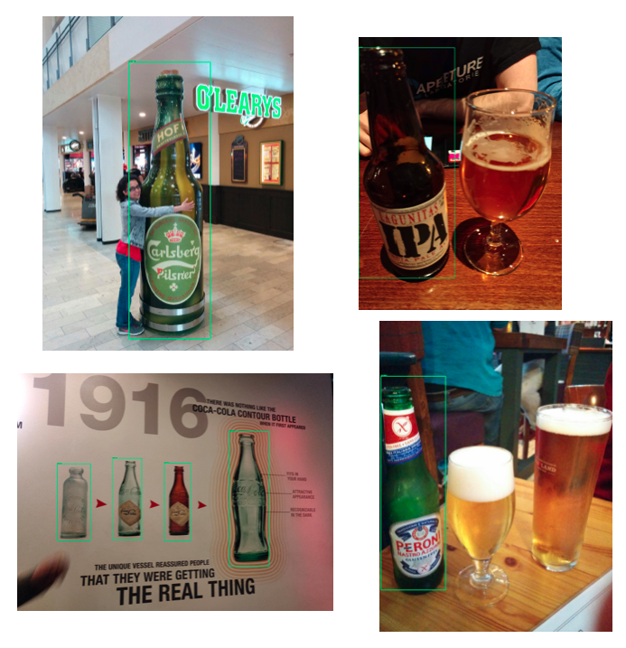

# Object Detection with ANNs

This page deals with using Deep Learning for object detection, but note that there are "traditional" \(read: not using Deep Learning\) methods to deal with this task, which we have explored in [its own page](../whats-in-an-image/object-detection-without-neural-networks.md).

This task, which consists of teaching a machine to recognise objects in an image and their location, can be addressed using TensorFlow and its object detection API \(see references\) -  the procedure is fairly well explained in the references we present, so we will not re-create a notebook here for illustration purposes, but rather refer to existing ones you can use and adapt. We will also briefly talk about using alternative approaches.

This picture illustrate what this is all about - you want to train an ML model to recognise items of choice in pictures, localising them \(tracing their bounding box\). This was me training a model to detect bottles in images, that would then both recognise their existence and where they were \(tracing the bounding box\). Top left: me hugging a giant bottle, I'm not sure where this was; bottom left: this was the Atlanta's Coca Cola museum, note how the model is detecting bottles when drawn on the wall; the other two are more traditional bottle pictures.

The gist of the work here is that these tasks will use Transfer Learning, basically piggy-backing an existing trained network to adapt the last layers to learn the features of your specific objects. In TensorFlow, you can do this quite easily as they share pre-trained models you can choose for many tasks.

## Creating a dataset for training the model

First and foremost, you need data to train upon. Creating this data, give you have to have images annotated with bounding boxes, is no doubt a quite tiring procedure, and rather expensive in terms of time. There are tools you can use to do that - [this one](https://github.com/tzutalin/labelImg), called labelImg, also recommended by D Tran's blog post in the references, is pretty good. It provides you with a GUI where you create the annotations in a click-and-point manner. The tool then saves the data in the form of XML files - so you will have a folder for images and a folder for the XML files. 

How many images do you need for this training? Well, it will largely depend on what you are trying to detect, the quality of the images per se and how distinct the shapes are, as well as clearly the base performance of the model you will use. It will largely be a process of trial and error: you train a model with what you have and based on the results you will decide how to proceed. 

For my bottles detection, I had annotated about 500 images - I did this on my own and note that it did cost me some hours \(and some risk of carpal tunnel inflammation!\) but it was worth it. The results of the model, which I trained as a faster RCNN network using TF's API have been pretty decent and it trained in only half an hour - I've been using a NVIDIA GEFORCE GTX 1080 Ti.

## Set-up for the TensorFlow object detection API

TF wants the input in the format of TFRecords, and the internet is full of tutorials on how to transform the XMLs you have into that - I wrote a blog post on this, see the references.

After this step is done, you just need to edit the configuration file for the TF network you want to use \(point it to your training/testing files and specifying your number of different objects to detect\) and just run it - note that you do need to train on a GPU, working with a CPU only won't be feasible. Note that you can use Google Colab for this, see [this page](../../toolbox/notebook-tools.md#google-colaboratory).

The TF model zoo is 

The rest of D Tran's blog post is pretty good at explaining how to do all the setups and then observe the results in TensorBoard \(which is TF's interface, you can use it to monitor training as well as see the evaluation results\). Note that the TF API can easily be used as a black box, where you won't have to change anything in their code. However, you can customise some flags for the training, e.g. if to spit out a performance metrics computed on the training data as well as on the evaluation data. 

## The networks for object detection

As specified above, you will use Transfer Learning, using a pre-trained network and adapting it to your data. There are several approaches one can use, and the TF API will support a variety of them \(look at the model zoo in the repo\). But TF isn't the only way one can do object detection. 

Let's briefly go through the workings of the current state-of-the-art approaches. The material in the references will provide better and deeper details.

### R-CNN networks

R-CNN stands for "region-based [CNN](../../artificial-neural-networks/types-of-neurons-and-networks/convolutional-neural-networks.md)", this network is a convolutional net which first isolates regions of interest where the object could be \(via a procedure called selective search\), then applies the regular machinery of convolutional features. These methods have been introduced in 2014 in the paper by Girschick et al below. 

This approach is very good in accuracy but pretty slow due to the passes of region proposal isolation and then classification, so improvements have been developed in the form of Fast R-CNN and Faster R-CNN.

It is available in the TF's object detection API.

### YOLO networks

YOLO is a different approach which works on the mantra that "you only look once", because the idea is dong just one pass over the image. This makes it very fast. Currently there is no direct support for YOLO in TensorFlow, but people have been writing code for this \(see the refs\). You can however easily run it on the [Darknet](https://github.com/pjreddie/darknet) framework.

The approach essentially divides the image into grids and then classifies them on the presence of the sought object, spitting probabilities scores. 

### SSD networks

This approach \(Single-shot Multibox Detector\) is understood to be a good compromise between quality and speed. It does use a single algorithmic pass again, making it relatively fast. Checkpoints for it are covered in TF's object detection API. 

## References

1. This blog [post](https://towardsdatascience.com/how-to-train-your-own-object-detector-with-tensorflows-object-detector-api-bec72ecfe1d9) by D Tran well illustrates the procedure to use the TensorFlow object detection API
2. TF's [models repo](https://github.com/tensorflow/models/tree/master/research/object_detection) with the object detection API
3. TF's own [Colab notebook](https://www.tensorflow.org/hub/tutorials/object_detection) which you can reuse
4. TF's \(v2\) own [tutorial](https://tensorflow-object-detection-api-tutorial.readthedocs.io/en/latest/index.html) on using the object detection API
5. The labelImg tool to annotate images for bounding boxes
6. I wrote a tutorial on how to create the training sets for TF in the right format [here](https://martinapugliese.github.io/tech/create-obj-det-tf-files/)
7. R Girschick et al.**,** [**Rich feature hierarchies for accurate object detection and semantic segmentation**](https://arxiv.org/abs/1311.2524)**,** _Proceedings of the IEEE Computer Society Conference on Computer Vision and Pattern Recognition_, 2014 - this is the original R-CNN paper
8.  R Girschick, [**Fast R-CNN**](https://arxiv.org/abs/1504.08083), _Proceedings of the IEEE International Conference on Computer Vision_, 2015 - this is the Fast R-CNN paper
9. S Ren et al, [**Faster R-CNN: Towards Real-Time Object Detection with Region Proposal Networks**](https://arxiv.org/abs/1506.01497)**,** _IEEE Transactions on Pattern Analysis and Machine Intelligence_, 2017 - this is the Faster R-CNN paper
10. [R-CNN, Fast R-CNN, Faster R-CNN, YOLO - Object detection algorithms](https://towardsdatascience.com/r-cnn-fast-r-cnn-faster-r-cnn-yolo-object-detection-algorithms-36d53571365e), a blog by R Gandhi
11. I [wrote](https://martinapugliese.github.io/tech/recognise-objects-yolo/) a bit about the YOLO approach
12. [YOLO v3 in TensorFlow](https://medium.com/@shahkaran76/yolo-object-detection-algorithm-in-tensorflow-e080a58fa79b), blog by J Shah

