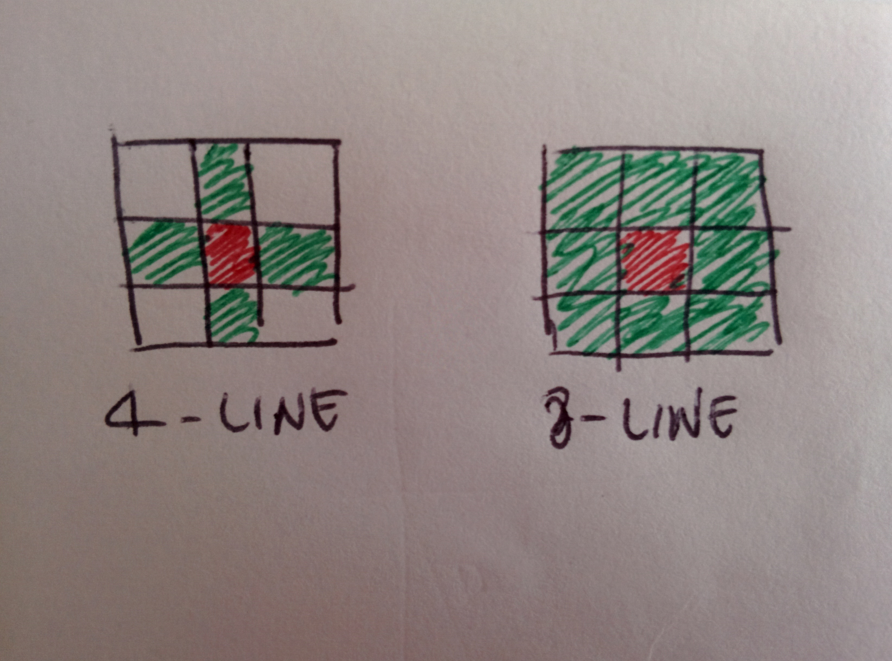
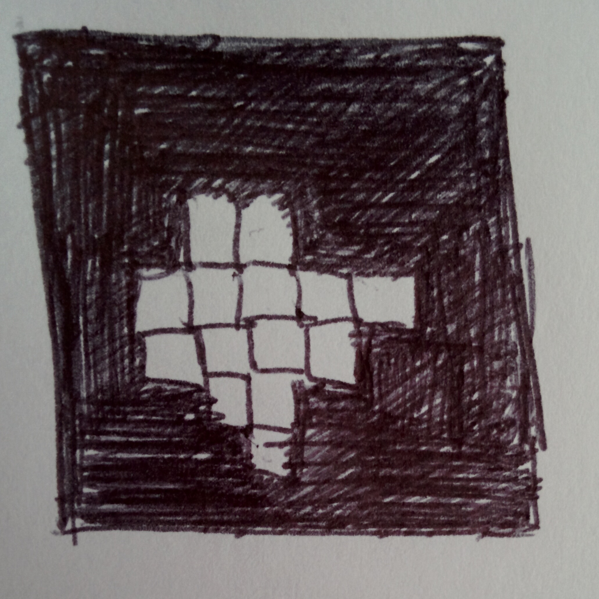
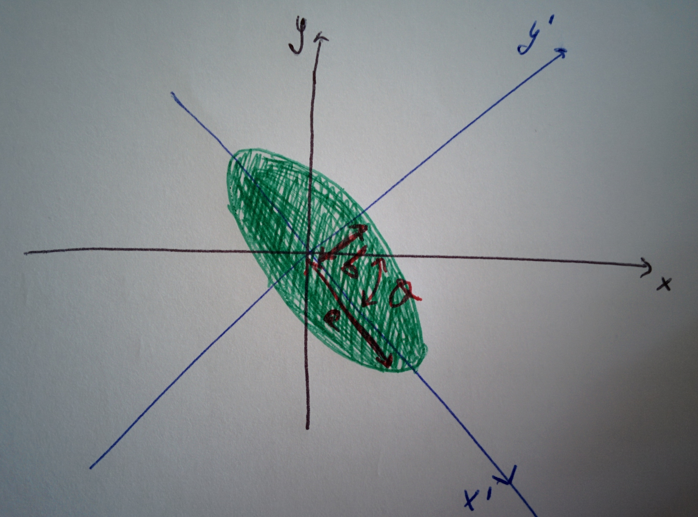

# Notes on the formalism

This page collects various things which contribute, all together, to tracing the picture of how to formalise images data into quantifiable entities, and the mathematics behind some building blocks of doing computer vision. An image is nothing else than a matrix of values, single numbers in the case of grayscale ones and arrays of 3 numbers in the case of colour images in something like the RGB space, for instance.

## Pixels

A pixel value is given in terms of _colour_ or _intensity_. Intensity is used in grayscale, it identifies the brightness of pixels and has a value between 0 and 255. For colour you have, for example, the values RGB \(a triple\) for red, green and blue, each reporting their respective intensities.

### The alpha channel

In a 32-bit graphic system, 8 bits are used to encode each of the three colours \(RGB\) and 8 further bits are used for the alpha channel, representing transparency: specifies how colours should be merged when overlapped.

## Colour space and colour model

A _colour space_ describes the organisation of colours, a _colour model_ is a way to represent colours as tuples of numbers. For example, Adobe RGB and sRGB are two different colour spaces, both based on the RGB colour model.

### Colour model

  

_Figure from_ [_Wikipedia_](https://commons.wikimedia.org/wiki/File:HSV_color_solid_cylinder_alpha_lowgamma.png)_, user Datumizer, licence_ [_CC BY-SA 3.0_](https://creativecommons.org/licenses/by-sa/3.0/deed.en)\_\_

There are five major colour models:

* **CIE** \(1931, was created by the International Commission on Illumination, or CIE, from its French name\): was the first attempt to link the wavelengths \(pure colours\) to the colours as perceived by humans. It uses the tristimulus values: the human eye has three kinds of cone cells, each of which has the peak of sensitivity for light at a given wavelength, so three parameters can be used, corresponding to the levels of the stimuli to the three types of cells.
* **RGB** \(red, green, blue\): describes what light produces a given colour. Several colour spaces can be derived from this model.
* **YUV** \(luma plus chroma\): it is built with a luma \(brightness, achromatic\) value and two chroma \(colour information\) values. **YPbPr** is its scaled version and **YCbCr** is its scaled digital version.
* **HSV**, also known as **HSB** \(hue, saturation, value/brightness\): is a coordinate transformation of RGB \(a cube\) into a cylindrical space. Note  that there is also **HSL** \(L for lightness\), which is similar. The HSV space is a cylinder:$$H \in [0,359], S,V \in [0,100]$$. The HSV space has been designed to represent colour properties in a way that is more in adherence to the human eye perception and is particularly useful in cases where illumination matters. The _hue_ of a colour is the base \(dominant\) colour that composes it, or better, the degree to which our colour is far away from the basic hues \(yellow, orange, red, violet, blue, green\); the _saturation_ of a colour is its intensity; the _value_ of a colour represents its lightness/darkness.
* **CMYK** \(cyan, magenta, yellow, key -black-\):  it is used in printing, describes what inks need to be used so that the reflected light produces the given colour.

### Colour space

Colour spaces are:

* **LMS** \(long/medium/short\), where long, medium and short refer to the wavelengths;
* **XYZ**: humans perceive light in the green \(medium\) part of the electromagnetic spectrum as brighter than those in the red \(long\) and the blue \(short\) parts of the spectrum. Y is the _luminance_; Z the _blue stimulation_; X is a linear combination of the cone responses. So, at fixed X, the plane XZ contains all the  cromaticities at that luminance. The cromaticity is the quality of colour regardless of luminance and is given by hue and saturation

## Pixel connectivity

  

Pixel connectivity is the way pixels relate to neighbours, and there's two ways we can define it:

* **4-line**: each pixel is connected to all those which touch one of their edges
* **8-line**: each pixels is connected to all those which touch their edges and corners

## Moments of an image

### What are

Image moments are weighted averages of the pixels' intensities. They share a similarity to the definition of moments in probability, where the intensity plays the role of the probability density function.

For a grayscale image a _raw moment_ is defined as

$$
M_{ij} = \sum_x \sum_y x^i y^j I(x, y) \ ,
$$

where$$(x, y)$$is a cell of the image and I its intensity;$$i+j$$gives the order of the moment

_Central_ moments are

$$
\mu_{ij} = \sum_x \sum_y (x-\bar x)^i (y-\bar y)^j I(x, y) \ ,
$$

where $$\bar x = \frac{M{10}}{M{00}}$$and$$\bar y = \frac{M{01}}{M{00}}$$.

It can be derived that

$$
\mu_{pq} = \sum_m^p \sum_n^q \binom{p}{m} \binom{q}{n} (- \bar{x})^{p-m} (- \bar{y})^{q - n} M_{mn}
$$

Some interesting results are:

* central moments are invariant with respect to translation;
* the second order moments define the orientation of the image;
* for an analogy to physics, the 0-th moment has the same role as the mass of the object, the first moments are analogous to the center of mass and the second moments to the moments of inertia;
* if the intensity is considered as a density, so that $$M_{00} = 1$$_,_ the first moments __$$M_{10}$$and$$M_{01}$$are the mean values in each coordinate, the second moments are the variances of the horizontal and vertical projections,$$M_{11}$$is their covariance.

### Object features based on moments

Moments are used to calculate features of the objects displayed in an image. Let us refer here to a binary image \(see page\).



#### **Zeroth moment: area of object**

 

The _area_ of an object is directly linked to the 0-th raw moment. In fact, the area is simply the sum of the 1's, that is, the total number of white pixels:

$$
M_{00} = \sum_x \sum_y x^0 y^0 I(x, y) = \sum_x \sum_y I(x, y) \ ,
$$

**First moments: Center of mass**

The _center of mass_ is given by, in each coordinate, by

$$
M_{10} = \iint d x d y \ x \ I(x, y) \ \ ; \ \ M_{01} = \iint d x d y \ y \ I(x, y)
$$

**Second moments: Inertia tensor, orientation, roundness and eccentricity**

 

In analogy to mechanical moments, the central second order image moments $$\mu_{20}$$_,_ $$\mu_{02}$$and$$\mu_{11}$$contain terms in which$$\rho(x, y)$$is multiplied by the square of the distance from the center of mass. They compose the inertia tensor of the rotation of the object around its center of gravity:

$$
J = 
\begin{bmatrix}
    \mu_{20} & -\mu_{11} \\
    \mu_{11} & \mu_{02}
\end{bmatrix}
$$

From this, several parameters can be derived.

The eigenvalues of J:

$$
\lambda_{1,2} = \sqrt{\frac{1}{2} (\mu_{20} + \mu_{02}) \pm \sqrt{4 \mu_{11}^2 - (\mu_{20} - \mu_{02})^2}}
$$

give the main inertial axes of the rotation, which correspond to the semi-major and semi-minor axes of the ellipse which can be used as an approximation of the object.

The _orientation_ of the object-ellipse is the angle$$\theta$$between the x axis and the axis around which the object can be rotated with minimal inertia \(the direction of the major semi-axis a\). It corresponds to the eigenvector with minimal eigenvalue:

$$
\theta = \frac{1}{2} \arctan{\frac{2 \mu_{11}}{\mu_{20} - \mu_{02}}}
$$

The _roundness_ is defined as

$$
\mathcal{k} = \frac{p^2}{2 \pi A}
$$

where p is the perimeter of the object and A its area. It is 1 for a circle and greater than 1 for other objects.

The _eccentricity_ is defined as

$$
\epsilon = \frac{\sqrt{a^2 - b^2}}{a} = \frac{(\mu_{20} - \mu_{02})^2 - 4 \mu_{11}^2}{\mu_{20} + \mu_{02}} \ \ 0 \leq \epsilon \leq 1
$$

### Scale invariance and Hu invariants

Given$$f'(x, y)$$, a function of a new image scaled by factor$$\lambda$$, so that$$f'(x, y) = f(\frac{x}{\lambda}, \frac{y}{\lambda})$$, if we rescale in such a way that$$x' = \frac{x}{\lambda}$$and$$y' = \frac{y}{\lambda}$$, we have$$dx = \lambda dx'$$and $$dy = \lambda dy'$$, so

$$
\begin{align} \mu'_{pq} &= \int \int dx dy x^p y^q f(x, y) \\ &= \int \int dx' dy' \lambda^2 (\lambda x')^p (\lambda y')^q f(x', y') \\ &= \lambda^p \lambda^q \lambda^2 \int \int dx' dy' x'^p y'^q f(x', y') \\ &= \lambda^{p+q+2} \end{align}
$$

Setting the total area to 1, then$$\mu'_{00} = \lambda^2 \mu_{00} = 1$$, so$$\lambda = \mu_{00}^{-1/2}$$. The scale invariant \(invariant by both scale and translation\) is

$$
n_{pq} = \frac{1}{\mu_{00}^{\frac{p+q+2}{2}}} \mu_{pq} \ .
$$

Hu in [his paper](notes-on-the-formalism.md#references) has calculated invariants to translation, scale and rotation, called the [_Hu invariants_](https://en.wikipedia.org/wiki/Image_moment#Scale_invariants).

#### **Image reconstruction**

An image can be reconstructed from its moments, when known. Assuming that all moments $$M_{pq}$$ __of a function$$f(x, y)$$and of order$$N = p+q$$are known up to order$$N_{max}$$, it is possible to obtain function $$g(x, y)$$whose moments match those of the original function up to order$$N_{max}$$:

$$
g(x, y) = g_{00} + g_{10}x + g_{01}y + g_{20}x^2 + g_{11}xy + \ldots + g_{pq}x^py^q
$$

That is,

$$
g(x, y) = \sum_p \sum_q g_{pq} x^p y^q  \ , \ \  N_{max} = p + q
$$

Assuming that the image is a continuous function bounded as$$x \in [-1, 1]$$,$$y \in [-1, 1]$$ , then

$$
\int \limits_{-1}^1 \int \limits_{-1}^1 dx dy g(x, y) x^p y^q = M_{pq}
$$

and substituting the expansion above gives a set of equations which can be solved for the $$g_{pq}$$ __in terms of$$M_{pq}$$.

## Operators on an image

### The Sobel operator

The Sobel \(or Sobel-Feldman\) [operator](notes-on-the-formalism.md#references) is an operator used as a filter to create an image with emphasised edges. It is a discrete differentiation operator: computes an approximation of the gradient of the image density function .

The algorithm consists in applying a convolution to the image with a filter in both directions. Two kernels, $$K_x$$and$$K_y$$, are convolved with the image matrix to calculate approximations of the derivative in the two directions:

$$
K_x = 
    \begin{bmatrix}
    -1 & 0 & 1 \\
    -2 & 0 & 2 \\
    -1 & 0 & 1
    \end{bmatrix} ,  \ \ \ 
K_y =
    \begin{bmatrix}
    -1 & -2 & -1 \\
    0 & 0 & 0 \\
    1 & 2 & 1
    \end{bmatrix}
$$

The convolution is applied at each point of the image, so that the matrix convolved with the kernel is the $$3 \times 3$$ matrix centered on the point under consideration.

$$K_x$$and$$K_y$$represent the change in the$$x$$and$$y$$directions, respectively. They can both decomposed as the product of an averaging and a differentiation kernels, so that for instance

$$
K_x = 
    \begin{bmatrix}
    1\\
    2\\
    1
    \end{bmatrix}
    \begin{bmatrix}
    -1 & 0 & 1
    \end{bmatrix}
$$

This means they compute the gradient with smoothing.

The gradient magnitude

$$
K = \sqrt{K_x^2 + K_y^2}
$$

is computed at each point of the image, as well as the gradient direction

$$
\theta = \arctan{(K_y, K_x)} \ .
$$

## References

1.  M K Hu, **Visual pattern recognition by moment invariants**, _IRE transactions on information theory_, 8.2, 1962
2.  I Sobel, [**An isotropic 3×3 image gradient operator**](https://www.researchgate.net/publication/239398674_An_Isotropic_3_3_Image_Gradient_Operator), _Machine Vision for three-dimensional Sciences_, 1990

