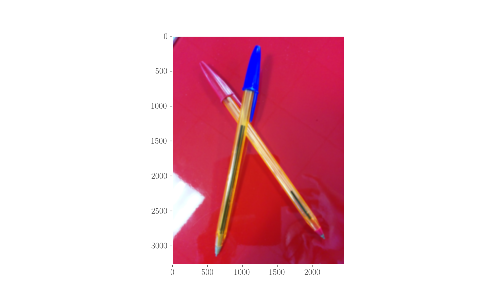
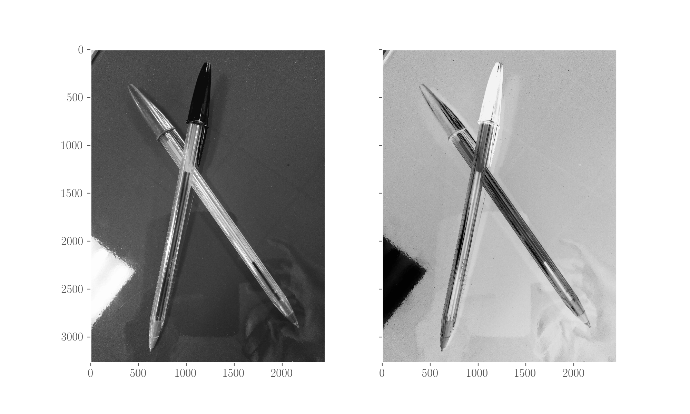
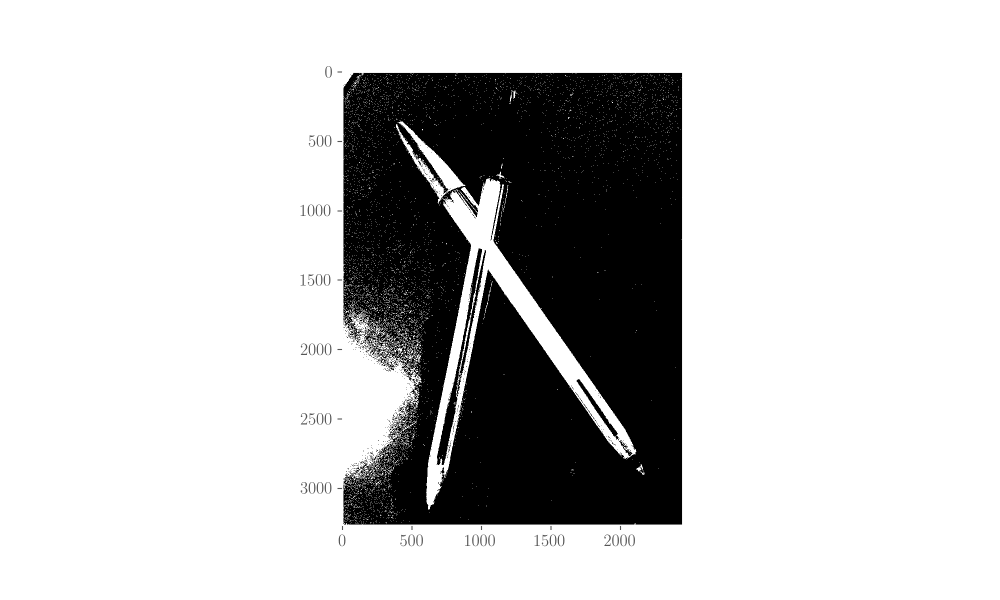
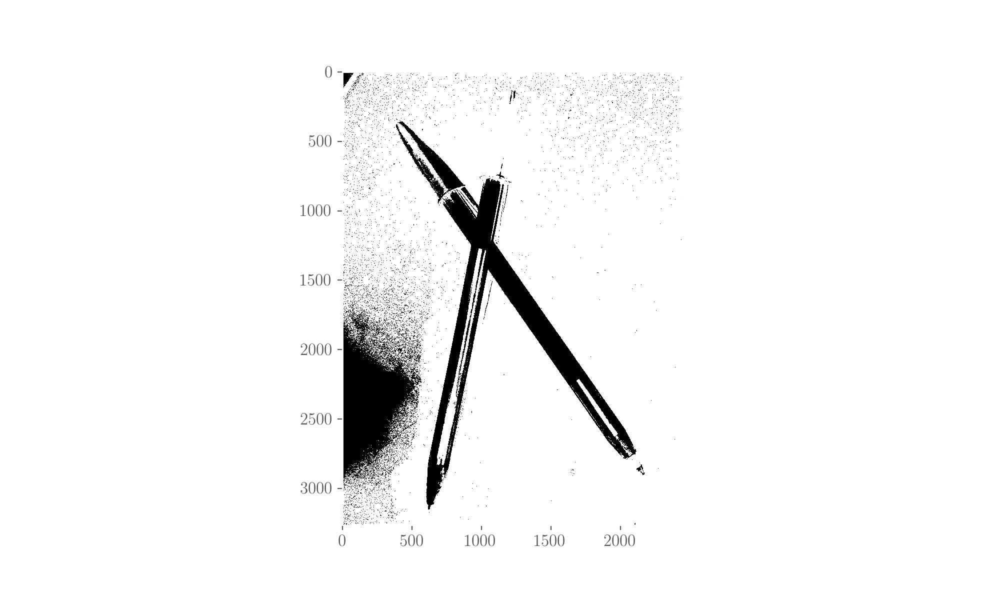
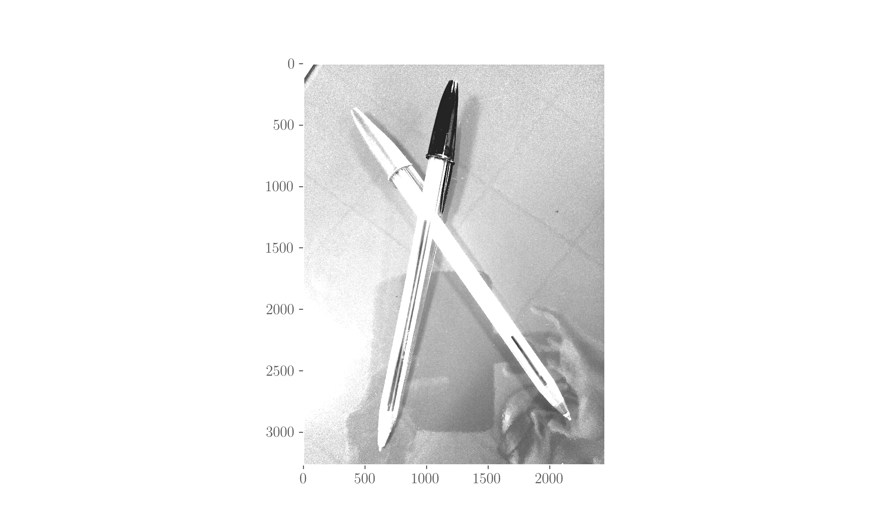
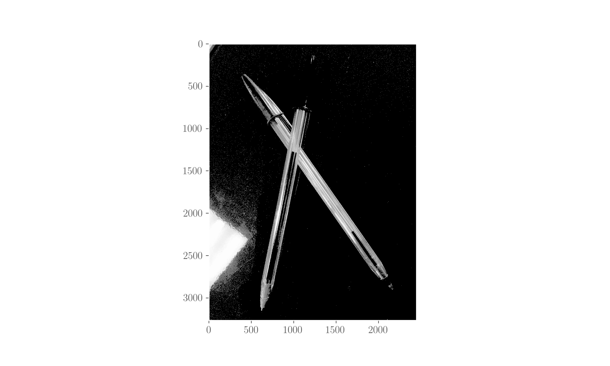
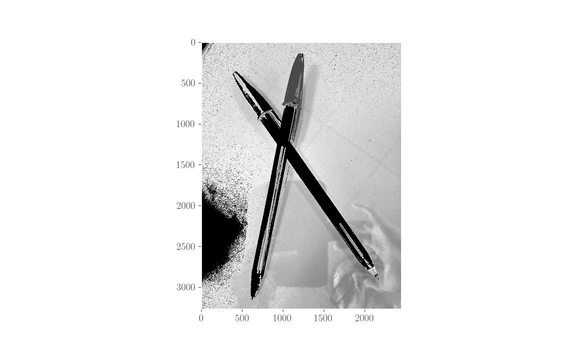
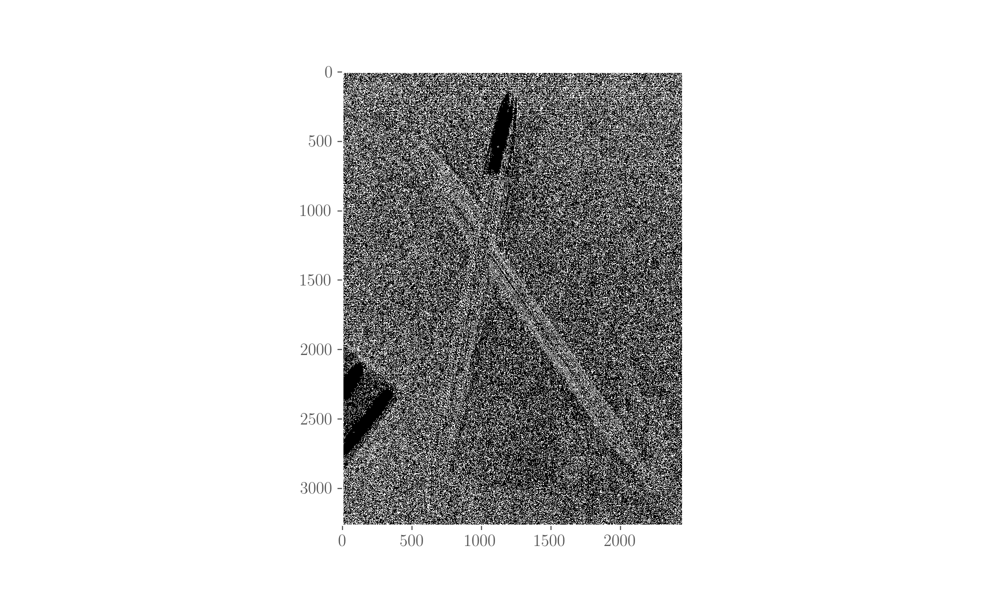
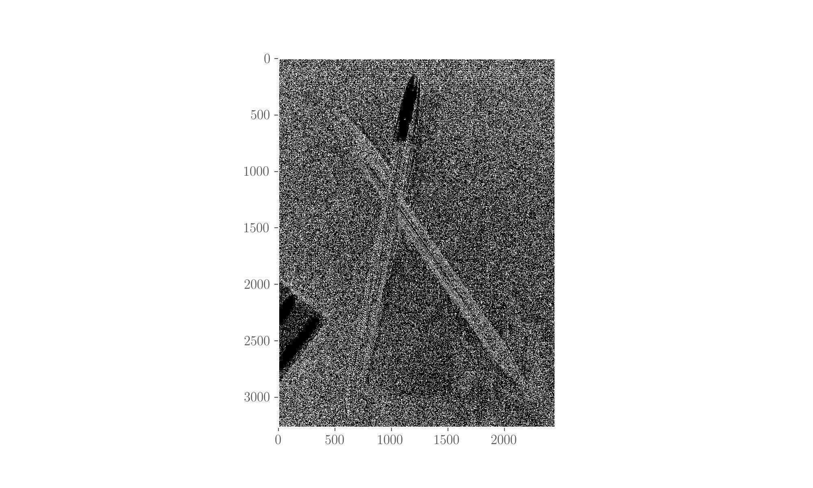
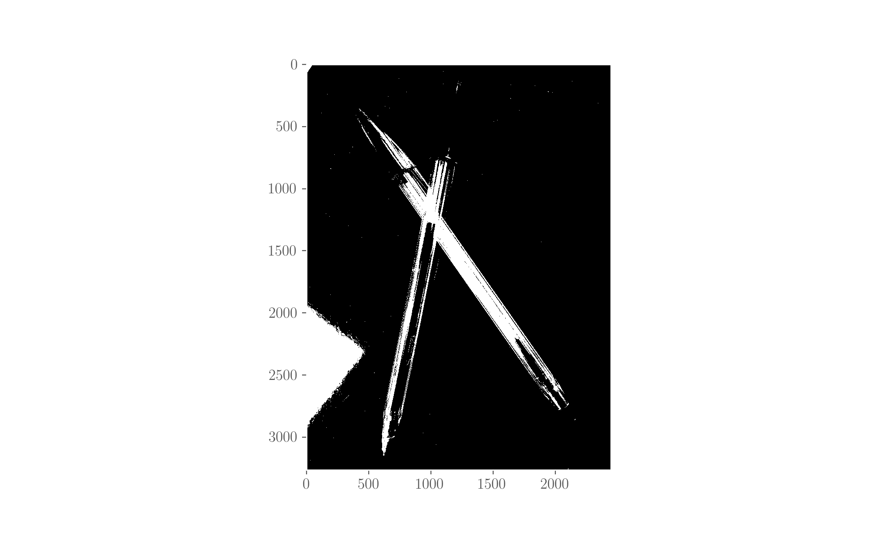

# Blurring, inverting, thresholding an image

We're going to use the same sample image used in other pages in this section - a photo I took of two pens on a desk. You will need to import some stuff:

```python
import cv2
from matplotlib import pyplot as plt
```

## Read the image, show it

```python
# read an image with OpenCV

image = cv2.imread('pens.jpg')

# transform into RGB as OpenCV reads in BGR (and Matplotlib uses RGB)
RGB_image = cv2.cvtColor(image, cv2.COLOR_BGR2RGB)

# show it
plt.imshow(RGB_image)
plt.grid()
plt.show();
```


## Blurring

_Blurring_ is also called _smoothing_ and it is an operation typically used to reduce noise on the source. It consists in applying a filter to the image. Let's see what this means.

The operation goes like this:

$$
g(i,j) = \sum_{h,l} f(i+h, j+l) K(h,l) \ ,
$$

where$$g(i,j)$$represents the transformed value of the pixel at position $$(i,j)$$,$$K(h,l)$$is the _kernel_ and$$f$$represents the original pixels. What the sum is doing is weighing every pixel by the kernel and considering its neighbourhood. The kernel is a matrix which determines how should the neighbourhood be factored in.

In the following, we'll go through some common types of filters and we'll try them out on the image.

### Common types of filters and trying them out

#### **Normalised Box Filter**

Each pixel value gets transformed into the mean of its neighbours, each of which contributes with equal weight. The kernel$$K$$is a matrix with the same value at each place, and this value is

$$
k = \frac{1}{k_w k_h} \ ,
$$

where$$k_w, k_h$$are the \(width and height\) dimensions of the matrix. In other words, this filter is considering a neighbourhood rectangle of dimension$$k_w \times k_h$$around each pixel and averaging the intensities values inside it, assigning to pixels.

```python
# a normalised box filter with kernel 50X50 and showing result
nb = cv2.blur(RGB_image, (50, 50))

plt.imshow(nb)
plt.grid()
plt.show();
```


#### **Gaussian Filter**

It's the most popular but not the fastest. The kernel is given by a gaussian in 2 dimensions, so that at a point$$(x, y)$$it is:

$$
K(x, y) = \frac{1}{2 \pi \sigma_x \sigma_y} e^{-\frac{(x - \mu_x)^2}{2 \sigma_x^2}} e^{-\frac{(y - \mu_y)^2}{2 \sigma_y^2}}
$$

This way, the pixel in the middle is given the largest weight and this weight decreases normally with distance to the pixel in consideration. Look at the [docs](http://docs.opencv.org/3.2.0/d4/d86/group__imgproc__filter.html#gaabe8c836e97159a9193fb0b11ac52cf1) for the implementation of this filter in OpenCV3.

```python
# a Gaussian filter with kernel 49X49 and  and showing result
# Note that the third (required) arg is the sigma_x, if 0 means both sigma_x and sigma_y are calculated from the
# kernel size. Also note kernel size must be odd (not sure why this constraint)
gb = cv2.GaussianBlur(RGB_image, (49, 49), 0)

plt.imshow(gb)
plt.grid()
plt.show();
```



#### **Median Filter**

Each pixel gets replaced with the median of its neighbours \(those in a square around it\).


#### **Bilateral Filter**

Avoids \(to a certain extent\) smoothing the edges in a picture \(all other filters don't avoid that\). Considers neighbouring pixels with weight. In a region of pixels similar in intensity, it will replace pixel with the average of neighbourhood, acting similarly to other filters; in a region where there is a boundary of two intensity areas, that is, a region where pixels on one side are sensibly brighter than those on the other side, a bilateral filter yields a value of 1 for pixels on the same side and 0 for the others. See the detailed explanation in the [references](blurring-inverting-thresholding-an-image.md#references) for a detailed explanation and the OpenCV3 [docs](http://docs.opencv.org/3.2.0/d4/d86/group__imgproc__filter.html#ga9d7064d478c95d60003cf839430737ed) for the API.

Note that it's a quite slow algorithm, especially for large diameters of the neighbourhood.

```python
# a bilateral filter with kernel of diameter 15 and sigmas in color space and coordinate space
bb = cv2.bilateralFilter(RGB_image, 15, 2, 2)

plt.imshow(bb)
plt.grid()
plt.show();
```


## Inverting

Inverting an image means subtracting each pixel value from 255, so that white becomes black and vice versa.

```python
# make the sample image grayscale
gray = cv2.cvtColor(image, cv2.COLOR_BGR2GRAY)

# invert it
inverted = 255 - gray

# Plot both gray image and inverted

plt.gray()
f, (ax1, ax2) = plt.subplots(1, 2, sharey=True)

ax1.grid()
ax1.imshow(gray)

ax2.grid()
ax2.imshow(inverted)

plt.show();
```



## Thresholding

Thresholding is a way to modify the pixels of an image based on a given threshold in their intensity/colour.

See the [API](http://docs.opencv.org/2.4/modules/imgproc/doc/miscellaneous_transformations.html?highlight=threshold#cv2.threshold) call `cv2.threshold`: it needs the grayscale image as first argument, the threshold$$t$$as the second argument and the value to assign as the third argument in the case of a binary and binary inverted thresholding.

See the OpenCV [docs](blurring-inverting-thresholding-an-image.md#references) for an explanation of thresholding with graphics on OpenCV itself.

### Simple Thresholding

Applied to grayscale images, it sets the pixel to a new value if it exceeds a given threshold and to another value otherwise. Modes are, calling $$p(x, y)$$the pixel,$$a$$the value to set and$$t$$the threshold:

* **binary**:

  $$
  p'(x, y) = 
  \begin{cases}
  a \ \text{if} \ p(x,y) > t \\
  0 \ \text{else}
  \end{cases}
  $$

* **binary inverted**:

  $$
  p'(x, y) = 
  \begin{cases}
  0 \ \text{if} \ p(x,y) > t \\
  a \ \text{else}
  \end{cases}
  $$

* **threshold truncated**:

  $$
  p'(x, y) = 
  \begin{cases}
  t \ \text{if} \ p(x,y) > t \\
  p(x,y) \ \text{else}
  \end{cases}
  $$

* **threshold to zero**:

  $$
  p'(x, y) = 
  \begin{cases}
  p(x,y) \ \text{if} \ p(x,y) > t \\
  0 \ \text{else}
  \end{cases}
  $$

* **threshold to zero inverted**:

  $$
  p'(x, y) = 
  \begin{cases}
  0 \ \text{if} \ p(x,y) > t \\
  p(x,y) \ \text{else}
  \end{cases}
  $$

#### Trying the binary thresholding 

```python
# binary threshold: put 255 (white) if pixel passes 100 threshold, 0 (black) otherwise

dest = cv2.threshold(gray, 100, 255, cv2.THRESH_BINARY)[1]

plt.gray()
plt.grid()
plt.imshow(dest)
plt.show();
```



#### Trying the binary inverted thresholding

The code is the same, what changes is the use of `cv2.THRESH_BINARY_INV`.



#### Trying the binary truncated thresholding

Code is the same, it uses `cv2.THRESH_TRUNC`.



#### Trying the thresholding to 0

Same code, uses `cv2.THRESH_TOZERO`. 



#### Trying thresholding to 0 inverted

Same code, uses `cv2.THRESH_TOZERO_INV`.



### Adaptive thresholding

Applied to grayscale images, the threshold is calculated locally so it is different for each region and this accounts for different conditions like illumination. Modes are _binary_ and _binary inverted_, as above, with the difference that$$t = t(x, y)$$. The pixel gets set to a specified new value. Methods are:

* **Adaptive mean**:$$t(x, y)$$is the average of the neighbourhood of pixel$$p(x, y)$$, the neighbourhood being a square of specified size around pixel
* **Adaptive gaussian**:$$t(x, y)$$is a weighted sum, with gaussian weights of the neighbourhood of pixel $$p(x, y)$$. The standard deviation depends on the block size. 

```python
# adaptive mean thresholding with binary method and a neighborhood of 3X3
# note that last arg (required) gets subtracted from the mean for computing the threshold

dest = cv2.adaptiveThreshold(gray, 100, cv2.ADAPTIVE_THRESH_MEAN_C, cv2.THRESH_BINARY, 3, 0)

plt.gray()
plt.grid()
plt.imshow(dest)
plt.show();
```



```python
# adaptive gaussian thresholding with binary method and a neighborhood of 3X3
# note that last arg (required) gets subtracted from the mean for computing the threshold

dest = cv2.adaptiveThreshold(gray, 100, cv2.ADAPTIVE_THRESH_GAUSSIAN_C, cv2.THRESH_BINARY, 3, 0)

plt.gray()
plt.grid()
plt.imshow(dest)
plt.show();
```



### Otsu's Binarization Thresholding

This \(see the OpenCV [docs](blurring-inverting-thresholding-an-image.md#references)\) is a global thresholding method but the value of the threshold is computed as the mean value in between the two peaks of a bimodal image \(see page\). For this reason, it is not good on non-bimodal images. It minimises the weighted within-class variance where a class is the set of pixels around a peak.



```python
# Otsu binarisation

dest = cv2.threshold(gray, 100, 255, cv2.THRESH_OTSU)[1]

plt.gray()
plt.grid()
plt.imshow(dest)
plt.show();
```




## References

1.  A detailed [explanation](http://homepages.inf.ed.ac.uk/rbf/CVonline/LOCAL_COPIES/MANDUCHI1/Bilateral_Filtering.html) of the bilateral filter, University of Edinburgh, School of Informatics
2.  The [explanation](http://docs.opencv.org/2.4/doc/tutorials/imgproc/threshold/threshold.html) of thresholding on OpenCV itself
3.  N Otsu, [**A Threshold Selection Method from Gray-Level Histograms**](http://web-ext.u-aizu.ac.jp/course/bmclass/documents/otsu1979.pdf), _IEEE Transactions on Systems, Man and Cybernetics_, 9, 1979.

