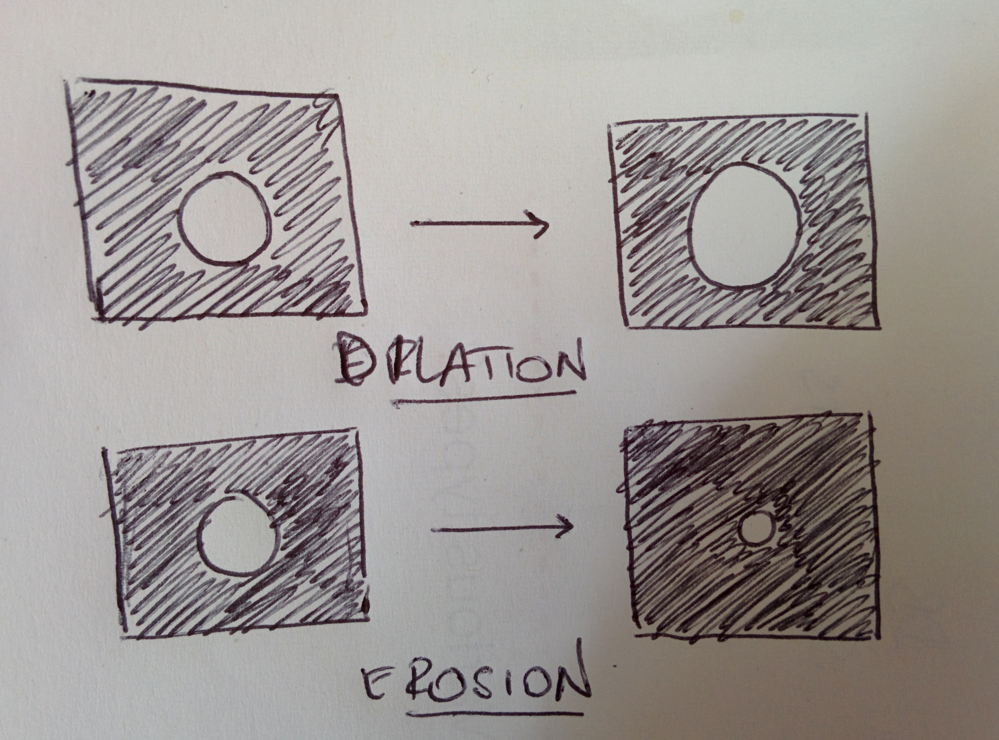

# Morphological operations

## What is morphology



_Morphological operations_ on a image take as input a binary image \(see page\) and a _structuring element_ \(usually a $$3 \times 3$$matrix, also known as _kernel_\) and use it to transform the image into another one.

 

The structuring element can be, for instance, the matrix \(its central point is called the _origin_\):

$$
\begin{bmatrix}
    1 & 1 & 1 \\
    1 & 1 & 1 \\
    1 & 1 & 1
\end{bmatrix}
$$

and it get passed over each pixel of the image in such a way that the origin is overlayed to the pixel, so that corresponding values are compared: if values match, the image pixel gets set to a pre-defined value. In the figure, the kernel is represented by the matrix in blue, shifted over the image matrix in black.

## What are these operations

The main morphological operations are:

* _Dilation_: enlarges objects 
* _Erosion_: shrinks objects
* _Opening_: removes boundary pixels
* _Closing_: fills boundary pixels

There are several other ones, and for some more comprehensive explanations refer to the [references](morphological-operations.md#references).

 

Dilation and erosion are the main morphological operations, all the other ones are combinations of these.

Consider the binary image in the figure as an example, there is a black background and a foreground object.

* _dilation_ dilates the borders of the object
* _erosion_ erodes the borders of object

In dilation, the borders of the foreground are expanded so the object appears enlarged; in erosion those borders get reduced, so the object appears shrunk.

The _morphological gradient_ is the difference between dilation and erosion, the result of which is the outline of the object.

\_\_ 

_Opening_ consists in an erosion operation followed by dilation operation and it is used to remove noise. It is called like this because it can fill in \("open"\) a gap between bunches of pixels.

_Closing_ on the other hand, is dilation followed by erosion and what it does is filling in the small holes in the objects.

Warning: note that in my drawing here, the one referring to closing, there shouldn't be any line between the two blocks of the closed image. You will forgive my mistake!

Other relevant operations are

* _Top hat_ is the difference between image and opening of image. 
* _Black hat_ is the difference between image and closing of image
* _Hit or miss_ is done with two kernels: one used to erode the image and the other to erode the complement of image. Then an AND of the two results is performed.

## References

1.  Morphology, [page](https://homepages.inf.ed.ac.uk/rbf/HIPR2/morops.htm) by the University of Edinburgh, School of Informatics
2.  [Morphology on a course on Vision @ Univ of Auckland](https://www.cs.auckland.ac.nz/courses/compsci773s1c/lectures/ImageProcessing-html/topic4.htm#morpho)

