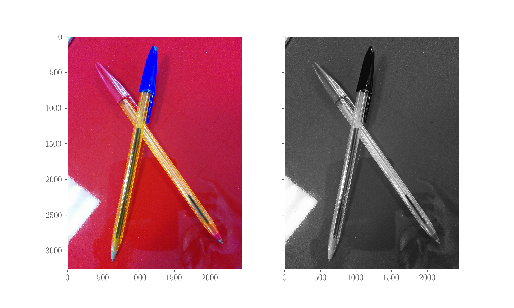

# The intensity histogram

The _intensity histogram_ of an image is the histogram of its pixels' [intensities](../some-glossary.ipynb#Intensity) values. Typically the binning is given in such a way that each single intensity value is a bin, so we count the number of pixels with intensity value 0, the number of pixels with intensity value 1, ..., the number of pixels with intensity value 255.

The broader an intensity histogram is, the larger the contrast of the image is.

For the code in this part, you need to use OpenCV on top of some regular imports:

```python
import cv2
from matplotlib import pyplot as plt
```

## In OpenCV

We will here read our sample image and then we'll plot its intensity histograms, both for the grayscale version and for the 3 channels of the coloured one. You will see that due to the large amount of red in the image, the RED channel has its peak at a high intensity, while the GREEN channel is really peaked at low intensity.

### Read image, transform it to grayscale

I will use a photo I've taken of some pens on a desk.

```python
# First read an image
image = cv2.imread('pens.jpg')

# Transform into grayscale and into RGB (for Matplotlib)
gray = cv2.cvtColor(image, cv2.COLOR_BGR2GRAY)
RGB_image = cv2.cvtColor(image, cv2.COLOR_BGR2RGB)

# show them both
f, (ax1, ax2) = plt.subplots(1, 2, sharey=True)

ax1.grid()
ax1.imshow(RGB_image)

plt.gray()
ax2.grid()
ax2.imshow(gray)

plt.show();
```



### Calculate and plot the intensity histogram - grayscale

Let's calculate and plot the intensity histogram of the grayscale image.

```python
# Hist of the gray image: channel 0, no mask, 256 pixels, range (0, 256)
gray_hist = cv2.calcHist([gray], [0], None, [256], (0, 256))  # the method can do multiple images at a time

# Hists of the color image, each channel, same args
R_hist = cv2.calcHist([RGB_image], [0], None, [256], (0, 256))
G_hist = cv2.calcHist([RGB_image], [1], None, [256], (0, 256))
B_hist = cv2.calcHist([RGB_image], [2], None, [256], (0, 256))
```

```python
# Plot of the grayscale image hist
plt.plot(hist, c='k')
plt.title('Grayscale image intensity hist')
plt.xlabel('Pixel value')
plt.ylabel('Count')
plt.show();
```


### Intensity histograms of the coloured image - R, G, B values

```python
# Plot of the RGB image hists
plt.plot(R_hist, c='r', label='RED channel')
plt.plot(G_hist, c='g', label='GREEN channel')
plt.plot(B_hist, c='b', label='BLUE channel')

plt.title('Coloured image intensity histograms')
plt.xlabel('Pixel value')
plt.ylabel('Count')
plt.legend()
plt.show();
```


## Histogram equalisation

Given the intensity histogram \(see page\) of an image, the procedure of equalising it increases the contrast of the image \(see page\).




Equalisation maps the intensity histogram to a wider and more uniform distribution so that intensity values are more spread over the whole image. The pixels of the image get reassigned in such a way that their distribution in the output image is uniform, through the use of a transfer function. See the [references]() for details.

Using the grayscale image created above, we can run

```python
# equalise
gray_eq = cv2.equalizeHist(gray)
```

and we can plot them both, here they are:


