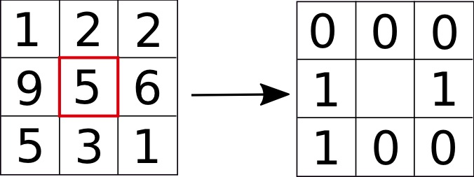
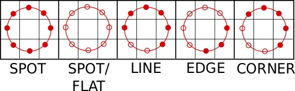

# Face recognition

## What do we mean

We describe here the procedure to recognise faces in images as "similar". We are _not_ talking about face detection, which is the task of finding faces in an image.

As humans, recognising a person by his/her face is a very quick task, mundane even for our daily life, although the specifics of what happens in the human brain are still to be fully understood. 

As machines though, the situation is different. There have been approaches based on vectors built with geometrical features \(see the Scientific American [ref](face-recognition.md#references), an amusing read\), but they have been proven to not be good enough. Standard methods today consist in training a Machine Learning classifier \(we are not considering recent Deep Learning approaches here\).

## Methodologies

### Eigenfaces

The _eigenfaces_ \(yes, they are really called like that\) are the set of eigenvectors outlining the major properties of a face and derived via PCA and used to train a classifier. [Wikipedia](face-recognition.md#references) has a good page on the topic.

An image is a high-dimensional object and not all the features which can be inferred from its pixels are relevant. The steps of the algorithm computing the eigenfaces are:

1. Use a large training set of images of faces, ideally taken under the same light conditions;
2. Normalise them in such a way to have eyes and mouth aligned and then resampled to the same pixel resolution;
3. Perform a PCA and project the original images onto the chosen components;
4. The query image is then projected on the principal components as well;
5. Use a distance method to compare the projected query image and the projected training images

The problem with computing the PCA on many large images is about performance. With 400$$10^2 \times 10^2 $$ images, the covariance matrix will be$$10^4 \times 10^4$$. Thankfully though, note that a$$M \times N$$matrix with $$M > N$$has only$$N-1$$non-zero eigenvalues, so the problem becomes much more accessible.

In fact what we can do is apply a little trick: instead of the eigenvalues and eigenvectors of$$XX^T$$, where $$X$$is the dataset matrix, which is a$$M \times M$$matrix, we can use the eigenvalues and eigenvectors of$$X^TX$$, which is a$$N \times N$$matrix, much smaller. Because matrix multiplication is associative, this gives:

$$
\begin{align} (X^TX) \mathbf{v} &= \lambda \mathbf{v} \\ X(X^TX) \mathbf{v} &= \lambda X \mathbf{v} \\ (XX^T)(X \mathbf{v}) &= \lambda (X \mathbf{v}) \end{align}
$$

### Fisherfaces

A PCA in the eigenfaces approach finds linear combinations of features that maximise the total variance in the data. This way, some discriminative information can be lost when throwing away the components which do not contribute much to the variance. This is particularly a problem when variance is generated by an external source in the images, like light and this is why that approach works well only when images are taken in the same conditions.

The Fisherface approach is a sort of correction on this problem which uses a Linear Discriminant Analysis, which allows for class-specific dimensionality reduction. See this nice page on [Scholarpedia](face-recognition.md#references).

### LBPH: Local Binary Patterns Histograms

Both the Eigenfaces and the Fisherfaces approaches require to be trained on several images per person.

LBPH, standing for _Local Binary Pattern Histograms \(_see Ahonen's [paper](face-recognition.md#references)_\)_, is a 2-dimensional texture analysis method which consists in comparing each pixel with its neighbourhood.

Consider the situation illustrated in the figure here: the image is transformed into a matrix of binary numbers, so that$$2^8$$combinations are possible, given that in 2 dimensions each pixel has 8 neighbours. Here is where _binary_ in the name of the method comes from. A pixel and its neighbourhood are depicted: if the neighbouring pixel has higher intensity, it gets a 1, otherwise it gets a 0.

The LBP operator is defined as, in a generic$$p$$-dimensional space,

$$
LBP(x_c, y_c) = \sum_{k=0}^{k=p-1} 2^k S(i_p-i_c) \ ,
$$

where$$i$$indicates the pixel's intensity \(see page\),$$(x_c, y_c)$$is the central pixel under consideration and $$S(x)$$is the sign function:

$$
S(x) =
\left\{
    \begin{array}{ll}
        1  & \mbox{if } x \geq 0 \\
        0 & \mbox{if } x < 0
    \end{array}
\right.
$$



This method captures fine-grained details. However, a fixed neighbourhood cannot encode details which differ in scale, so the operator has been modified to account for a variable neighbourhood, so that an arbitrary number of pixels is aligned on a circle with variable radius to capture the neighbourhoods \(see figure\).

For a given point$$(x_c, y_c)$$, the neighbour$$(x_p, y_p)$$, with $$p \in D$$ \($$D$$being the number of dimensions\), can be calculated as

$$
\begin{cases}
x_p = x_c + R \cos(\frac{2 \pi p}{D}) \\
y_p = y_c - R \sin(\frac{2 \pi p}{D})
\end{cases}
$$

The operator is an extension of the LBP one. If a point on the circle does not correspond to the image coordinate, it gets interpolated.

The recognition of faces works by dividing the LBP image in local regions and extracting a histogram from each region. The local histograms, concatenated, give a spatially enhanced feature vector.

## References

1.  [How we save face -- Researchers crack the brain's facial recognition code](https://www.scientificamerican.com/article/how-we-save-face-researchers-crack-the-brains-facial-recognition-code/), _Scientific American_, 1 June 2017
2. [Wikipedia](https://en.wikipedia.org/wiki/Eigenface) on Eigenfaces
3. [Scholarpedia](http://www.scholarpedia.org/article/Fisherfaces) on Fisherfaces
4.  T Kanade, _**Picture processing system by computer complex and recognition of human faces**_, Doctoral Thesis, Kyoto University, 1973
5.  T Ojala, M Pietikainen, D Harwood, [**Performance evaluation of texture measures with classification based on Kullback discrimination of distributions**](http://ieeexplore.ieee.org/abstract/document/576366/), _Pattern Recognition, Proceedings of the 12th IAPR International Conference, IEEE_, 1, 1994
6.  T Ahonen, A Hadid, M Pietikainen, ****[**Face description with local binary patterns: Application to face recognition**](https://pdfs.semanticscholar.org/7476/922f1f6b69d9425b013613442bd4ee099fbe.pdf), _IEEE transactions on pattern analysis and machine intelligence_, 28:12, 2006
7.  [A very well done and detailed explanation of the three methods and usage in OpenCV](http://eyalarubas.com/face-detection-and-recognition.html)
8.  Y S Liu W S Ng C W Liu, [A comparison of different face recognition algorithms](http://cs.unc.edu/~chunwei/papers/2009pr_face_recog.pdf)

