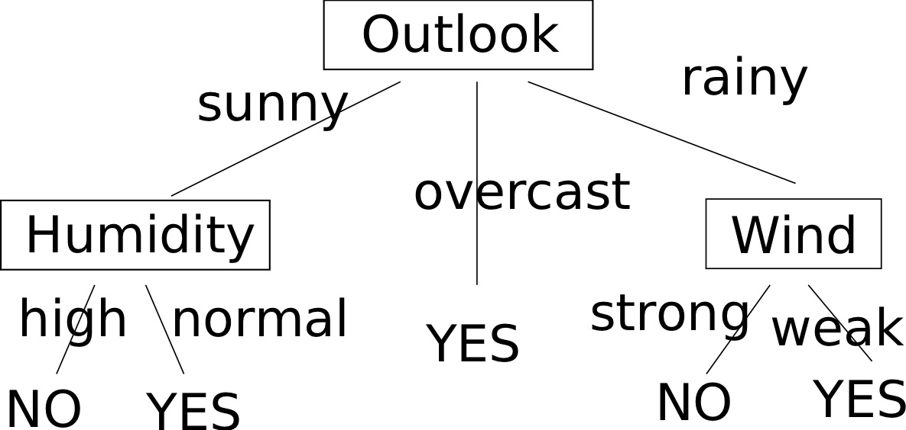

# Decision Trees

A decision tree builds \(like, literally\) a tree of decisions where at each split a decision is taken and is an algorithm which can be used both in regression and in classification problems.

## The algorithms

### Concept Learning System \(CLS\)

This algorithm is the core of decision tree learning and the original paper outlining it dates back from the [sixties](decision-trees.md#references).

Let us briefly outline its procedure. Given a training set $C$ and classes $1/0$ \(so we refer to a binary classification problem\), the algorithm follows this routine:

1. * If $$c > 0  \forall c \in C$$ , build a 1 node and halt;
   * If $$c < 0  \forall c \in C$$ , build a 0 node and halt;
   * Otherwise, choose feature$$f$$of data and create a decision node    
2. Partition$$C$$into $$C_1, C_2, \ldots, C_n$$ , a group for each value of feature $$f$$ 
3. Apply 1. recursively $$\forall C_i$$ 

### Iterative Dichotomiser 3 \(ID3\)

This one, whose original paper is by [Quinlan](decision-trees.md#references), adds a feature selection heuristics to CLS, where the idea is selecting the feature which best separates the data.

The best thing is, as in many cases, to use an example to illustrate how it works. The example we'll use is the same authentic one Quinlan uses in his paper, and can also be found in many places online, like \[here\].

#### **An example**

Suppose we want to build a tree to determine if tomorrow the weather is going to be good to play football. We are in possess of data for the last 2 weeks where the weather has been described by 4 attributes and where we recorder if we went to play or not:

* the _outlook_: was it sunny/overcast/rainy?
* the _temperature_: was is hot/mild/cold?
* the _humidity_: was it high/normal?
* the _wind_: was it weak/strong?

The data we collected is in the following table, which we will refer to as $$S$$.

| Day | Outlook | Temperature | Humidity | Wind | Play ? |
| :--- | :--- | :---: | :---: | :---: | :---: |
| $$d_1$$  | sunny | hot | high | weak | NO |
| $$d_2$$  | sunny | hot | high | strong | YES |
| $$d_3$$  | overcast | hot | high | weak | YES |
| $$d_4$$  | rainy | mild | high | weak | YES |
| $$d_5$$  | rainy | cold | normal | weak | YES |
| $$d_6$$  | rainy | cold | normal | strong | NO |
| $$d_7$$  | overcast | cold | normal | strong | YES |
| $$d_8$$  | sunny | mild | high | weak | NO |
| $$d_9$$  | sunny | cold | normal | weak | YES |
| $$d_{10}$$  | rainy | mild | normal | weak | YES |
| $$d_{11}$$  | sunny | mild | normal | strong | YES |
| $$d_{12}$$  | overcast | mild | high | strong | NO |
| $$d_{13}$$  | overcast | hot | normal | weak | YES |
| $$d_{14}$$  | rainy | mild | high | strong | NO |

To measure how data is spread out, we calculate the entropy.

$$
H(S) = -\sum p \log p \ ,
$$

which, because $$p = \frac{9}{14}$$ as there are 9 out of 14 YES, becomes

$$
H(S) = -\frac{9}{14} \log(\frac{9}{14}) - \frac{5}{14} \log(\frac{5}{14}) = 0.94
$$

Now, given attribute $$A$$ , the _Information Gain_ $$G(S, A)$$ of S on it is defined as the difference in entropy before and after splitting the data on $$A$$ :

$$
G(S, A) = H(S) - \sum_{t \in A} p(t) H(t) \ ,
$$

where the sum goes over all the values of attribute $$A$$, $$p(t)$$ represents the fraction of the data with value $$t$$ for attribute $$A$$ and $$H(t)$$ is the entropy of the subset of data with value $$t$$ for attribute $$A$$ .

As an example, if we want to compute the gain in splitting the data on attribute **Wind**, which has two possible values, we consider that we have $$p_{strong} = 6/14$$ __and __$$p_{weak} = 8/14$$ , then

$$
H(\text{"strong"}) = -\frac{3}{6} \log(\frac{3}{6}) - \frac{3}{6}\log(\frac{3}{6}) \ ,
$$

as there are 3 YES in subset of data with **Wind** attribute equal to _strong_. In the same way,

$$
H(\text{"weak"}) = -\frac{6}{8} \log(\frac{6}{8}) - \frac{2}{8}\log(\frac{2}{8})
$$

This way we are able to compute the Information Gain related to each attribute:

$$
G(S, Outlook) = 0.246 \ ; G(S, T) = 0.029 \ ; G(S, Humidity) = 0.151 \ ; G(S, Wind) = 0.048
$$

We see that the **Outlook** is the attribute with the highest gain and this means that it gets chosen at the first node. It has branches for _sunny_, _overcast_ and _rainy_ which furnish the next level in the tree. So the next question is "what attribute should be checked at the _sunny_ branch node?"

At this point the dataset to be considered is that including _sunny_, which is $$S{"sunny"} = {D_1, D_2, D_8, D_9, D{11}}$$ and so we calculate the information gains

$$
G(S_{sunny}, T) = 0.570 \ ; G(S_{sunny}, Humidity) = 0.970 \ ; G(S_{sunny}, Wind) = 0.019
$$

so the humidity gives the highest gain and furnishes the next decision node.

This process goes on until all data is classified as we run out of attributes. Note that other metrics than the Information Gain can be used.

### C4.5

It is a successor of ID3, removes restrictions over features having to be categorical. When it supports numerical target variables, we talk of CART trees.

### C 5.0

It is Quinlan's latest version, more accurate and faster.

## Cons of Decision Trees

Cons are

* Prone to overfitting \(problem can be mitigated via pruning and setting the max depth or via training multiple trees in an ensemble as in a Random Forest \(see page\)
* unstable: it is very dependent on the exact series of training examples
* the optimal decision tree strategy is a NP problem, a practical strategy like ID3 is greedy and does optimal decisions at each node
* If some classes dominate, the tree will be biased; it is in fact recommended to balance the training set



## A note on the impurity measures

In the explanation above, the impurity measure used to split the data is the _entropy_, used to calculate the information gain. A competitor metric would be the _Gini impurity_, defined as

$$
I = \sum p(1-p) \ ,
$$

where the first factor \($$p$$\) expresses the probability of an item being chosen and the second the probability of a mistake in the classification of the item. $$I$$ is maximal in the same point where the entropy $$H = -\sum p \log p$$ is maximal. The Gini impurity, named after the statistician and demographer C Gini, tells how often an element randomly chosen from the set would be incorrectly labelled if it were randomly labelled according to the distribution of labels in the set, hence furnishing a criterion to minimise the probability of a misclassification.

The Gini impurity can be used in the information gain in place of the entropy. See Raschka's post for a discussion on the difference.

## CART

CART stands for _Classification and Regression Trees_ and is an umbrella term used to identify decision trees producing either classifications or regressions depending on whether the dependent variable is categorical or numerical.

## References

1. E B Hunt, J Marin, P J. Stone, **Experiments in induction**, 1966
2. J R Quinlan, [**Induction on Decision Trees**](http://hunch.net/~coms-4771/quinlan.pdf), _Machine learning_ 1.1, 1986
3. Some [slides](http://www4.stat.ncsu.edu/~dickey/Analytics/Datamine/Reference%20Papers/machine%20learning.pdf) illustrating the weather example
4. S [Raschka](https://sebastianraschka.com/faq/docs/decision-tree-binary.html) on the entropy vs Gini impurity as the impurity metric

