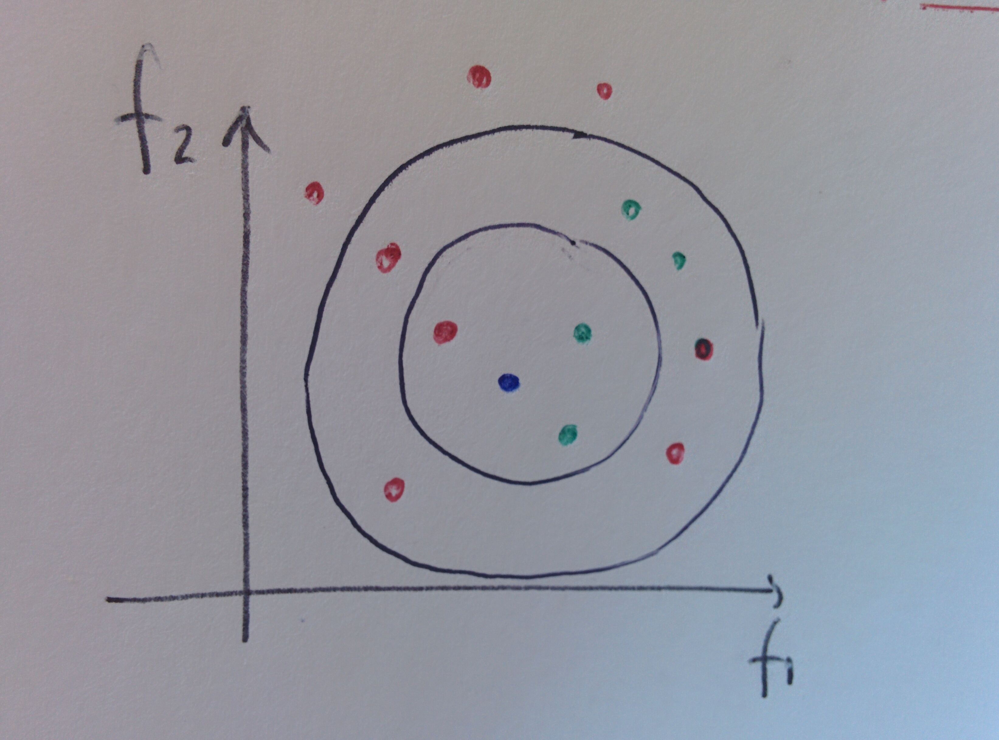

# k-nearest neighbours

## What is

The k-nearest neighbours \(shortened as k-nn/knn\) is a method utilised in both classification and regression that works off of a calculation on the neighbourhood of each given data point; the size of this neighbourhood is a parameter chosen by the user \($$k$$\). In the case of classification, the class attributed to the point is the majority class among its neighbours; in the case of regression the prediction is given as the weighted average of the neighbours, the weight being the inverse of the distance.

 

For classifying data, the idea is to use a majority rule: the new data point gets classified with the label which is the most frequent among its$$k$$nearest neighbours according to the chosen measure of distance. The figure illustrates an example in 2 dimensions:$$f_1$$and$$f_2$$are two features, the colour-coding indicates the labels and the blue point is the one to be classified. According to the chosen distance \(given by the radius of the circle\), the point would be classified as green in the case of k=3 and as red in the case of k=9.

A graphic representation of this is furnished by the Voronoi tasselation.

In the case of regression, the value for the new data is assigned as the weighted average of its k nearest neighbours, weighted with the inverse distance to them.

## Pinch\(es\) of salt

Observe that a k which is too low would make the algorithm model the noise and not catch the pattern; a k which is too high would, on the flip side, make the algorithm include too many neighbours and not catch the pattern as well. The spread of the distances among the neighbours can furnish a sensible indication of where to fish for the best k.

Features have to be scaled to the same scale in order to make proper use of the distances in the space.

The k-nn algorithm is a very simple one and an example of lazy learning \(see page\) because no training is involved and new training examples can be added easily. It is also an expensive and slow algorithm \($$O(nd)$$\) , where n is the number of samples and d the number of dimensions\): this is because to determine the nearest neighbours of a new point all the distances to all other points have to be recomputed.



