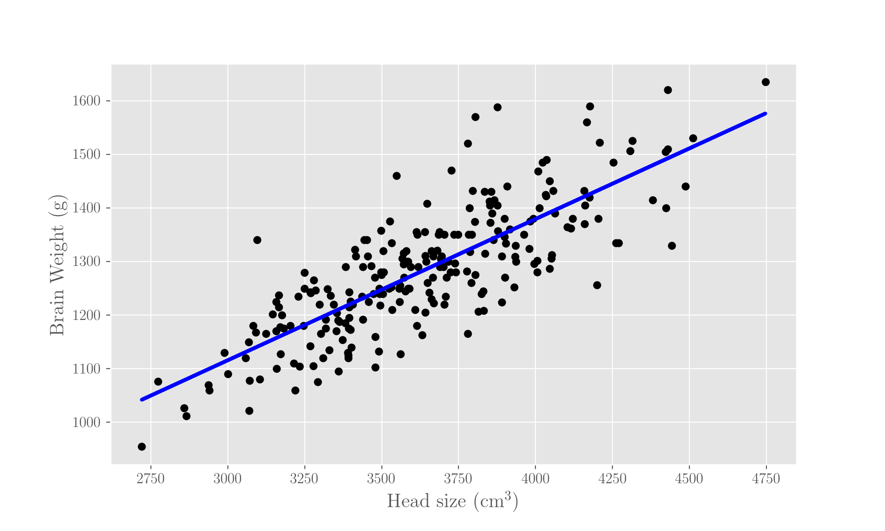

# Linear Regression

## What is it

A linear regression models the relationship between a dependent variable and one \(_simple linear regression_\) or more \(_multiple linear regression_\) independent variables using a linear predictor, that is, the assumption is that the relationship between them is linear.

For the code here, you need a few imports:

```python
import pandas as pd
from sklearn.linear_model import LinearRegression
from matplotlib import pyplot as plt
```

### Simple

In the simple one-dimensional case, we are modelling the dependency as

$$
y = \alpha + \beta x \ ,
$$

$$\alpha$$\(the slope of the line\) and$$\beta$$\(the intercept\) being the coefficients we want to compute. What we mean by this is that in reality we assume

$$
y = \alpha + \beta x + \epsilon \ ,
$$

expecting the error$$\epsilon$$to be "small".

### Multiple

In the case of a multiple linear regression, we would have the line \(let's say we have$$p$$variables, that is, features\):

$$
y = w_0 + \mathbf{w} \cdot \mathbf{x} \ ,
$$

where$$\mathbf{w}$$is the vector of parameters

$$
\mathbf w = [w_1, w_2, \ldots, w_p] \ ,
$$

and $$\mathbf{x}$$ the features

$$
\mathbf x =
    \begin{bmatrix}
         x_1\\
         x_2\\
         \ldots\\
         x_p
 \end{bmatrix} \ .
$$

For convenience, we can write the model as

$$
y = \mathbf w \cdot \mathbf x \ ,
$$

where we have set $$x_0 = 1$$ .

Because we would have several \(let's say$$n$$\) observations \(sample data points\), each$$x_j$$and each$$y_j$$, where$$j \in {1, \ldots ,p}$$, is a vector in$$\mathbb R^n$$, so we will denote the $$j$$-th feature of the $$i$$-th sample by$$x_i^j$$, the $$j$$-th coefficient by$$w_j$$and the target variable of the$$i$$-th sample by$$y_i$$.

## Estimators: Ordinary Least Squares \(OLS\)

The problem is that of estimating the parameters which suit the assumption of the model. There are several methods to do that; OLS is the most commonly used method and indeed the simplest one.

The _cost function_ of an OLS is given by the sum of the squared residuals between the vector of the real dependent variables and the model predictions:

$$
E(\mathbf w) = \sum_{i=1}^{i=n} (y_i - \mathbf w_i \cdot \mathbf x_i)^2
$$

\(the vector operations are in the features space\). In extended form, the cost function is

$$
E(\mathbf w) = \sum_{i=1}^{i=n} \Big(y_i - \sum_{j=1}^{j=p} w_j x_i^j\Big)^2 \ ,
$$

or, in a short form,

$$
E(\mathbf w) = ||y - \mathbf w \cdot \mathbf x||^2
$$

This function has to be minimised over the parameters, so the becomes solving

$$
\min_{\mathbf w} E(\mathbf w)
$$

which can be tackled via Gradient Descent \(see page\).



If for the sake of simplicity we put ourselves in just one dimension \(one feature, so that$$x$$is a single variable\), we would have

$$
E(\alpha, \beta) = \sum_{i=0}^{i=n} (y_i - (\alpha x_i + \beta))^2
$$

so we'd have to solve the problem

$$
\min_{\alpha, \beta} E(\alpha, \beta)
$$

which, by the Gradient Descent method translates into solving the system

$$
\begin{cases} 
    \frac{\partial E}{\partial \alpha} = 2 \sum_{i=0}^{i=n} (y_i - (\alpha x_i + \beta))(-x_i) \\ 
     \frac{\partial E}{\partial \beta} = 2 \sum_{i=0}^{i=n} (\alpha x_i + \beta - y_i)
\end{cases}
$$

## An example

We will use a classic dataset, head size and brain weight, which you can find [here](linear-regression.md#references). Download the file, put it in the same folder as your code and import it with Pandas:

```python

df = pd.read_csv('head_size_brain_weight.csv')
```

Let's then run a linear regression \(using the routine in sklearn and trying to predict the brain weight given the head size\), plotting the resulting line and giving the fitted parameters:

```python
# Num samples
n = df.count()['Head_size(cm^3)']

# Invoking the regressor (fit the intercept as well)
lr = LinearRegression(fit_intercept=True)

# Getting x as head size columns and y as brain weight column
# Reshaping x from (num_rows,) to (num_rows,1) for the regressor fit to work 
# (needed when using only one feature as fit method expects a matrix)
x = df['Head_size(cm^3)'].as_matrix().reshape(n, 1)
y = df['Brain_weight(g)'].as_matrix()

# Fit the model
fit = lr.fit(x, y)

# Plot the data and the fitting line
# Change the label index in the header_index key
plt.scatter(x, y, color='black');
plt.plot(x, fit.predict(x), color='blue')
plt.xlabel('Head size (cm^3)')
plt.ylabel('Brain Weight (g)')
plt.show();

# Display the fitted slope and intercept of the fitting line
print('Slope of the fit: ', fit.coef_)
print('Intercept of the fit: ', fit.intercept_)
```

Fitted parameters turn out to be 0.26 for the slope and 325.5 for the intercept, and this is the resulting line:



## References

1. [Notes](http://cs229.stanford.edu/notes/cs229-notes1.pdf) on linear regression from the Stanford ML course by A Ng
2. The head size and brain weight [dataset](http://users.stat.ufl.edu/~winner/data/brainhead.txt), data from R J Gladstone, **A study of the brain to the size of the head,** _Biometrika_, 4, 105-123 \(1905\)


