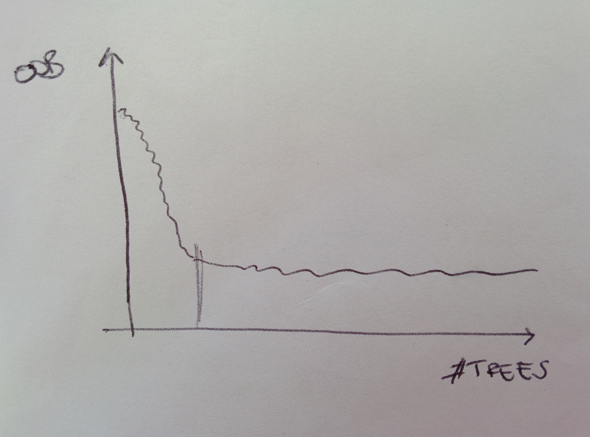

# Random Forest

## What is

A _Random \(decision\) Forest_ is an ensemble learning method used for both for classification and regression. It is based on a brilliant yet simple idea: training a bunch of decision trees together to improve the accuracy reachable with of a single tree and address its problems, for example overfitting.

The first paper out which explores this method dates back to [1995](random-forest.md#references), Breiman then formalised the concepts and set them [down](random-forest.md#references) in in the early 2000s. He and Cutler also registered a [trademark](https://trademarks.justia.com/786/42/random-78642027.html) for the method.

## How does it work

In the case of a _classification_ problem, the output of a forest is the mode of all classes spit out by individual trees, that is, the most frequent one; in the case of a _regression_ problem, the output is the average of the predictions of individual trees.

The idea is fitting a number of decision trees, each on a sampled replica of the training set and use averaging to improve the accuracy and to control for overfitting. Each of these samples is chosen in such a way to have the same size as the original training set, but data is sampled with replacement so that effectively you are building replicas of the whole training set. This methodology is called _bagging_ \(short for bootstrap aggregating\) and it's good way to decrease variance without increasing the bias.

Overfitting is reduced by bagging, if we compare to a single decision tree. Also, note that if we were to train each tree on the same set the trees would be correlated so bagging helps in de-correlating the trees.

 

A parameter of the forest is the number of decision trees to use. Its optimal value can be found indeed by observing the _out-of-bag error_ \(OOB\), which is the mean prediction error on each sample$$x_i$$using only the trees that did not have$$x_i$$as a training sample. Looking at the OOB error is equivalent to running cross-validation. The optimal number of trees to use can be pinpointed by looking at the OOB error as a function of the number of trees: when the curve stabilises, it is a good indication that that quantity is sufficient.

## Ranking the importance of features with a Random Forest

A Random Forest can also be used to rank the importance each feature has in a task. Steps are

1. Fit a forest to the data and record the OOB error
2. The importance of the j-th feature is computed as
   * randomly permute the values of feature in the training set \(build a perturbed dataset\)
   * compute the OOB error again
   * the difference in the OOB errors before and after the feature permutation, averaged and normalised by the standard deviation of these differences will quantify the importance of the feature

Features with a high importance score are the important predictors because it means that perturbing the dataset decreases the model performance.

## References

1. T K Ho, [**Random Decision Forests**](http://ect.bell-labs.com/who/tkh/publications/papers/odt.pdf), _Proceedings of the Third International Conference on Document Analysis and Recognition_, 1 IEEE, 1995
2. L Breiman, [**Random Forests**](http://machinelearning202.pbworks.com/w/file/fetch/60606349/breiman_randomforests.pdf), _Machine Learning_, 45.1, 2001

