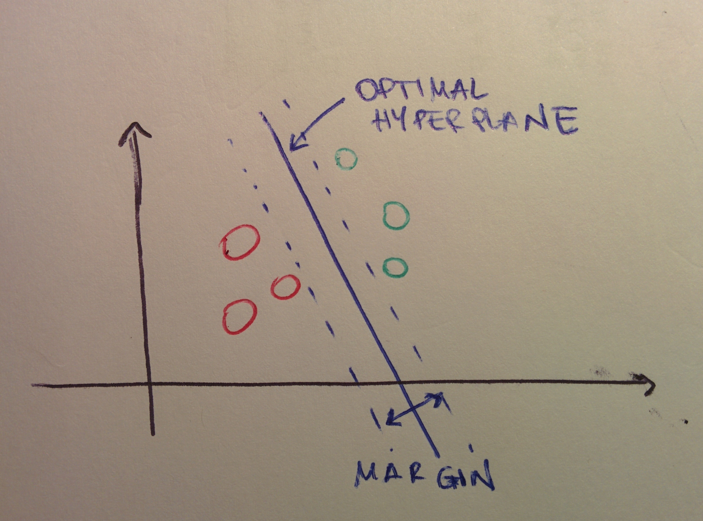

# Support Vector Machine

## What is

A Support Vector Machine \(SVM\) is a non-probabilistic method used both to classification \(naturally\) and for regression \(see later\) which builds a hyperplane \(or a set of hyperplanes\) in a high dimensional space to separate the data.

## In classification

 

Given some labelled data, an SVM spits out the optimal hyperplane separating them: in$$D$$dimensions, this will have$$D-1$$ dimensions. Referring to the figure, where we are in$$D=2$$ so the hyperplanes are lines, and we have a binary classification problem \(colours indicate the class\), multiple possible lines can separate the data, but the optimal separation is achieved with the one line which is the farthest away from all points. The problem then is about finding the hyperplane which gives the largest minimum distance to all training samples, that is, which maximises the margin.

A hyperplane $$L$$ is given by

$$
f(x) = \beta_0 + \bar{\beta^t} \bar{x} = 0 \ ,
$$

where $$\beta_0$$ is called the _bias_ and $$\bar{\beta}$$ the _weight vector_. Properties are

* $$\forall \bar{x_1}, \bar{x_2} \in L$$, $$\bar{\beta}^t(\bar{x_1} - \bar{x_2}) = 0 \rightarrow \frac{\bar{\beta}}{p}$$ is the vector normal to the surface of $$L$$ 
* $$\forall \bar{x_0} \in L$$, $$\bar{\beta}^t \bar{x_0} = - \bar{\beta_0}$$ 
* The signed distance of any $$\bar{x}$$ to$$L$$is given by 

  $$
  \frac{\bar{\beta}}{\bar{\beta_0}} (\bar{x} - \bar{x_0}) = \frac{1}{||\bar{\beta}||} (\bar{\beta}^t \bar{x} + \bar{\beta_0}) = \frac{1}{||f'(x)||} f(x)
  $$

    where that is the distance of $$x$$ to the hyperplane$$(\bar{\beta_0}, \bar{\beta})$$, hence $$f(x)$$is  proportional to the signed distance from$$x$$to the hyperplane defined by $$f(x) = 0$$. 

The optimal hyperplane is represented in infinite number of ways by scaling$$\bar{\beta_0} $$and $$\bar{\beta}$$. The convention is to pick the representation which gives

$$
|\bar{\beta_0} + \bar{\beta}^t x| = 1
$$

with $$x$$ the training samples closest to the hyperplane. These are called the _support vectors_.

For the canonical hyperplane, the distance to the support vectors is $$\frac{1}{||\beta||}$$. Because the margin $$M$$ is defined by twice the distance between the hyperplane and the closest samples, then

$$
M = \frac{2}{||\beta||} \ ,
$$

the problem of maximising $$M$$ becomes that of minimising $$L(\beta)$$ with some constraints:

$$
\max_{\beta_0, \beta} M \text{subject to} \frac{y_i}{||\beta||} (x_i^t \beta + \beta_0) \geq M \forall i = 1, \ldots, N
$$

with$$N$$being the number of training samples. This is called the _SVM problem_ and the constraints ensure that all points are at least a signed distance$$M$$from the decision boundary defined by$$\beta_0$$and $$\beta$$ .

Equivalently,

$$
\min_{\beta_0, \beta} \frac{1}{2} ||\beta||^2 \text{subject to} y_i (x_i^t \beta + \beta_0) \geq 1 \forall i = 1, \ldots, N
$$

The SVM problem can be solved using Lagrange multipliers. This was a brief round up of the linear case, but SVMs can be used in several problems, including non-linearly separable data.

The hyperplane defining the margin are

$$
\begin{cases}
    \beta_0 + \beta^t x = 1 \\
    \beta_0 + \beta^t x = -1
\end{cases}
$$

so the constraints that points are not falling inside them are

$$
\begin{cases}
    \beta_0 + \beta^t x \geq 1 \text{if} y = 1\\
    \beta_0 + \beta^t x \leq -1 \text{if} y = -1
\end{cases}
$$

which can be rewritten as $$y_i(\beta_0 + \beta^t x) \geq 1   \forall i = 1, \ldots, N$$ 

So the classifier is $$sgn(\beta_0 + \beta^t x)$$.

### Non-linear SVM

The idea is mapping the training points to some higher-dimensional euclidean space, with possibly infinite dimensions, where it is linearly separable so that a linear SVM can then be applied. The "kernel trick" consists in applying a kernel function to operate in a high-dimensional space without computing the coordinates of the data but just the inner products between the images of all pairs of data, which is computationally cheaper.

Linear boundaries in the higher-dimensional space achieve a better separation and translate to non-linear boundaries in the original space. The classifier is fitted with features

$$
h(x_i) = (h_1(x_i), h_2(x_i), \ldots, h_M(x_i)) \ ,
$$

where$$h_m(x_i)$$with $$m = 1, \ldots, M$$are the change of base functions and the hyperplane function is now non-linear:

$$
\hat f(x) = \hat \beta_0 + \hat \beta^t h(x)
$$

but the classifier$$sgn \hat{f(x)}$$is the same.

Because in the linear SVM the Lagrange multipliers method furnishes

$$
\beta = \sum_{i=1}^N \alpha_i y_i x_i \\
0 = \sum_{i=1}^N \alpha_i y_i
$$

so that the hyperplane becomes $$f(x) = \sum{i=1}^N \alpha_i y_i x_i x + \beta_0$$ _,_ which in the case of a non-linear SVM translates to __$$\hat f(x) = \sum{i=1}^N \alpha_i y_i  + \beta_0$$ 

$$h(x)$$ is only involved via inner products. There is no need to specify the transformation $$h(x)$$ at all, but only require knowledge of the kernel function

$$
K(x, x') = <h(x), h(x_i)>
$$

The kernel function computes inner products in the transformed space, it should be symmetric and semi-positive. Popular choices for $$K$$ in literature are

* the d degree polynomial $$K(x, x') = 1 + <h(x), h(x_i)>$$ 
* the radial basis $$e^{-\gamma ||x - x'||^2}$$ 
* the neural network $$\tanh{\kappa_1<x, x'> + \kappa_2}$$ 

The effectiveness of a SVM depends on the selection of kernel and its parameters, which are usually optimised via grid search.

## SVM for Regression: SVR

Given a tolerance level $$\epsilon$$ , the idea is finding the optimal hyperplane with some fault tolerance. The SVR is trained solving

$$
\min_{\beta_0, \beta} \frac{||\beta||^2}{2}
$$

subject to

$$
\begin{cases}
    y_i - \beta_0 -\beta^t x_i \leq \epsilon \\
    \beta^t x_i + \beta_0 - y_i \leq \epsilon
\end{cases}
$$

The inner product plus intercept $$\beta^t x_i + \beta_0$$ is the prediction for sample$$i$$.$$\epsilon$$ is a free parameter used as a threshold: all predictions have to be within a range$$\epsilon$$of true predictions.

## Advantages and disadvantages of SVMs

Advantages are:

* It's effective in high-dimensional spaces
* Only use a subset of training data in the decision function \(the support vectors\), which makes them memory-efficient
* Versatility: choice of kernel and parameters

Disadvantages are:

* If the number of features is much bigger than the number of samples, poor performance is likely
* They do not furnish a probability estimate

## References

1. C Cortes, V Vapnik, [**Support Vector Networks**](http://image.diku.dk/imagecanon/material/cortes_vapnik95.pdf)**,** _Machine Learning_, 20, 1995

