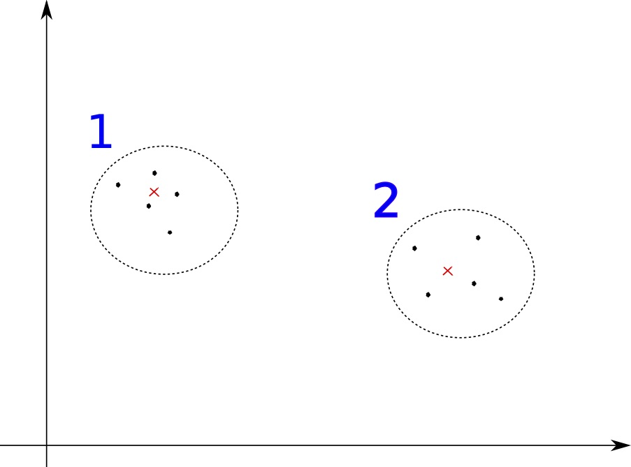
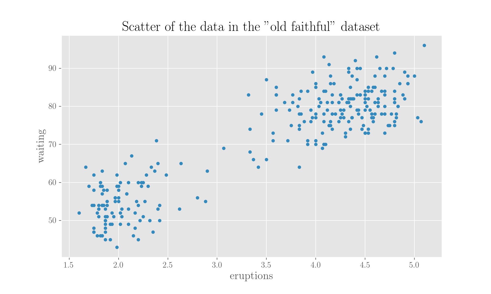
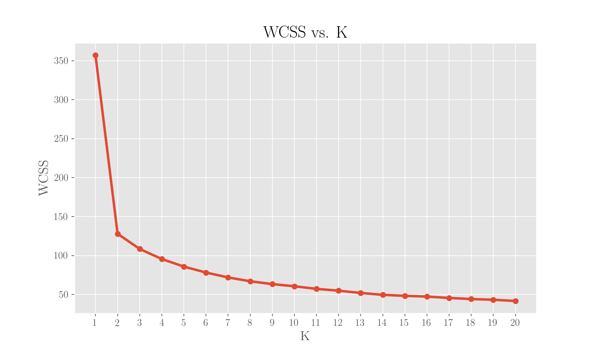
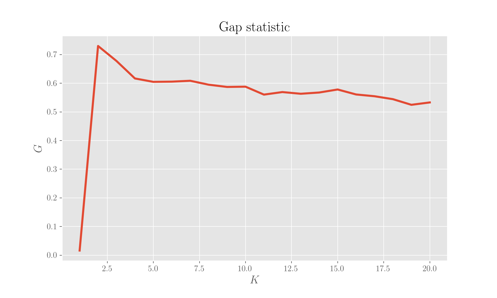
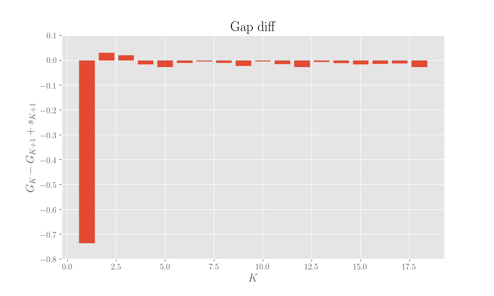
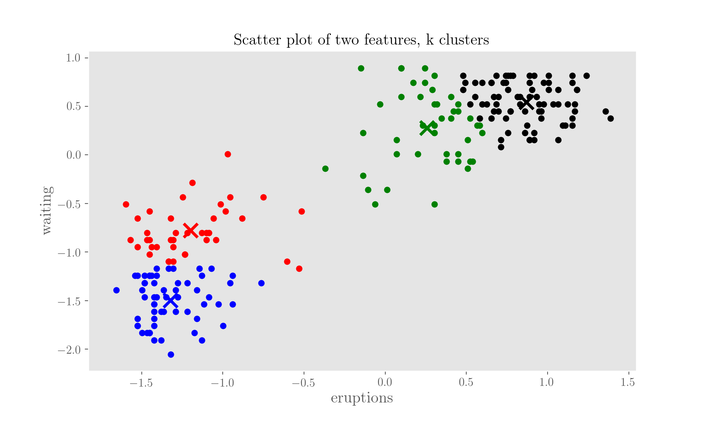

# k-means

_The k-means is a clustering algorithm. Not to be confused with kNN!_

For the code reported here, you can head to the notebook present in the repo. You will need some imports:

```python
import math
import random

import pandas as pd
import numpy as np
from matplotlib import pyplot as plt
from sklearn.cluster import KMeans
from sklearn.preprocessing import scale
from scipy.spatial.distance import euclidean
```

## How it works

The k-means clustering algorithm needs you, the user, to choose$$K$$, which is the number of clusters you want to end up with. It is the fastest of the clustering methods and it always converges, though it may do to a local minimum.

 

Given a set of$$n$$observations, $$(\mathbf{x_1}, \mathbf{x_2}, \ldots, \mathbf{x_n})$$, each living in a$$d$$-dimensional space \($$\mathbf{x} \in \mathbb{R}^d$$\), where$$d$$are the features, the algorithms wants to partition them into$$K \leq n$$clusters$${\mathcal{C}_1, \mathcal{C}_2, \ldots, \mathcal{C}_n}$$so to minimise the within-cluster-sum-of-squares \(WCSS, $$W$$\):

$$
\boxed{W = \sum_{k=1}^{K} \sum_{\mathbf{x} \in \mathcal{C}_k} || \mathbf{x} - \mathbb{\mu}_k ||^2} \ ,
$$

where$$\mathbb{\mu}_k$$is the mean of the points falling in cluster$$C_k$$\(the so-called _centroid_ of the cluster\), itself a vector in$$\mathbb{R}^d$$, each of its coordinates being the mean for that feature in the cluster.

In this horrible figure I did above,$$K$$is two and the red crosses indicate the centroids.

## The standard algorithm

The standard k-means algorithm is [that of Lloyds](k-means.md#references) \(dated 1957, was only published outside of Bell Labs in 1982\).

In short, the algorithms starts by initialising the$$K$$centroids with points picked randomly from the sample. It then proceeds iteratively, until convergence, through steps called

1. _assignment_
2. _update_  

The _assignment_ step consists in assigning each sample point to the cluster whose centroid is the nearest; this procedure is equivalent to partitioning the samples according to the Voronoi diagram generated by the centroids. The Voronoi diagram is a way to partition a plane in regions based on the distance to points. The _update_ step calculates the new centroids with the new cluster configuration.

These steps are executed one after the other until the difference between new and old centroids does not exceed a chosen threshold.

## Further metrics

On top of the _WCSS_, we can use other metrics to assess and monitor the quality and the nature for our clustering.

### Compactness

We can assess how "compact" our clustering is via summing up all the intra-cluster distances for each cluster, divided by twice the number of points in each of them:

$$
\boxed{c = \sum_{k=1}^K \frac{1}{2n_k} d_k} \ .
$$

To expand on the above,$$n_k$$is the number of points in cluster $$\mathcal{C}_k$$ identified by index$$k$$, with $$k \in {1, \ldots, K}$$, and $$d_k$$ is the sum of distances within the cluster:

$$
d_k = \sum_{\mathbf{x} \in \mathcal{C}_k} \sum_{\mathbf{y} \in \mathcal{C}_k} || \mathbf{x} - \mathbf{y} ||^2 \ ,
$$

and it can be written as \($$\mathbf{\mu}_k$$being the centroid of the cluster\)

$$
2 n_k \sum_{\mathbf{x} \in C_k} || \mathbf{x} - \mathbf{\mu}_k ||^2 \ .
$$

#### **Proof**

By definition, we have \($$\mu_k$$is the centroid of$$\mathcal{C}_k$$\)

$$
\mathbf{\mu}_k = \frac{\sum_{\mathbf{x} \in \mathcal{C}_k} \mathbf{x}}{n_k}
$$

because each component of$$\mathbf{\mu}_k$$is the mean of the corresponding components of the points in the cluster.

The first member is \(we use the fact, in the second line, that$$\sum_{\mathbf{x}} 1 = n_k$$\):

$$
\begin{align}
\sum_{\mathbf{x}} \sum_{\mathbf{y}} (||\mathbf{x}||^2 + ||\mathbf{y}||^2 - 2 \mathbf{x} \cdot \mathbf{y}) &= 
\sum_{\mathbf{x}} \sum_{\mathbf{y}} ||\mathbf{x}||^2 + \sum_{\mathbf{x}} \sum_{\mathbf{y}} ||\mathbf{y}||^2 - 2 \sum_{\mathbf{x}} \sum_{\mathbf{y}} \mathbf{x} \cdot \mathbf{y} \\
&= n_k \sum_{\mathbf{x}} ||\mathbf{x}||^2 + n_k \sum_{\mathbf{y}} ||\mathbf{y}||^2 -2 n_k \sum_{\mathbf{x}} \mathbf{x} \cdot \mathbf{\mu}_k \\
&= 2 n_k \sum_{\mathbf{x}} ||\mathbf{x}||^2 - 2n_k^2 ||\mu_k||^2
\end{align}
$$

The second member is

$$
\begin{align}
2 n_k \big[ \sum_{\mathbf{x}} ||\mathbf{x}||^2 + \sum_{\mathbf{x}} ||\mu_k||^2 -2 \sum_{\mathbf{x}} \mathbf{x} \cdot \mathbf{\mu}_k \big] &= 2 n_k \big[ \sum_{\mathbf{x}} ||\mathbf{x}||^2 + n_k ||\mu_k||^2 - 2 n_k ||\mu_k||^2 \big] \\
&= 2 n_k \big[ \sum_{\mathbf{x}} ||\mathbf{x}||^2 - n_k ||\mu_k||^2 \big] \\
&= 2 n_k \sum_{\mathbf{x}} ||\mathbf{x}||^2 -  2 n_k^2 ||\mu_k||^2 \ ,
\end{align}
$$

so the two things are the same.

## How to choose the best$$K$$?

Clearly, if I choose a too large$$K$$, I end up with a too-fine clustering which fails in showing me similarities in the data. On the flip side, If I choose a too small$$K$$, I also fail in separating similar points for the reverse reason, as I'm putting too much stuff together. How should I go with choosing the$$K$$that best separates my points?

There can be \(at least\) three ways: one rule of thumb, one heuristic and one mathematical.

### The rule of thumb

The _rule of thumb_ method suggests choosing $$K \sim \sqrt{n/2}$$. This is a \(very\) hand-waving method, and gives an "approximate" clustering \(it typically gives too many clusters\). The justification behind it comes from the fact that it runs in linear time so it really should only be taken as an indication when wanting to reduce dataset size.

### The elbow method

The _elbow method_ is a heuristic method consisting in looking at when adding a new cluster does not model the data any better.

By plotting$$W$$as a function of$$K$$, it should be clear where the contribution of another cluster gives minimal further gain \(the "elbow" point of the curve\). It is clear that the choice of this point is kind of subjective anyway, as it depends on the situation and on the what we, in that situation, consider a minimal further gain not worth pursuing.

See the [reference about Stack Overflow](k-means.md#references) for a computational answer.

### The Gap Statistic method

It is a mathematical presented in the original [paper](k-means.md#references), you can read an explanation plus implementation in the [references](k-means.md#references). The authors define the gap statistic as

$$
G(K) = \mathbb{E}[\log W^*_K] - \log W_K \ ,
$$

where the asterisk refers to a null reference dataset. It is demonstrated that the best$$K$$clustering the data is the smallest$$K$$such that

$$
G(K) \geq G(K+1) - s_{K+1} \ ,
$$

where$$s_K$$is the simulation error calculated from the standard deviation $$\sigma_K$$ of B Monte Carlo replicates $$\log(W^*_K)$$ , as

$$
s_K = \sqrt{1 + \frac{1}{B}} \sigma_K \ ,
$$

and

$$
\mathbb{E}[\log W^*_K] = \frac{1}{B} \sum_{b=1}^{B} \log W^*_{Kb} \ ,
$$

$$W^*_{Kb}$$ given by the clustering of$$B$$reference datasets.

The reference distribution is obtained by generating each reference feature randomly \(uniformly\) within the range values for that feature, that is, within the bounding box for that feature. Then the expected value is estimated by an average of $$B$$ copies $$\log W^*_K$$ _,_ each computed from a Monte Carlo sample __$$x^*_1, \ldots, x^*_n$$, drawn from a reference distribution \(x is the dataset matrix\).

Because

$$
\mathbb{E}[\log W^*_K] = \frac{1}{B} \log \Pi_b W^*_{Kb} \ ,
$$

then

$$
G(K) = \log \left[ \frac{(\Pi_b W^*_{Kb})^{\frac{1}{B}}}{W_K} \right]
$$

In the logarithm, at the denominator, we got the geometric mean of $$W^*_K$$ _. T_his last equation is saying that the gap statistics is the logarithm of the ratio of the geometric mean of __$$W^*_K$$ to $$W_K$$ .

The standard deviation is

$$
\sigma_K = \sqrt{\frac{1}{B} \sum_{b=1}^B (\log W^*_{Kb} - \mathbb{E}[\log W^*_{Kb}])^2 }
$$

## Trying it!

We will use the[ Old Faithful dataset ](http://www.stat.cmu.edu/%7Elarry/all-of-statistics/=data/faithful.dat)for this, which reports some eruption times and waiting times between eruptions of the Old Faithful geyser in Yellowstone, a classic dataset. A copy of the data is available in the repo for this book for convenience.

```python
# Let's read the Old Faithful dataset into a Pandas Dataframe, choosing the columns

data = pd.read_csv(dataset, delimiter=' ')[['eruptions', 'waiting']]

```

Let's scale the data so that each column lives on the same scale:

```python
scaled_data = scale(data)
```

And let's see how the data looks like:

```python
data.plot.scatter('eruptions', 'waiting')
plt.title('Scatter of the data in the "old faithful" dataset')
plt.show();
```



### Apply the rule of thumb

```python
thumb_k = np.sqrt(data.shape[0]/2)
print(' * Rule of thumb asserts optimal k =', round(thumb_k, 2))
```

The rule of thumb suggests an optimal k of 12!

### Apply the elbow method

You will see the elbow will appear quite soon. Let's define some functions first, for convenience:

```python
def retrieve_cluster_points(cluster_index, labels, samples_matrix):
    """
    In a clustering, retrieve points (their coordinates)
    belonging to given cluster. Return array of such points.
    samples_matrix is a Numpy array.
    """

    cluster_points = []
    for sample_index in np.where(labels == cluster_index)[0]:
        cluster_points.append(samples_matrix[sample_index, :])
    cluster_points = np.array(cluster_points)

    return np.array(cluster_points)


def compute_wcss(centroids, labels, samples_matrix):
    """
    Compute the WCSS for a k-means clustering, given the
    centroids and the dataset matrix of samples.
    samples_matrix is a Numpy array.
    """

    k = len(centroids)
    wcss = 0
    for cluster_index in range(k):
        cluster_points = retrieve_cluster_points(cluster_index,
                                                 labels,
                                                 samples_matrix)
        wcss += sum([euclidean(point, centroids[cluster_index])
                    for point in cluster_points])

    return wcss
```

and then run the method, plotting the result k by k:

```python
k_range = range(1, 21)    # range of K (decide arbitrarily how many Ks to test)
inertia_k = dict()        # inertia for each k
wcss_k = dict()           # WCSS for each k
p_k = dict()              # percentage of variance explained for each k

# Loop over the value of K
for k in k_range:
    print('k = ', k)
    
    # Fit the model
    fit = KMeans(n_clusters=k).fit(scaled_data)

    # Retrieve centroids for fitted model
    # A centroid is the cluster center, given as the vector of coordinates over the n_features dimensions
    # So there will be K number of n_features-dimensional centroids
    centroids = fit.cluster_centers_
    
    # Retrieve cluster labels for fitted model
    labels = fit.labels_

    # Retrieve the inertia of the fitted model
    inertia_k[k] = fit.inertia_
    
    # Compute the WCSS of the fitted model
    wcss_k[k] = compute_wcss(centroids, labels, scaled_data)
    
plt.title('WCSS vs. K')
plt.plot(k_range, list(wcss_k.values()), marker='o')
plt.xlabel('K')
plt.xticks(k_range)
plt.ylabel('WCSS')
plt.show();
```



It is clear that 2 is giving the sought elbow.

### Apply the gap statistics method

Let's define some preliminary convenience functions \(note that they make use of the ones defined above\):

```python
def compute_gap_statistic(samples_matrix,
                          k,
                          b=10,
                          scale_data=True):
    """
    Compute the Gap Statistic for a k-means clustering.
    b is the number of replicates to use (defaults to 10);
    k is the chosen number of clusters;
    scale_data (defaults to True): if to scale replicates samples matrix.
    Return the gap statistic, the stdev of the Monte Carlo replicas and
    the simulation error.
    samples_matrix is a Numpy array.
    """

    if scale_data:
        samples_matrix = scale(samples_matrix)
    fit = KMeans(n_clusters=k).fit(samples_matrix)
    centroids = fit.cluster_centers_
    labels = fit.labels_
    Wk = compute_wcss(centroids, labels, samples_matrix)
    Wkb = []
    for i in range(b):
        replicate = []
        for sample in range(samples_matrix.shape[0]):
            replicate_sample = \
                [random.uniform(min(samples_matrix[:, feature]),
                                max(samples_matrix[:, feature]))
                 for feature in range(samples_matrix.shape[1])]
            replicate.append(replicate_sample)
        replicate = np.array(replicate)
        if scale_data:
            replicate = scale(replicate)
        fit = KMeans(n_clusters=k).fit(replicate)
        replicate_centroids = fit.cluster_centers_
        replicate_labels = fit.labels_
        Wkb.append(compute_wcss(replicate_centroids,
                                replicate_labels,
                                replicate))
    gap = np.mean(np.log(Wkb)) - np.log(Wk)
    stdk = np.std(np.log(Wkb))
    sk = math.sqrt(1 + 1. / b) * stdk

    return gap, stdk, sk
```

then we will run the method:

```python
k_gap = {}
for k in k_range:
    gap = compute_gap_statistic(scaled_data, k, scale_data=False)
    k_gap[k] = gap 
    
k_gapdiff = {}
for k in range(min(k_range), max(k_range)-1):
    k_gapdiff[k] = k_gap[k][0] - k_gap[k+1][0] - k_gap[k + 1][2]
        
'The best k according to the gap statistic is: ', evaluate_gap_statistic_best_k(scaled_data)
```

which yields an optimal k of 2. Let's see it with a few plots:

```python
plt.plot(list(k_gap.keys()), [value[0] for value in k_gap.values()])
plt.title('Gap statistic')
plt.ylabel('$G$')
plt.xlabel('$K$')
#plt.grid()
plt.show();
```





And finally, let's plot the clustered points - you can choose the k desired

```python
# Choose feature indices from the header
f1 = 1
f2 = 2

k = 4

# List of colours: if len is < k, add some
colours = {
    'red': 'r',
    'black': 'k',
    'blue': 'b',
    'green': 'g',
    'grey': '#929090',
    'pink': '#FFB6C1',
    'light_blue': '#00BFFF',
    'light_green': '#29E191'
}

plt.title('Scatter plot of two features, k clusters', fontweight='bold', fontsize=16)
plt.xlabel('eruptions')
plt.ylabel('waiting')
plt.grid()

# Note: plot displays the scaled data
for cluster_index in range(k):
    cluster_color = colours[list(colours)[cluster_index]]
    cluster_points = retrieve_cluster_points(cluster_index, labels, scaled_data)
    plt.scatter([point[f1-1] for point in cluster_points], 
                [point[f2-1] for point in cluster_points], color=cluster_color)
    plt.scatter(centroids[cluster_index,f1-1], centroids[cluster_index, f2-1], marker='x', s=200, color=cluster_color)

plt.show();
```




## References

1. S Lloyds, [**Least squares quantization in PCM**](http://www.cs.nyu.edu/~roweis/csc2515-2006/readings/lloyd57.pdf), _IEEE transactions on information theory_, 28.2, 1982
2. [Stack Overflow](http://stackoverflow.com/questions/6645895/calculating-the-percentage-of-variance-measure-for-k-means) on the elbow method
3. This great [blog](https://datasciencelab.wordpress.com/2013/12/27/finding-the-k-in-k-means-clustering/) on the gap statistic, with a Python implementation and examples
4. Tibshirani, Walther, Hastie, ****[**Estimating the number of clusters in a data set via the gap statistic**](http://web.stanford.edu/~hastie/Papers/gap.pdf), _J R Statistic Society_, 63:2, 2001
5. [K-means is no free lunch](http://varianceexplained.org/r/kmeans-free-lunch/), Variance Explained

