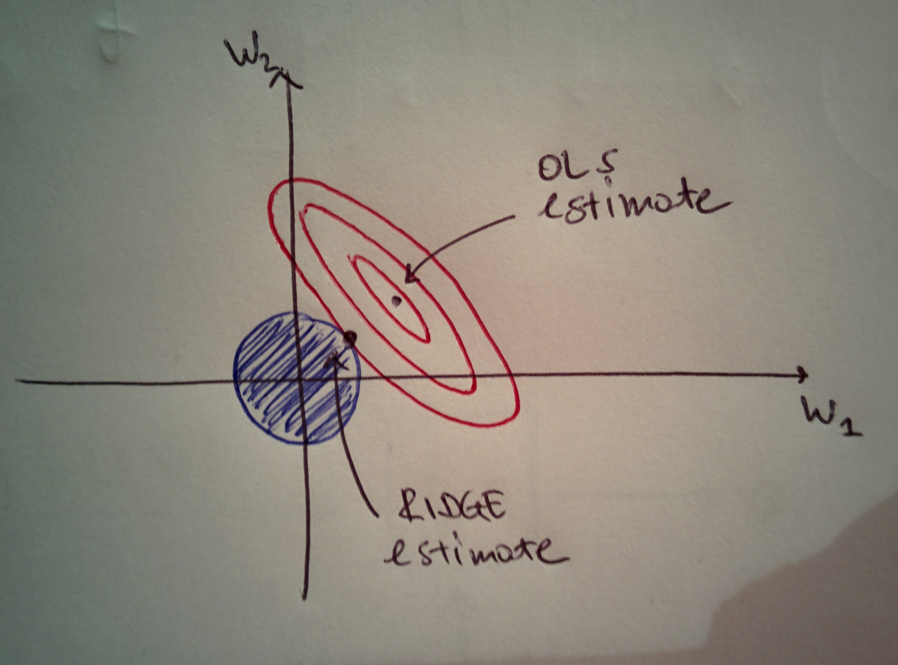
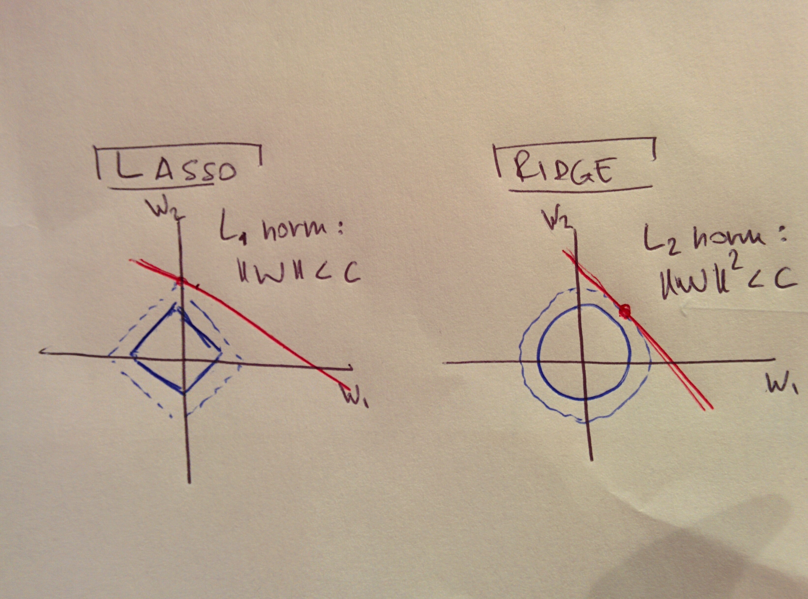

# Regularisation techniques

Regularisation is the procedure whereby you add terms to the cost function your algorithm is trying to minimise in order to control for overfitting and in cases when the problem is ill-posed, like when there are multiple or no solutions to the problem.

## Ridge: $$L_2$$ 

Ridge regression, or Tikhonov-Philips regularisation, adds a quadratic term to the cost function, hence the $$L_2$$ type.

### In general terms

Refer to the page about Linear Regression for a presentation of the Ordinary Least Squares method:



Discussion borrowed from [Wikipedia](regularisation-techniques.md#references). Suppose we want to solve the problem

$$
A x = b
$$

While OLS minimises the function $$||Ax - b||^2$$ , Ridge regression minimises $$||Ax - b||^2 + ||\Gamma x||^2$$ , where $$\Gamma$$ is called the _Tikhonov matrix_, usually chosen as a multiple of the identity $$\mathbb{1}$$, and serves the purpose of giving preference to solutions with small norms. The explicit solution is

$$
x = (A^t A + \Gamma^t \Gamma)^{-1} A^t b
$$

and the effect of the regularisation may be varied via the scale of the matrix $$\Gamma$$ . For $$\Gamma = 0$$ , we fall back on the OLS solution, provided $$A^t A$$ exists.

### In linear regression

In the context of linear regression, where $$w$$ are the parameters, the Ridge regularisation solves the problem

$$
\min_w ||wx - y||^2 + \beta ||w||^2 \ \ , \ \ \beta \geq 0
$$

where the regularisation term is a way to penalise large coefficients. This regularisation is usually applied when there are too many predictors \(features\), for instance when the number of input variables exceeds the number of observations; in such cases fitting the model without penalisation will result in large sizes for the coefficients so the added term controls for this behaviour.

In fact, the Ridge problem is equivalent \(thinking in terms of Lagrange multipliers\) to minimising $$||wx - y||^2$$ under constraint

$$
||w||^2 < c \ ,
$$

for some $$c > 0$$ , which means constraining the sizes of the coefficients. Therefore, Ridge regression is equivalent to putting a threshold on the size of the parameters. The trade-off is that a large $$w$$ would give a better RSS but the penalty term would be higher. A small $$w$$ instead, would given a lower RSS and is preferable.

The larger the $$\beta$$used, the more we want the coefficients close to 0.

The figure shows the relation between an OLS and a Ridge solution, in the case of 2 dimensions. The ellipses are the contours of the residual sum of squares: the inner ellipse has the smallest RSS, which is minimised at the estimate point. The constraint in ridge regression corresponds to a circle. We are trying to minimise the ellipse size and the circle simultaneously so the estimate is the point of contact between the ellipse and the circle.

Ridge shrinks coefficients but does not nullify any. The solutions of a Ridge regression have to be found by solving \( $$E$$ is the error function\)

$$
\frac{\partial E}{\partial w_j} = 2 \sum_i (y_i - w_j X_{ij})(-X_{ij}) + 2 \beta w_j = 0 \ ,
$$

getting to

$$
w_j = \frac{-\sum_i X_{ij} y_i}{\sum_i X_{ij}^2 + \beta} = \frac{w_j^0}{\sum_i X_{ij}^2 + \beta} \ ,
$$

$$w^0$$ being the solution of a normal regression and the denominator being a function of $$\beta$$. So it's apparent that Ridge scales the coefficients by a constant factor.

## LASSO: $$L_1$$ 

[LASSO](regularisation-techniques.md#references) \(_Least Absolute Shrinkage \(and\) Selection Operator_ \) is a $$L_1$$ regularisation where the cost function to be minimised is

$$
||w x - y||^2 + \alpha ||w||_1 \ .
$$

This is equivalent \(thinking in terms of Lagrange multipliers\) to minimising $$||w x - y||^2$$ subject to constraint $$||w|| < c$$ with $$c$$ being a tuning parameter.

If $$c$$ is large enough, the regularisation has no effect and the solution is the OLS one; for a sufficiently small $$c$$ instead, the solutions are the shrunken versions of the OLS ones. LASSO shrinks some coefficients and sets some to 0.

LASSO solves

$$
\frac{\partial E}{\partial w_j} = 2 \sum_i (y_i - w_j X_{ij})(-X_{ij}) + 2 \beta = 0 \ ,
$$

giving

$$
w_j = \frac{-\sum_i X_{ij} y_i - \beta}{\sum_i X_{ij}} = \frac{w_j^0 - \beta}{\sum_i X_{ij}}
$$

So it's clear that LASSO shifts the coefficients by a constant factor, allowing for the possibility to set some to 0.

## Elastic net

[Elastic net ](regularisation-techniques.md#references)is a linear combination of $$L_1$$ and $$L_2$$ regularisations so that the function to be minimised is

$$
||wx - y||^2 + \alpha_1 ||w_1|| + \alpha_2 ||w_2||^2
$$

## References

1. Wikipedia on the Tikhonov regularisation
2. R Tibshirani, Robert, **Regression Shrinkage and Selection via the lasso**, _Journal of the Royal Statistical Society B_, 58:1, 1996
3. H Zou, T Hastie, **Regularization and Variable Selection via the Elastic Net**, _Journal of the Royal Statistical Society B_, 67:2, 2005

