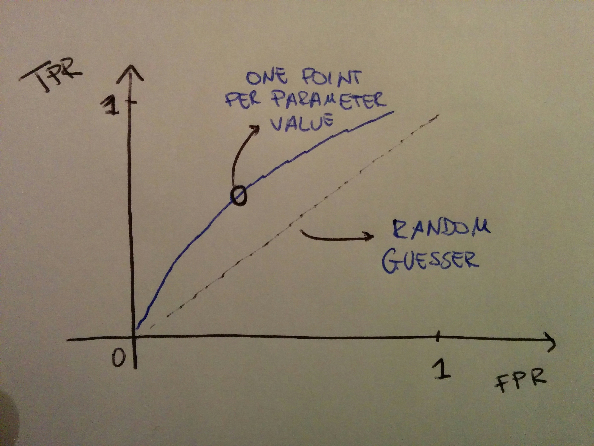
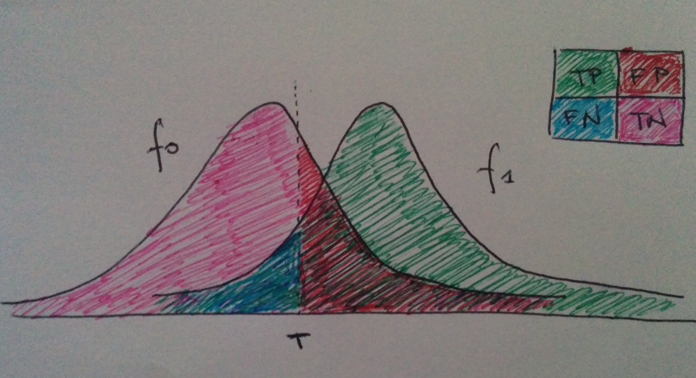

# The ROC curve

## Intro

 

**ROC** stands for _receiver operating characteristic_ and is a curve first designed and used at the times of World War I for radar signals purposes. It is a curve used to validate the performance of a binary classifier which depends on a threshold parameter when it varies.

The ROC plots the true positive rate against the false positive rate at each varying value of the parameter, also called threshold. See the [note](../perf-metrics/classification.ipynb) on the performance metrics for classification for a description of those. In this plane, the point \(0, 1\) represent the perfect classification; the diagonal line shows what a random guesser \(a coin flip\) would give, so that points above it are good results, points below are poorly classified results.

## Details: definition of the ROC curve and the AUC

 

Discussion borrowed from [Wikipedia](the-roc-curve.md#references). Let's say that we got a continuous random variable$$X$$and a binary classifier which depends on a threshold$$T$$, so that$$x > T$$yields a "positive" \(1\) classification and $$x \leq T$$yields a "negative" \(0\) classification. The pdf of$$X$$is$$f_1(X)$$if the point is actually positive and $$f_0(X)$$ if the point is actually negative, so we can write

$$
TPR(T) = \int_T^\infty f_1(x) \ d x
$$

and

$$
FPR(T) = \int_T^\infty f_0(x) \ d x
$$

\(the last one because above $$T$$ the point is classed as positive but it is negative, so follows $$f_0$$\). The ROC curve, plots TPR\(T\) versus FPR\(T\) as a parametric function of $$T$$. At the same time, the other two metrics which quantify the performance of the classification can be expressed as

$$
TNR = \int_{-\infty}^T f_0(x) \ d x
$$

and

$$
TFR = \int_{-\infty}^T f_1(x) \ dx
$$

\(the last one because below T the point is classed as negative but it is actually positive so it follows $$f_1$$\).

The area under the curve \(AUC\) tells us how fast the curve grows \(how convex it is\), quantifying how good its performance is. In a typical use case, different classifiers will be evaluated by comparing their AUCs.

## References

1. [Wikipedia](https://en.wikipedia.org/wiki/Receiver_operating_characteristic) on the ROC

