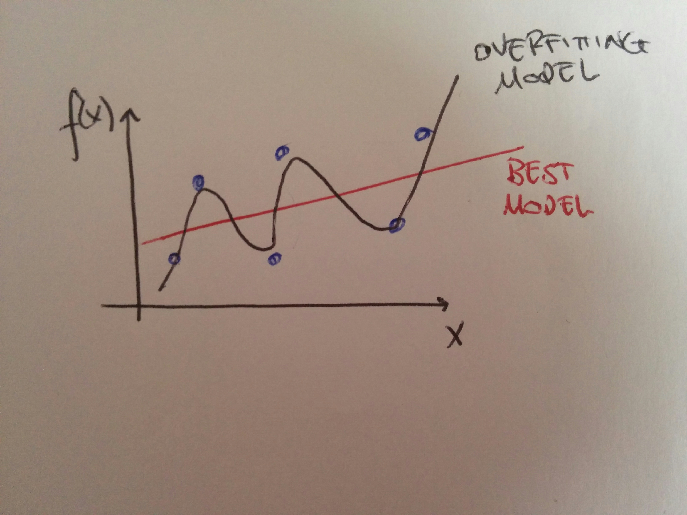
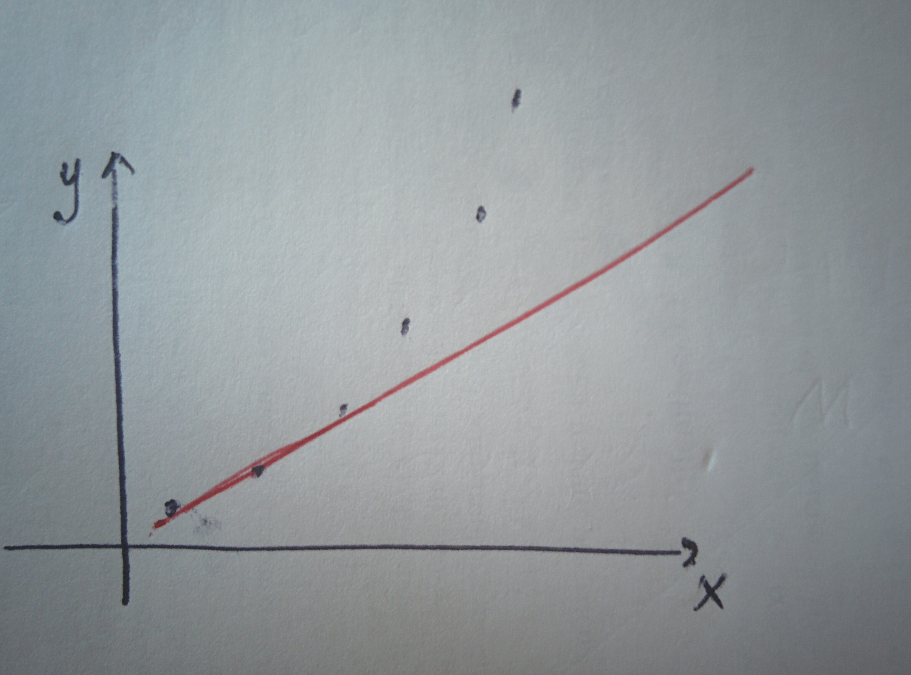

# Overfitting and underfitting

## Overfitting

 

Overfitting happens when the model, as in, the fit to data, follows the data too closely, effectively capturing features of the noise rather than the underlying structure. This implies that said model is not well generalisable to new data.

In the image, the model is following the points too precisely, ending up overfitting them. A simple linear model would work better. Overfitting may occur when the model uses too many features, especially if this number is larger than the number of data points in the training data.

Techniques have been developed to address the problem.

## Underfitting

 

On the other hand, underfitting happens when the chosen model fails to capture the trend in the data because it is too simple to explain it. In the image, a linear model is trying to fit points that clearly follow a higher order polynomial!

