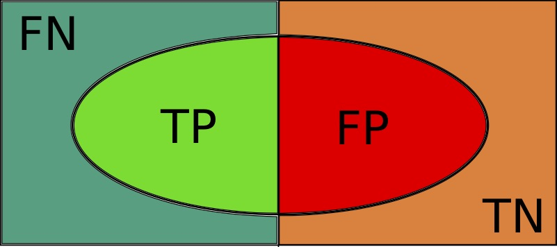
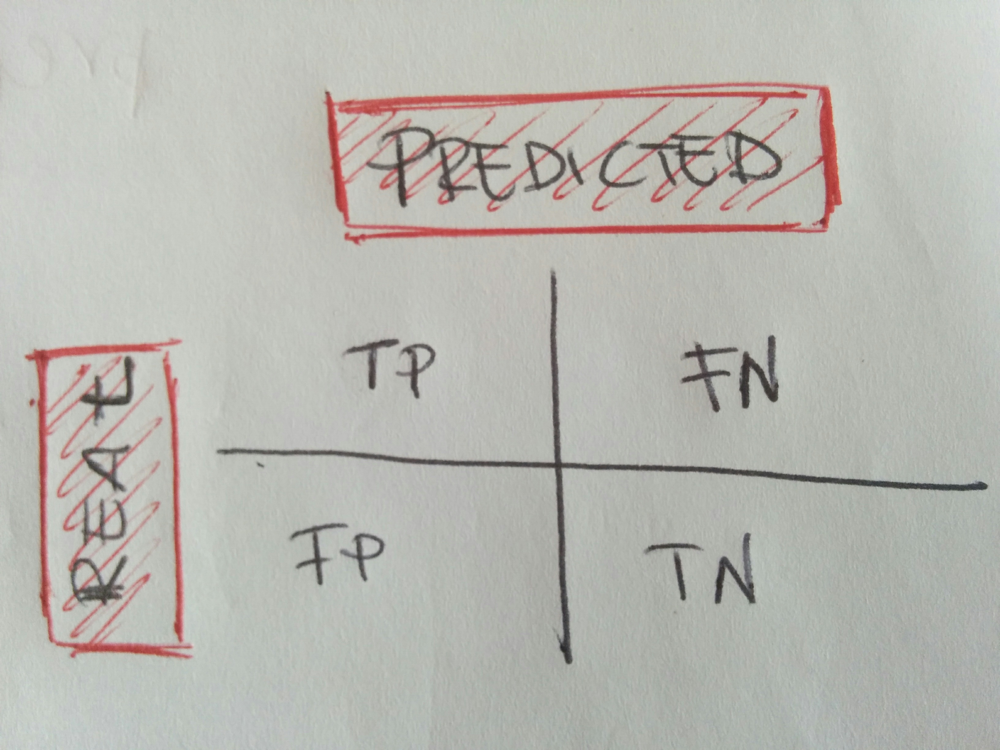
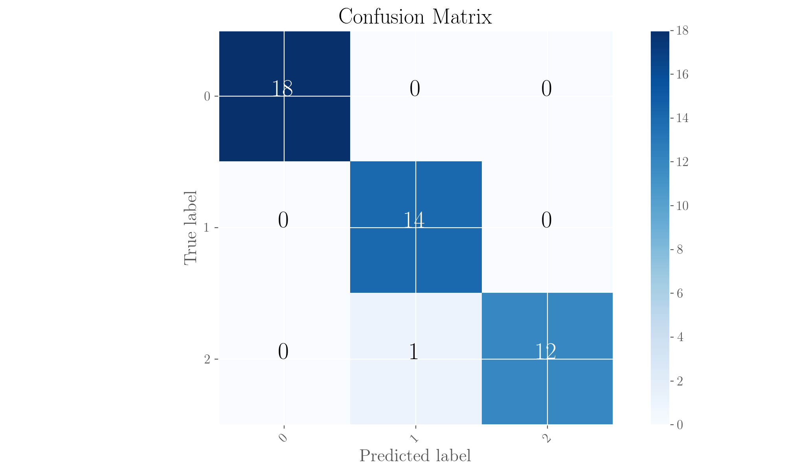
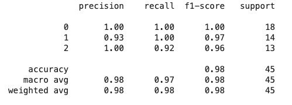

# Classification metrics

For the code in this page, you need these imports:

```python
from sklearn.datasets import load_iris
from sklearn.metrics import confusion_matrix
from sklearn.ensemble import RandomForestClassifier
from sklearn.model_selection import train_test_split
from sklearn.metrics import accuracy_score, precision_score, recall_score, classification_report

from matplotlib import pyplot as plt
import numpy as np
import itertools
```

## Possible outcomes of a classification task and the confusion matrix

If we are in a binary classification problem where the two classes are 1 \(call it positive\) and 0 \(call it negative\), our model can spit out either of them, but chances are some points will be classified wrongly. This leaves us with 4 possible situations in terms of how the points get classified based on what they actually are:

* _**TP**_: True Positives, those points which are classified as 1 and are actually 1;
* _**TN**_: True Negatives, those points which are classified as 0 and are actually 0;
* _**FP**_: False Positives, those points which are classified as 1 but are actually 0;
* _**FN**_: False Negatives, those points which are classified as 0 but are actually 1



A useful graphic representation of the categories above is given in the figure above.

The sum of counts in each of the categories, which is represented by the total area of the picture, equals the total of data points classified. The area of the ellipse, which is given by TP + FP \(note this is an abuse of notation: we're using the symbols above to mean the counts of the categories here!\), will give the total of points classified as positive; the area of the green parts, equalling TP + FN is the total of points which are actually positives; the area of the red parts, equalling FP + TN, is instead the total of points which are actually negatives.

These categories and the terminology we set here will be used in the following to define the metrics we can use to assess the performance of a classifier.

Note that we have specifically and for the sake of simplicity referred to the case of a binary classifier, but this framework is extensible to a generic multi-class classification with little work: you'd just have to consider that for each of the classes, you'll have points classified correctly and points classified as belonging to another class, so there will be counts of wrongly classified points in each class. We'll expand on this soon.

### The confusion matrix

 

Also known sometimes as _contingency table_ or _error matrix_, it is a good tool to have a quick eye-catching assessment of the performance of a classifier. Again in the simple case of a classification problem with two classes \(binary classification\), the confusion matrix is, considering the categories of points described above, displayed in the figure. It is literally just a square matrix with all the counts.

In the case of a multi-class classification problem with$$n$$classes, the matrix will be a$$n \times n$$one where the diagonal contains the true positives for each class, and out of diagonal items will report the number of wrongly classified items, class by class. In short, the categories are per class and for the wrongly categorised points you can compute how many points of actual class A are classified in class B, etc, for each class.

We'll now show what we mean using data from the [Iris dataset](https://en.wikipedia.org/wiki/Iris_flower_data_set), an old dataset created by Fisher which is now widely used for pedagogical purposes to illustrate the use of algorithms. It contains data for three species of Iris flowers \(we'll use numerical indices to indicate them here\), data being the lengths and widths of the petals and sepals. We'll use this data to classify the species and we'll employ a Random Forest classifier for the task \(see page\). 



This dataset can be called directly from `scikit-learn`, so quite useful. 

Let's see this. The classes of Iris species we have are called 0, 1 and 2. The matrix will show, from the test set, how many points get classified in each class for each class.

First, this is a routine to compute and plot a confusion matrix given the real classes and the classifier outcomes:

```python
def do_plot_conf_mat(targets_true,
                     targets_pred,
                     labels=None,
                     normalize=False,
                     cmap=plt.cm.Blues):
    """
    Compute the confusion matrix of a classifier and plot it 
    with overlayed numbers on each cell.
    Conf Mat will have the real targets on the rows and 
    the predicted targets on the columns.
    INPUT:
        - the list of real targets for samples
        - the list of predictes samples for samples
        - the list of labels to be plotted in that order on the cells rows/colums
            * defaults to None, which will put cells in the sorted order of all 
              targets found (all available classes will be used)
            * if list is given, this will automatically adjust cell values to 
              that order because this is what confusion_matrix does automatically
              In this case, you can pass a list containing only the classes 
              of your interest for the matrix.
        - boolean about whether to normalize matrix (by row) 
          or not (default:False)
        - the map of gradient colours to apply
    OUTPUT:
        - the conf matrix
    NOTEs:
        * overlayed numbers in the normalised case are printed 
          with 2 decimal digits
        * gradient colourbar on the side will always report non-normalised values
        * If normalised, the diagonal of the conf mat will give 
          the rate of correctly classified samples in each class
    """

    # Compute the confusion matrix
    cm = confusion_matrix(targets_true, targets_pred, labels=labels)

    # Set the title
    title = 'Confusion Matrix'

    if not labels:
        labels = sorted(list(set(targets_true) & set(targets_pred)))

    # Set plotting parameters
    plt.imshow(cm, interpolation='nearest', cmap=cmap)
    plt.colorbar()
    tick_marks = np.arange(len(labels))
    plt.xticks(tick_marks, labels, rotation=45)
    plt.yticks(tick_marks, labels)

    if normalize:
        cm = cm.astype('float') / cm.sum(axis=1)[:, np.newaxis]
        title += ', normalized (by row)'

    # this is for overlaying the numbers on cells
    thresh = cm.max() / 2.
    for i, j in itertools.product(range(cm.shape[0]), range(cm.shape[1])):
        plt.text(j, i, round(cm[i, j], 2),
                 horizontalalignment="center",
                 color="white" if cm[i, j] > thresh else "black")

    plt.tight_layout()
    plt.ylabel('True label')
    plt.xlabel('Predicted label')
    plt.title(title)

    plt.show()

    return cm
```

Let's now run the classification and plot its confusion matrix:

```python
# Load the Iris dataset from sklearn, separating the data matrix and the array of classes
iris = load_iris()
X = iris.data
y = iris.target

# Initiate the classifier (using default parameters)
rf = RandomForestClassifier()

# Splitting the dataset into train and test (70%/30%)
X_train, X_test, y_train, y_test = train_test_split(X, y, test_size=0.3)

# Fitting model on training set and predict on test set
rf.fit(X_train, y_train)
y_pred = rf.predict(X_test)

# Plot the confusion matrix
do_plot_conf_mat(y_test, y_pred)
```



## Per-class performance metrics

In the generic case of a multi-class classification, the results in each of the classes can be assessed. For each class, we can compute the metrics described here. We will also show their values in the little Iris classification from above.

The binary classification case would just be a special case of this so we thought we'd stay general. In this general case, the categories of points illustrated above refer to the specific class we're monitoring, so while TP is the diagonal value for class in the confusion matrix, FP will be the total of false positives for it, that is, the sum of values in the column for class in matrix excluding the diagonal value. With the same reasoning, FN will be the total of false negatives for the class, that is, the sum of values in the row for the class in the confusion matrix, excluding the diagonal value.

### Precision and specificity

The precision, referred to a class, is defined as

$$
p = \frac{TP}{TP + FP} \ ,
$$

and is the fraction of true points in that class over the total of points classified as belonging to that class. The precision is a measure of how _useful_ the classified results are as it gives the fraction of relevant items to the total classified in class. With reference to the ellipse figure above, precision is the fraction of the TP area in the ellipse to the whole ellipse area. A precision of 1 means that all samples in class were correctly classified.

In the case of a binary classification, the equivalent of precision but for the negative class is called _specificity_, or _true negative rate_, and is defined as

$$
s = \frac{TN}{TN + FP} \ .
$$

### Recall

The _recall_, also called _sensitivity_, or _true positive rate_, is defined as

$$
r = \frac{TP}{TP + FN} \ ,
$$

and gives the fraction of true positives for the class over the total of points belonging to the class. It is a measure of how _complete_ the results are, meaning how many of the real points in class are retrieved.

A recall of 1 means that all items in the class where actually classed as in class.

### An example on precision vs. recall

This is taken from the [Wikipedia page](classification-metrics.md#references) on precision and recall.

Let us imagine there is a surgeon who needs to remove all cancerous cells from a patient to prevent regeneration. In the process, if healthy cells are removed as well, this would leave disgraceful lesions to the organs involved. The decision to increase recall at the cost of precision is one where more cells than needed are removed and ensure that all bad ones will go. The decision to increase precision at the cost of recall, on the other hand, would see the surgeon be more conservative and ensure only bad cells are removed, at the cost of not removing them all.

### The F-score

While precision and recall measure different things, often related in such a way that increasing the one will decrease the other, the _F-score_ is a single metric which brings both information together.

In general, a F-score is defined as

$$
F_\beta = (1 + \beta^2)\frac{pr}{\beta^2p + r} \ \ \beta > 0, \beta \in \mathbb{R}
$$

The most commonly seen metric in this class is the _F1-score_, which is just the [harmonic mean](../../maths/measures.ipynb#The-harmonic-mean) of precision and recall:

$$
F_1 = 2 \frac{pr}{p + r}
$$

The general F-score furnishes a way to decide to weigh precision and recall differently: while the F1-score weighs them equally, the $$F_2$$-score gives more weight to the precision and the $$F_{0.5}$$-score does the reverse, for instance.

### In the case of our classifier above ...

Let's have a look at these per-class metrics for the classification problem we pursued above! We use the [`sklearn.metrics.classification_report`](http://scikit-learn.org/stable/modules/generated/sklearn.metrics.classification_report.html#sklearn.metrics.classification_report) for the job, which is a convenient routine spitting out the three metrics we just described, for all classes, in one go. Note that for each metric it also furnishes the weighted value based on the support of the class, namely for the average precision, for instance,

$$
p_{avg} = \sum_c^C p_c s_c \ ,
$$

where the sum runs over all the classes,$$p_c$$and$$s_c$$are, respectively, the precision and the support of the class.

```python
# sklearn furnishes a report of these metrics for all classes in one go!
print(classification_report(y_test, y_pred))
```

which gives these results:



## Global metrics

These metrics are meant to assess the performance of the classifier as a whole and not referring to each specific class. We already outlines the weighted average of precision, recall and F-score above, which serve exactly this purpose.

### Accuracy

The \(global\) _accuracy_ of a classifier is defined as

$$
a = \frac{\sum_c^C TP_c}{N} \ ,
$$

and measures the total number of correct predictions over the total of data points \(N is the total of points and the sum runs over the classes, summing the counts of true positives in each\). It would be the first thing which comes to mind \(I mean, the simplest thing to do\) when assessing a classifier's performance and indeed gives insight on how good it is to class points. But, its weak spot is that it gives no insight on the difference between the two types of errors: false positives and false negatives, treating them on the same ground. Plus it hides all information on which classes is doing better/worse.

```python
accuracy_score(y_test, y_pred)
```

Gives a solid 97%.

In reality, the accuracy can also be computed per class. See the example below.

## A final example - a cautionary tale on accuracies per-class and global

Let us assume that we have a binary classifier, tested on 100 samples for class 1 and 200 samples for class 0 and whose performance reports these results:

* TP = 80;
* FN = 20;
* FP = 5;
* TN = 195

The accuracy gives $$a = \frac{80 + 195}{80 + 20 + 5 + 195} = 0.91$$ , so quite high. But this masks the fact that actually class 1 has a misclassification rate of$$20/100$$\(class 0 has a misclassification rate of$$5/200$$, so quite small\). In terms of accuracies per class \(the complements of these misclassification rates\), class 1 has $$a_1 = 0.8$$ and class 0 has$$a_0 = 0.975$$ , so that the macro-average of the per-class accuracies is

$$
a_p = \frac{1}{2} \left(0.8 + 0.975 \right) = 0.88
$$

## References

1. A nice detailed [document](http://www.clips.uantwerpen.be/~vincent/pdf/microaverage.pdf) on classification metrics from the University of Antwerp
2. [Wikipedia](https://en.wikipedia.org/wiki/Precision_and_recall) on precision and recall

