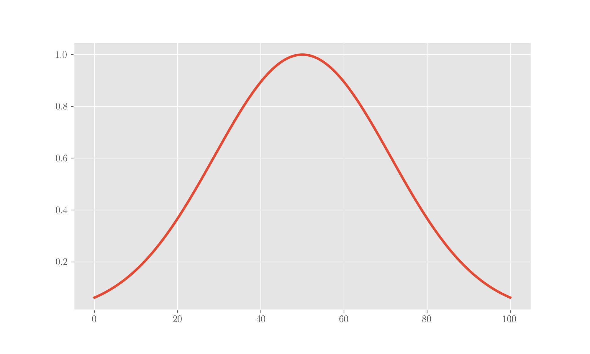

# What's in the residuals of a regression?

Refer to the page on linear regression for OLS:



and to the page about the performance metrics in regression:



For the code, you will need some imports

```python
import numpy as np
import statsmodels.api as sm
from matplotlib import pyplot as plt
import pandas as pd
```

## What are the residuals

For each point labelled $$(x_i, y_i)$$ __in the data set, where$$x_i$$is the independent variable and$$y_i$$the dependent variable, its **residual**$$r_i$$is the difference between the _observed_ value of the dependent variable $$y_i$$ __and the _predicted_ value $$\hat y_i$$ \(the point on the fitting curve\):

$$
r = y_i - \hat y_i \ .
$$

Residuals represent the variation not captured by the fit. The concept of _residual_ and that of _error_ are similar and easy to confuse; the error has in fact the same definition except for the fact that the difference is computed between the _observed_ value of the independent variable and the _real_ one, that is, the unknown population value of which the _observed_ one is an observation. Residuals have the role of an _estimate_ of the errors.

Note that we framed this in one dimension here, but the definition is general to any number of dimensions.

The general assumption of a linear regression is that residuals are _normally distributed_ around a mean of 0, because the model is expected to predict higher than the actual value or lower than the actual value with the same probability, or, to phrase it better, because we expect residuals to be pure noise and not display any pattern.

## Let's play with them

### On some fake data

Let us fabricate some data and fit them with OLS in order to have a look at the residuals. We use 500 independent variables in the range 0 to 100:

```python
x = np.linspace(0, 100, num=500)
```

and a dependent variable which lies on a line with slope 2 but contains some noise. Noise is given in such a way that its amplitude is extracted from a gaussian trend, this gaussian:

```python
x = np.linspace(0, 100, num=500)
g = np.exp(-(x-50)**2/30**2)

plt.plot(x, g)
plt.show();
```



This way points in the middle of the scale are given higher possibility to vary from the line. So these are the $$y$$ points:

```python
y = [2 * i + np.random.randint(-np.exp(-(i-50)**2/30**2)*30, np.exp(-(i-50)**2/30**2)*30) for i in x]
```

Let's fit an OLS on these data \(using [`statsmodels`](http://statsmodels.sourceforge.net/stable/)\). We see that the slope we obtain is $$\approx 1.99$$ and the $$R^2$$comes as 0.99.

```python
# fit an OLS, just the slope (intercept is 0)
fit_result = sm.OLS(y, x).fit()
fit_result.summary()
```


Now let's plot both the data points and the fitting line: the fact that residuals are larger in the middle is quite visible.

```python
plt.plot(x, y, 'o', label='points')
plt.plot(x, fit_result.params * x, label='fit')
plt.xlabel('$x$')
plt.ylabel('$y$')
plt.legend()
plt.show();
```


Residuals are, as expected, normally centered around 0:

```python
plt.hist(fit_result.resid, bins=20)
plt.title('Histogram of the residuals')
plt.show();
```


In this silly dataset, residuals are normally distributed but they display a pattern with the independent variable \(well, _we_ have imposed it!\). In fact, if we plot a scatter of them against $$x$$, this appears very clearly: points in the middle have larger errors.

This because we have imposed this feature to our data so it is an obvious "discovery", but in a general case the analysis of the trend of residuals can lead to interesting considerations which the sole histogram would hide. See the treatment in the [first reference](whats-in-the-residuals-of-a-regression.md#references) for a vivid example.

```python
plt.scatter(x, fit_result.resid)
plt.vlines(x, 0, fit_result.resid, lw=1)
plt.xlabel('$x$')
plt.ylabel('$r$')
plt.title('Residuals vs. x')
plt.show();
```


### On some real data

We'll now use one of the datasets readily available in `statsmodels` to perform an OLS. In particular, let's choose the dataset named [_Scotland_](http://statsmodels.sourceforge.net/0.5.0/datasets/generated/scotland.html), which contains data about the devolution referendum held in Scotland in 1997: the question to the voters was about the creation of a Scottish Parliament with its own powers, specifically over taxation.

There are 32 rows in the data, one for each county and 8 attributes, the dependent variable is the proportion of YES votes obtained. The attributes are:

* _COUTAX_: £ of council tax
* _UNEMPF_: percentage of total unemployment benefits claims from females
* _MOR_: standardised mortality rate \(UK one set to 100\)
* _ACT_: percentage of labor force participation
* _GDP_: GDP
* _AGE_: percentage of children aged 5 to 15
* _COUTAX\_FEMALEUNEMP_: _COUTAX \* UNEMPF_

```python
dataset = sm.datasets.scotland.load_pandas()
df = dataset.data
```

This is a sample of the dataset:

```python
df.head()
```


And these are the basic statistics and correlations:

```python
df.describe()
df.corr()
```


Using all the attributes, an OLS fit yields a very high$$R^2$$:

```python
fit_result = sm.OLS(dataset.endog, dataset.exog).fit()
fit_result.summary()
```


This is the histogram of residuals \(note that the number of points is quite small\):

```python
plt.hist(fit_result.resid, bins=10)
plt.title('Histogram of residuals')
plt.show();
```


Clearly we cannot reproduce the residual plot we did above because we have a matrix of independent variables in this case and not a 1-dimensional array.

## Which points are "influential"?

### The projection matrix

A data point is _influent_ in a regression if any changes to it would sensibly modify the regression. The influence is quantified via the _projection matrix_ \([Wikipedia](whats-in-the-residuals-of-a-regression.md#references) gives a nice overview\), also called _influence matrix_ or _hat matrix_, which is matrix$$\mathbf P$$such that

$$
\mathbf{\hat y} = \mathbf{P y} \ ,
$$

where$$\mathbf{\hat y}$$is the fitted dependent variable and$$\mathbf{y}$$is the observed dependent variable. You see why the name "hat matrix".

Because in a linear model$$\mathbf{y} = \mathbf{X} \boldsymbol{\beta} + \mathbf{\epsilon}$$we have

$$
\boldsymbol{\hat \beta} = (\mathbf{X}^t \mathbf{X})^{-1} \mathbf{X}^t \mathbf{y} \ ,
$$

where$$\boldsymbol{\hat \beta}$$are the estimated parameters such that$$\mathbf{\hat y} = \mathbf{X} \boldsymbol{\hat \beta}$$, it follows that

$$
\mathbf{P} = \mathbf{X} (\mathbf{X}^t \mathbf{X})^{-1} \mathbf{X}^t \ .
$$

The diagonal elements in $$\mathbf{P}$$are called the _leverages_:

$$
l_i = p_{ii} = \frac{\partial \hat y_i}{\partial y_i}
$$

Leverages quantify the influence of each point in the dataset.

The projection matrix is idempotent:

$$
\mathbf{P}^2 = \mathbf{X} (\mathbf{X}^t \mathbf{X})^{-1} \mathbf{X}^t \mathbf{X} (\mathbf{X}^t \mathbf{X})^{-1}  \mathbf{X}^t = \mathbf{X} (\mathbf{X}^t \mathbf{X})^{-1} (\mathbf{X}^t \mathbf{X}) (\mathbf{X}^t \mathbf{X})^{-1}  \mathbf{X}^t = \mathbf{X} (\mathbf{X}^t \mathbf{X})^{-1} \mathbf{X}^t = \mathbf{P} \ ,
$$

a property which will come in handy in the following. More properties and detailed proofs around the projection matrix can be found in the [third reference](whats-in-the-residuals-of-a-regression.md#references).

### Studentising the residuals

"Studentising" \(from [W S Gosset, aka "Student"](https://en.wikipedia.org/wiki/William_Sealy_Gosset)\) the residuals is a way to normalise them to a measure of their error in such a way that they are rendered comparable to one another. The idea is that residuals are _estimates_ of the error, so simply dividing them by their sample standard deviation would not be the best of ideas. A clean way has been provided by Mr. Student and it relies on the projection matrix.

Now the residual is expressed by

$$
\mathbf{r} = \mathbf{y} - \mathbf{\hat y} = (\mathbb{1} - \mathbf{P}) \mathbf{y} \ ,
$$

and we want to compute an estimate of its variance.

Because $$Var[\mathbf{X a}] = \mathbf{X} Var[\mathbf{a}] \mathbf{X}^t$$ \(see the page on the moments of a distribution for the proof\) it follows that the variance of the residuals is given by \(we are using the idempotence of the projection matrix\):

$$
Var[\mathbf{r}] =  (\mathbb{1} - \mathbf{P}) Var[\mathbf{y}] (\mathbb{1} - \mathbf{P})^t =  \sigma^2 (\mathbb{1} - \mathbf{P})^2 =  \sigma^2 (\mathbb{1} - \mathbf{P}) \ ,
$$

hence

$$
Var[r_i] = \sigma^2 (1 - l_i)
$$

where $$\sigma^2$$ is the variance of the independent observed variables.

Studentised residuals are obtained dividing the residual by their standard deviation so calculated:

$$
s_i = \frac{r_i}{\sigma \sqrt{(1-l_i)}}
$$

### The influence plot

The influence plot is obtained by displaying the studentised residuals in a regression against their leverage. This way, in a diagnosis effort, it can be visually monitored which points have the highest influence on the regression itself.

`statsmodels` makes everything super-easy as it has an API for plotting this data directly, which in the case of our data from above leads to \(the size of the bubbles is given by [Cook's distance](https://en.wikipedia.org/wiki/Cook%27s_distance)\):


What we see here is that there are points whose \(studentised\) residuals are not that high but which exercise a certain influence on the regression, so that removing/changing them would lead to a different outcome.



## References

1. D J Wheeler, [Should residuals be normal?](http://www.qualitydigest.com/inside/quality-insider-article/should-residuals-be-normal.html)
2. [Wikipedia](https://en.wikipedia.org/wiki/Projection_matrix) on the projection matrix
3. C E Ginestet, [**Hat Matrix: Properties and Interpretation**](http://math.bu.edu/people/cgineste/classes/ma575/p/w5_1.pdf), _Boston University lecture class_ 
4. [A worked example in R](http://www.stat.columbia.edu/~martin/W2024/R7.pdf)

