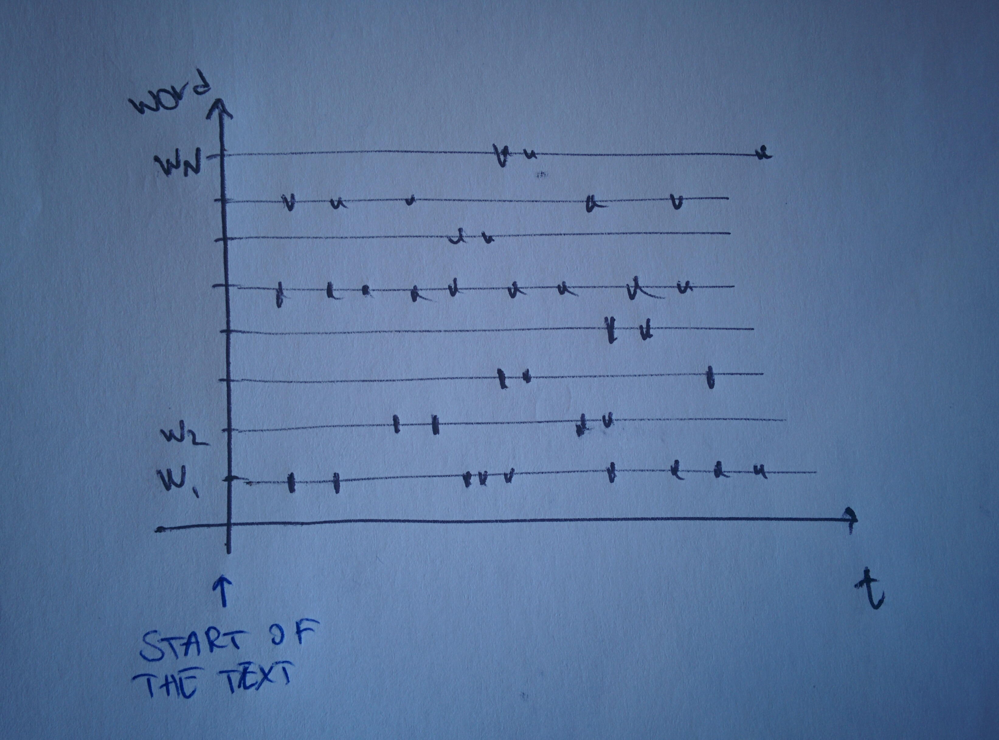

# Some concepts and basic tasks in Linguistics

This page collects some definitions of important concepts of Linguistics used in NLP, as well as basic tasks when dealing with words. A good book for an overview of NLP and introduction to the techniques is this [famous O'Reilly book](some-concepts-and-basic-tasks-in-linguistics.md#references). 

## A little linguistics glossary

### Antonyms & Synonyms

**Antonyms** are words with opposite semantic meaning; **synonyms** are words with the same semantic meaning.

_Examples_:

* beautiful/ugly \(**A**\); beatiful/pretty \(**S**\)
* big/small \(**A**\); big/large \(**S**\)

### Collocation

A **collocation** is a series of words which, in a text, occurs more often than it would by simple chance. Phrasal verbs in English are good examples.

_Examples_:

* white wine
* go out
* come in
* ...

### Concordance

The **concordance** of a word \(or phrase\) is a list of all occurrences and contexts of the given word \(or phrase\) in a corpus.

### Context-free grammar

A context-free grammar, shortened CFG, is a grammar paradigm invented by Chomsky in the 1950s to define the structure of sentences in a formal language, in the sense that it's a set of rules describing all possible elements of the language. Specifically, a CFG contains

* a list of syntactic categories for words
* a set of rules 

### Corpus

A **corpus** is a collection of texts, it can be generalistic \(not topic-based\) or specialistic. One example is the Corpus of Historical American English, or [CoHA](http://corpus.byu.edu/coha/) which at the time of writing is the largest existing corpus for the English language in history.

#### The Brown Corpus

Compiled in the 1960s at Brown University, it is the first appeared digital corpus of the \(American\) English language.

### Dispersion plot

 

It is a plot that, starting from where a text starts, displays where each word appears, giving an idea of both how often it is present but also how far from the etxt start it is and with which constancy.

### Entailment

**Entailment** is logical consequence. A sentence is entailed by another one if it logically follows it.

_Examples_:

* I woke up. I am awake. 
* He sleeps. He snores. \(_he cannot snore without sleeping_\)

### Some famous exemplar sentences

#### **"Colourless green ideas sleep furiously"**

A sentence by N Chomsky from his book _Syntactic structures_, released in 1957, it is an example of a sentence which is grammatically admissible but totally non-sensical.

#### **"Buffalo buffalo buffalo buffalo buffalo buffalo buffalo buffalo"**

This is a grammatically correct sentence which can be interpreted differently depending on how it gets parsed. It is taken from D Borgmann's _Beyond Language: Adventures in Word and Thought_, 1967.

The word "buffalo" can mean any of three things:

* the animal
* the city in the state of New York
* a verb which means "to intimidate"

With this, one of the possible parses would read _the buffalo from Buffalo that the buffalo from Buffalo intimidate, intimidate \(other\) buffalo from Buffalo_

### Hapax Legomenon

An **hapax legomenon** is a word or expression which appears only once in a text.

### Homophones

**Homophones** are words with the same pronunciation but different meaning.

### Hypernyms & Hyponyms

An word$$w_1$$is a **hypernym** of another word$$w_2$$if$$w_2$$is a kind of$$w_1$$, that is, if there is a downward hierarchical relation from$$w_1$$to$$w_2$$.

_Examples_:

* "mammal" is an hypernym of "kangaroo"
* "food" is an hypernym of "pasta"

On the other hand, a word$$w_1$$is an **hyponym** of a word$$w_2$$if the hierarchical relationship is reversed, that is, if$$w_1$$is contained in the concept of$$w_2$$.

_Examples_:

* "carrot" is an hyponym of "vegetable"
* "cotton" is an hyponym of "textile"

### Meronyms & Holonyms

A word$$w_1$$is a **meronym** of a word$$w_2$$if it describes something which is a constituent part of it.

_Examples_:

* "toe" is a meronym of "foot"
* "door" is a meronym of "house"

On the other hand, a **holonym** is the opposite concept: a word which describes the whole thing.

_Examples_:

* "flower" is a holonym of "petal"
* "shirt" is a holonym of "button"

### Noun Phrase \(NP\)

The NP is a phrase containing a noun or pronoun as the head, or a group of tokens with noun function. It can be replaced with a single pronoun without loss of grammatical validity.

_Examples_ \(NP highlighted in **bold**\):

* The **school** is there.
* The **cranberry-based yoghurt** is delicious for **young children**.
* There can be **several noun phrases** in **a single sentence**.
* **He** saw **someone**.

### Stem & Lemma

Both the processes of stemming and lemmatising a word refer to reducing it to the mother root of it, so that, say _cats_ and _cat_ would be considered the same. But they slightly differ. The process of _stemming_ a word is a very rough and heuristic one, which cuts the end based on some given rules \(for instance, it assumes an ending in -s for an English word must indicate a plural form in the case of a noun and a third person inflection in the case of a verb, so chops it\); the process of _lemmatising_ a word is a bit more sophisticated, uses morphology and grammar to decide when and what to cut, mapping the word to its very root vocabulary form. For instance, the lemma for _better_ is _good_ and stemming wouldn't catch it.

Have a read a this great [page](some-concepts-and-basic-tasks-in-linguistics.md#references) from the Stanford NLP group on the topic, which is enriched with examples.

### Stopwords

Stopwords are those words in natural language which carry no own meaning and serve the purpose of connecting other words together to create grammatical sentences. They are essential components of grammar and needed for effective communication, but do not have semantic significance. Best examples are articles \("the", "a", ...\), personal pronouns \("I", "me", "you", ...\) or prepositions \("in", "on", "to", ...\). Usually modal verbs and auxiliaries are there as well.

### Synset

A **synset** \(synonym set\) is a group of synonyms.

### Tokens & Types

A **token** is the instace of a concept, while the **type** is the word representing the overarching concept.

For nouns, they can be singular and plural: the token would represent any occurrence of the word while the type the stemmed version of it, so that singular and plural are collapsed into the same type.

For verbs, they can be conjugated in all tenses, so that each inflected verb is a token of the same type. Similarly to all other grammatical categories.

Sentence _"The cat chases the mouse, cats chase mice"_ contains tokens \[_"the", "cat", "chases", "the", "mouse", "cats", "chase", "mice"_\] and types \[_"the", "cat", "chase", "the", "mouse", "cat", "chase", "mice"_\], so the number of unique types is smaller than the number of unique tokens.

### Treebank

A treebank corpus parsed for syntactic structure, that is, one that contains information about the parts of speech and the sentence structure. The first created one is the Penn Treebank, dating back from the early 1990s and created at the University of Pennsylvania.

### WordNet

WordNet is a database for synsets of the English language. It started being compiled at the University of Princeton in 1985 and is available in NLTK.

## An outline of \(some\) tasks in NLP

### POS tagging

It is the process of automatically identifying the POS \(_part of speech_\) of tokens in a text and it is performed through the use of a tagger using info from the context of the word.

### Stemming and Lemmatisation

The two tasks refer to the linguistic difference between stem and lemma.

Stemming is a heuristic way of chopping off the end of a word to isolate its root; lemmatisation is a dictionary and grammar-based method aimed at isolating the real mother lemma the word belongs to.

### Text normalisation

Text normalisation is the comprehensive name for all those sorts of operations on text aimed at cleaning it for analysis, like lowering the case, removing punctuation and so on.

### Tokenisation

It is the task of splitting text into linguistic units. The simplest method is to use whitespace to separate words in a sentence, for instance, but there can be more sophisticated ways as this doesn't work well for things like phrasal verbs, for instance. In any case there is no one-suits-all solution.

### Word-sense disambiguation

It the problem \(which is still an open problem\), started being researched in the 1940s, of detecting the right meaning of a word given the context. It is tackled either via dictionary-based methods or Machine Learning.

### Word alignment

It is the task of aligning corresponding parts of the same sentence in different languages.

## References

1.  S Bird, E Klein, E Loper, [**Natural Language Processing with Python**](http://www.nltk.org/book_1ed/), _O'Reilly_, 2009
2.  [The Stanford NLP group on stemming and lemmatising](https://nlp.stanford.edu/IR-book/html/htmledition/stemming-and-lemmatization-1.html)

