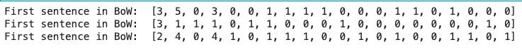

# Text as numerical features

Text is unstructured, and in order for it to be used in a model, we typically need to find a numerical representation of it.

For the code here, you need to run some imports:

```python
import string
```

## The Bag of Words framework

The Bag of Words framework \(usually shortened as the "BoW"\) is possibly the simplest numerical representation of strings of text one could envisage.

[Wikipedia](text-as-numerical-features.md#references) claims that an early reference to this name is present in Z Harris' [paper](text-as-numerical-features.md#references) _Distributional Structure_, of 1954.

In BoW, a text is simply transformed into a "bag" \(a multiset, that is, a set allowing for multiple occurrences\) of the words composing it: this methods is very simplistic in that it disregards grammar and word order.

You have a corpus of sentences. What you do is you take all the unique words in the corpus and for each of the sentences you count the occurrences of each of those words.

### **Example**:

Given a corpus composed by the two texts

1. "John likes watching movies. Mary likes movies too."
2. "John also likes watching football games."

The list of unique words in it is \["John", "likes", "watching", "movies", "also", "football", "games", "Mary", "too"\], there's 9 words.

The two texts get encoded into the lists, 9-items long, of the occurrences counts of all of those words. Respecting the order we chose for the list of unique words, we have:

1. \[1, 2, 1, 2, 0, 0, 0, 1, 1\]
2. \[1, 1, 1, 0, 1, 1, 1, 0, 0\]

This is because "John" \(first item\) appears once in the first text, "likes" appears twice in the first text, and so on.

We can play around with this a bit!

### Play with bag of words

Let's use three sentences:

A. _I like to watch Netflix but can never choose a movie._  
B. _The movie I saw last night was good._  
C. _Mary didn't like the movie but she can choose on Netflix._

Let's now lower the case, remove punctuation and tokenise \(simply space-splitting in this case\) the sentences, gathering all unique words:

```python
# Concatenate sentences, replace punctuation with space and split on space
# Do the same for each single sentence (for later use)

s = s1 + s2 + s3
s = s.lower()
for sign in string.punctuation:
    s = s.replace(sign, ' ')
    s1 = s1.replace(sign, ' ')
    s2 = s2.replace(sign, ' ')
    s3 = s3.replace(sign, ' ')
    
# Create the unique words list
unique_words = list(set(s.split()))

print('unique words are: ', unique_words)
```

This retrieves the unique words: "a", "t", "yesterday", "i", "the", "good", "movie", "choose", "like", "to", "was", "she", "mary", 'but", "watch", "netflix", "can", "didn", "saw", "on"

Finally, for each sentence provided, we now compute its BoW representation:

```python
s1_bow, s2_bow, s3_bow = [], [], []

for word in unique_words:
    s1_bow.append(s1.count(word))
    s2_bow.append(s2.count(word))
    s3_bow.append(s3.count(word))

print('First sentence in BoW: ', s1_bow)
print('First sentence in BoW: ', s2_bow)
print('First sentence in BoW: ', s3_bow)
```



## The TF-IDF framework

TF-IDF stands for _term frequency - inverse document frequency_ and it is an improvement over the BoW model.

There are two main ingredients in the framework. Suppose we are considering a word \(or _term_\)$$t$$and its presence in a set of documents \(texts\)$$D = {d}$$\(corpus\). We have:

* the _term frequency_ $$tf(t)$$ : a function of the number of times $$t$$ appears in a document$$d$$, quantifies the relevance of$$t$$in$$d$$ 
* the _inverse document frequency_ $$idf(d, D)$$: an inverse function of the number of documents in the corpus in which$$t$$appears, it quantifies how spread$$t$$is across$$D$$, so that it will be used to scale down words which are very frequent across the texts

The idea behind the$$idf$$is that words which are very common in the whole corpus \(say articles, for instance\) carry little specific information and need to be weighted down.

The TF-IDF is given as the product of these two components:

$$
tf \ idf(t, d, D) = tf(t, d) \cdot idf(t, D)
$$

The term frequency$$tf$$can be given as either of:

1. raw frequency \(count of occurrences\):$$f_{t, d}$$ 
2. boolean frequency, 1 if $$t \in d$$, 0 otherwise
3. log-scaled frequency$$1 + \log(f_{t, d})$$or 0 if$$t \not \in d$$
4. augmented frequency: $$\frac{f{t, d}}{\max{f{t',d'} : t'\in D}}$$ \(the augmentation is intended as the division by the max of the raw frequencies in the document, so that we control for the bias towards very frequent words in a text\)

The inverse document frequency$$idf$$\(see the [third reference](text-as-numerical-features.md#references) for the original idea of scaling down words by their presence in the corpus\) is given as

$$
idf(t, D) = \log \left[ \frac{\left|D\right|}{\left|\{d \in D: t \in d\}\right|} \right] \ ,
$$

but typically a 1 is added at the denominator to control for those cases where term does not exist in document so it is zero. So the$$idf$$is the logarithm of ratio of the total number of document in corpus and the number of documents containing the term.

The probabilistic interpretation of this choice \(see [Wikipedia](text-as-numerical-features.md#references)\) is given by the fact that the probability that a given document$$d$$contains term$$t$$is written as

$$
P(t | d) = \frac{\left|\{d \in D: t \in d\}\right|}{\left|D\right|} \ ,
$$

so that the$$idf$$is a function of the inverse of this probability. Furthermore, the choice of a logarithm is a natural one in Information Retrieval, where scoring function are sought to be additive, and also because of the [Zipf's law](https://en.wikipedia.org/wiki/Zipf%27s_law) \(see the [fifth reference](text-as-numerical-features.md#references)\).

$$
idf(t, D) = -\log(P(t | d))
$$

The$$idf$$is then the logarithm of the inverse relative document frequency.

### **An example**

Let us consider a corpus$$D$$with the two documents:

* A: "this is a sample"
* B. "this is another example"

We have

$$
idf(this, D) = \log(2/2) = 0 \ ,
$$

because the term "this" appears in two out of two documents, and

$$
idf(example) = \log(2/1) \ ,
$$

because "example" appears in one out of two documents.

## Term-document matrix

Once each text in a collection of documents has been encoded into numerical features, what we can do to represent the whole collection is building the so-called _term-document matrix_, which is a matrix with documents on the rows and terms \(words\) on the columns, as in, as features.

The typical way is to put each row of the matrix as the array of occurrences of each term in that document, with a cell for each term which exists in the whole corpus of texts.

## References

1.  [Wikipedia on the Bag of Words model](https://en.wikipedia.org/wiki/Bag-of-words_model)
2.  Z S Harris, [Distributional Structure](http://www.tandfonline.com/doi/pdf/10.1080/00437956.1954.11659520), _Word_ 10.2-3, 1954
3.  K Spärck Jones, ****[**A statistical interpretation of term specificity and its application in retrieval**](https://pdfs.semanticscholar.org/4f09/e6ec1b7d4390d23881852fd7240994abeb58.pdf), _J of Documentation_ 28:1, 1972
4.  [Wikipedia on the TF-IDF model](https://en.wikipedia.org/wiki/Tf–idf)
5.  [A quora question on the choice of log in idf](https://www.quora.com/Why-do-we-take-the-logarithm-of-ratio-total-number-of-documents-number-of-documents-containing-the-term-while-calculating-inverse-document-frequency-IDF)

