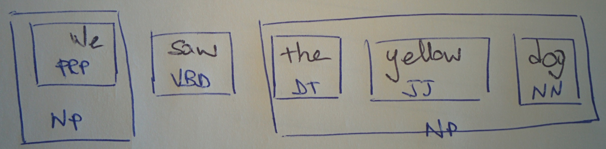

# Information Extraction

_Information extraction_, a part of _information retrieval_, deals with the automatic extraction of structured information from unstructured data in the form of text, trying to get the meaning out of it. It is composed of several tasks. Examples are the recognition of certain words as entity names, like names of places, brands, or temporal expressions.

This area of NLP is as old as NLP itself, having seen its first attempts in the early 1970s.

## Chunking

 Chunking is a technique aimed at separating and labelling sequences of tokens. Effectively, what you do is identifying constituent parts of sentences and linking them up together in higher order units. In the image, you got a sentence which has been separate into its noun phrases constituents.

Techniques to perform these types of tasks vary, from heuristic ones to machine learning-based ones.

### NP-chunking

Probably the most widely used way of chunking, identifies noun phrases, uses POS tags and a chunk grammar. NP-chunks are defined as to not contain other NP-chunks. A chunk grammar is made of rules that indicate how sentences should be chunked, for instance a regex can be used.

For instance, we establish that the rule for which a NP-chunk is formed is when a DT is followed by adjectives \(JJ\) and a noun \(NN\), so the chunker will use pattern `<DT>?<JJ>*<NN>`, chunking all sentences starting with the optional determiner, then followed by zero or more adjectives and a noun.

## Chinking

Chinking is the task of excluding certain patterns from chunks, meaning breaking the chunk into smaller parts.

## Entity and relations recognition

Entity recognition is about recognising certain words/expressions in sentences as some entity, like names \(of brands, of places, of people, ...\), temporal expressions and so on.

Relation recognition is about identifying relationships between the recognised entities, for example in "Google is in Mountain View".

### Named Entity Recognition: NER

NER is about recognising noun phrases/nouns about proper names of individuals, brands, places, organisations, countries, ...

How do you do it?

* in a lookup approach, you'd use a dictionary of names to search: this way is prone to mistakes and may suffer from ambiguity
* another, better way would be to use a classifier

