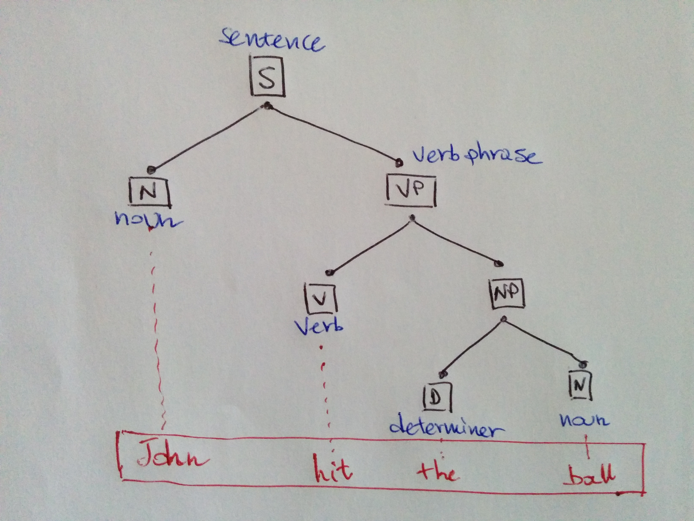

# Parsing, POS tagging and stemming text

## Parsing

 Parsing is the process of separating the syntactical structure of a sentence into the hierarchical relationships of the components. The structure determines a tree with a root which is the whole sentence level and then the more you go down the more granular it gets. A parser is a program that uses a [CFG](../concepts-tasks/notions-linguistics.ipynb#Context-free-grammar) to generate such tree. What is does is searching in the space of trees allowed by the grammar to select the one which fits the sentence under scrutiny. There are different types of parsers.

### Types of parsers

#### **Recursive descent parser**

A recursive descent parser breaks a goal into sub-goals. Its top-level goal is to find the root node of the sentence. Then, grammar rules like

$$
S \longrightarrow NP \ \ \ VP
$$

allow the parser to identify the subsequent two sub-goals: finding a NP \(noun phrase\) and a VP \(verb phrase\). These sub-goals will be themselves split into the next layer of sub-goals and the process goes on until the parser finds the end token. If the selected rule does not work, as in, a final match is not found, the parser goes back again to the previous hierarchical level and tries a different alternative.

Once all words in the sentence under scrutiny are matched, the parser looks for other possible parses \(other possible trees\) for the same sentence to account for possible ambiguity \(see the famous example "I shot an elephant in my pijamas", where it is ambiguous who is wearing the pijamas\).

This parser is:

* expensive: has to consider all rules and check if they match
* risky: may not converge to a solution
* top-down: uses a grammar beforehand to check whether the input agrees with it

**An example**

Take the sentence "The dog saw a man in the park".

1. At the first stage, the root node is the full sentence S = "The dog saw a man in the park".
2. At the second stage, apply rules 

$$
S \longrightarrow NP \ \ \ VP
$$

which fit with the the noun phrase NP = "the dog" and the verb phrase VP = "saw a man in the park"

1. At the third stage, apply rule

$$
NP \longrightarrow D \ \ \ N
$$

and match the determined "the" and the noun "dog"

1. continue this way until you match the whole sentence. If some rule fails to match, go back to the previous stage and look for another rule which matches it

#### **Shift-reduce parser**

This is a bottom-up parser in that it tries to find sequences of words corresponding to the right hand side of the grammar rule, rather than starting from the rule as a whole and finding for patterns matching it. Each input word is put in a stack \(_shift_ phase\). Then, if the n top words in the stack match the n items on the right of some rule, they get popped and the item on the left side of the rule is pushed on the stack \(_reduce_ phase\), which means that n items get replaced with one.

The parser stops when all the input has been consumed and there is just one item on the stack: the root node \(full sentence\).

This parser:

* does not apply backtracking \(the choices done cannot be corrected by going back\), so is not guaranteed to find a tree even if it exists; this means it risks getting stuck
* it only builds structured that correspond to the input text

#### **Left-corner parser**

This is a hybrid between a bottom-up and a top-down approach: it effectively is a bottom-up parser with a top-down filtering; does not get trapped in recursions and pre-processes the grammar to build a table such as

| Category | Left corner |
| :--- | :---: |
| S | NP |
| NP | D, P |
| VP | V |
| ... | ... |

where the first column contains the non-terminal nodes and the left column all the possible left corners of that terminal. Each time a rule is under consideration, the parser checks if the next input is compatible with at least one pre-terminal category.

#### **Chart-parsing**

This one uses dynamic programming in that partial results get stored for reusing, eliminating the need for backtracking. For example the part "in my pijamas" is saved in a table \(well-formed substring table, or WFST\) and then later looked up when needed to be used as a subconstituent of NP or VP. When complete, the WFST contains all the possible solutions to abb subproblems needed to solving the whole problem.

The table automatically stored all parses so this method is economical.

#### **Statistical parsing**

In statistical parsing, you have grammar rules and probability, which report the relative frequency of the rule. The parser aims at maximising the probability of the parse returned given the sentence, according to Bayes' rule \(see page\), that is, maximising the probability of the parse given the sentence.



The parser is trained on a pre-parsed corpus; a grammar is read; the empirical frequencies are collected and then the probability of the parse is computed.

A famous statistical parser is the [Stanford Parser](parsing-pos-tagging-and-stemming-text.md#references).

## POS tagging

POS Tagging deals with automatically attaching a part of speech \(POS\) to tokens in a text and uses _taggers_ for the job. A tagger is a program which decides what to do and can be of different nature.

### Types of taggers

* _Default tagger_: assigns to each token the same tag, this is clearly a silly idea
* _Regex tagger_: uses regex pattern recognition to recognise patterns; for instance, a word ending in _-ing_ would be recognised as a verb
* _Unigram tagger_: uses a pre-tagged \(manually\) corpus at assigns to each token the tag it appears \(in the corpus\) most frequently associated with. For instance, if "bank" appears as a NOUN the majority of times in the corpus, every occurrence of "bank" will be classed as NOUN
* _N-Gram tagger_: instead of using just the unigram, uses context as well in the form of the N-1 tokens preceding the one under scrutiny and picks the tag that is most frequent for that combination \(using a manually tagged corpus as the Unigram tagger\). The problem here is that the results will be poor if the tagger hasn't seen many of those combinations in the corpus, so this method suffers from a sparsity problem. It is also a quite expensive method.
* _Brill tagger_ \[1\]: it is a transformation-base tagger, the basic idea is to assign a tag to a token and then iteratively modify it via assigned rules; the first tag is assigned as the most frequent one in a corpus, the rules are in the form of "replace tag T1 with T2 in context C", where T1, T2 and C are learned during training

These ones are all supervised methods, in the sense that one way or the other they rely on pre-learned information. There are also taggers which are non-supervised and employ more sophisticated Machine Learning techniques.

## Stemming

The process of stemming is a heuristic way of chopping off the ending of a token to isolate its root.

### The Porter stemmer

The Porter stemmer \(see [ref](parsing-pos-tagging-and-stemming-text.md#references)\) starts from the separation of letters into _vowels_ \(A, E, I, O, U, Y\) and _consonants_ \(those which aren't vowels\). Every word is one of the combinations

* CVCV ... C
* CVCV ... V
* VCVC ... C
* VCVC ... V

where V and C are strings of \(respectively\) vowels and consonants of length more than 0. All these patterns can be shortened into $$[C][VC]^m[V]$$ , \[\] indicating an arbitrary presence and m the fact that the pattern can be repeated m times \(m stands for "measure"\).

The rules for removing a suffix are in the form

\(condition\) S1 -&gt; S2,

where S1 is the original suffix and S2 the transformed one. For example in the case or \(m&gt;1\)-EMENT, we get - \("replacement" becoming "replac"\); in the case of \(-_V_\)-ED we get \(means that the stem contains a vowel\) -, like in the case of "agreed" becoming "agree"; in the case of \(m&gt;0\)-ATIONAL we get -ATE, as in the case of "relational" becoming "relate".

The algorithm is such that it does not remove a suffix if the stem is too short; m gives the length of the stem. The Porter stemmer is rather simple. However, it can get quite funny and it naturally suffers from under-stemming: an example is the word "alumnus" which becomes "alumnu" and "alumna" becoming "alumna", so the two words are not conflated and this depends on the morphology which stemming does not catch, you would need a lemmatiser for that.

### The Lancaster stemmer

Also called the [Paice-Husk stemmer](parsing-pos-tagging-and-stemming-text.md#references), developed at Lancaster University, is more aggressive than Porter and uses rules in a iterative fashion. Rules perform string matching.

### Snowball and Porter2

[Snowball](parsing-pos-tagging-and-stemming-text.md#references) is a programming language based on string processing designed by M F Porter as a framework to develop stemming algorithms in 2006, the name being a reference to SNOBOL, a string processing language developed in the 1960s. The stemmer Porter2 has been developed in Snowball and is still widely used. It performs some improvements over the Porter stemmer.

## References

1. The [Stanford Parser ](https://nlp.stanford.edu/software/lex-parser.shtml)
2. E Brill, **A simple rule-based part of speech tagger**, _Proceedings of the workshop on Speech and Natural Language. Association for Computational Linguistics_, 1992
3.  M F Porter, [**An algorithm for suffix stripping**](http://stp.lingfil.uu.se/~marie/undervisning/textanalys16/porter.pdf), _Program_, 14.3, 1980
4.  C D Paice, **Another stemmer**, _SIGIR Forum_, 1990
5.  The website of the [**Snowball**](http://snowballstem.org) project

