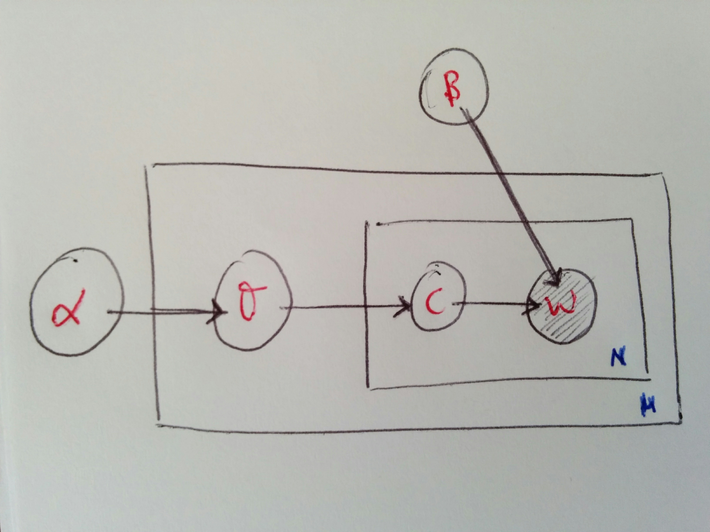
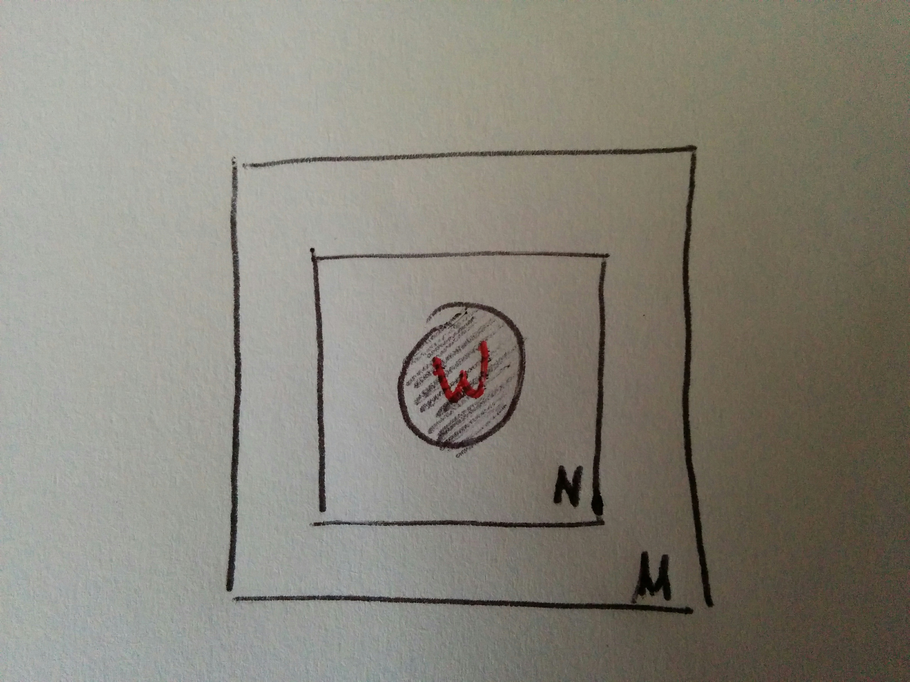
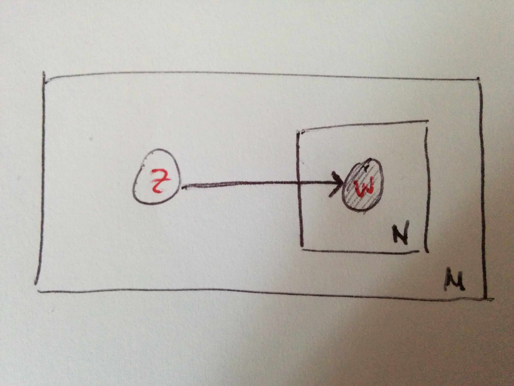

# Latent Dirichlet Allocation

## What is

LDA \(see the [paper](latent-dirichlet-allocation.md#references)\) is the simplest proper topic model. It assumes that topics are generated first, before the documents, and that topics are distributions over a fixed vocabulary. It is a generative statistical model and the idea is that documents can have multiple topics and each word's creation can be attributed to one of them.

It is a technique mostly used in NLP, that is, for text, but not only. Apart from the original paper, Wikipedia's [page](latent-dirichlet-allocation.md#references) on the topic is quite extensive.

## How it works

Given words indexed in a vocabulary$${1, \ldots, V}$$,

* represent _words_ as vectors with the only component equal to 1 being the one at the word index, that is, such that$$w^i = 1$$for word i in the vocabulary and$$w^j = 0$$for all the rest of words
* represent _documents_ as sequences of N words $$\bar w = (w_1, \ldots, w_N)$$so that$$w_i$$is the i-th word in it 
* represent a _corpus_ as a collection of M documents$$D = { \bar w_1, \ldots, \bar w_M }$$ 

We look for a probabilistic model that assigns high probability to members of the corpus and also to other similar documents; the LDA is a generative model of a corpus, based on the idea that documents are random mixtures over latent topics and topics are distributions over words.



For each document$$\bar w \in D$$, the following generative process is assumed \(see the linked page for the distributions mentioned\):

1. Choose N from a Poisson distribution$$P(\xi)$$\(other assumptions are allowed\)
2. Choose $$\theta$$ from a Dirichlet distribution$$D(\alpha)$$ 
3. For each of the N words$$w_i$$, 
   * Choose a topic $$c_i$$ from a Multinomial distribution$$M(\theta)$$ 
   * Choose a word$$w_i$$from$$P(w_i | c_i, \beta)$$, a multinomial conditioned on topic $$c_i$$ 

$$\theta$$ varies in a \($$k-1$$\)-dimensional [simplex](../../maths/generic/geometry.ipynb#Simplex) has PDF

$$
P(\theta | \alpha) = \frac{\Gamma(\sum_{i=1}^k)}{\Pi_{i=1}^k \Gamma(\alpha_i)} \theta_1^{\alpha_1-1} \cdots \theta_k^{\alpha_k-1} \ ,
$$

with $$\alpha$$ being a $$k$$-vector with components$$\alpha_i>0$$ .

The Dirichlet distribution is chosen because of convenience: it is in the exponential family, and is conjugate to the multinomial.

Given $$\alpha$$ and $$\beta$$ , we have

$$
P(\theta, \bar c, \bar w | \alpha, \beta) = P(\theta | \alpha) \Pi_{i=1}^N P(c_i | \theta) P(w_i | c_i, \beta) \ ,
$$

where the first is the joint distribution of topic mixture$$\theta$$, set of N topics $$\bar c$$ and N words$$\bar w$$;$$P(c_i | \theta)$$is equal to$$\theta_j$$for the unique j such that$$c_i^j=1$$.

Integrating over$$\theta$$and summing over the topics, we get the marginal distribution of a document

$$
P(\bar w | \alpha, \beta) = \int P(\theta | \alpha) \Pi_{i=1}^N \sum_{c_i} P(c_i | \theta) P(w_i | c_i, \beta) d \theta
$$

And the probability of a corpus is the product over the documents

$$
P(D | \alpha, \beta) = \Pi_{d=1}^M \int P(\theta_d | \alpha) \Pi_{i=1}^{N_d} \sum_{c_i} P(c_{d_i}|\theta_d) P(w_{d_i}|c_{d_i},\beta) d \theta_d
$$

 Plate representation of LDA

* $$\alpha$$and$$\beta$$are corpus-level parameters, assumed to be sampled once when generating a corpus
* $$\theta_d$$are the document-level variables, assumed to be sampled once per document
* $$w_{d_i}$$are the word-level variables, assumed to be sampled once per word in document

## Comparison to other latent variable methods

### Unigram model

  

In the figure, plate representation of a unigram model.

It's a very simplistic model: the words of every document are drawn independently from a single multinomial distribution, so that the probability of the document is

$$
P(\bar w) = \Pi_{i=1}^N P(w_i)
$$

### Mixture of unigram models

 

In the figure, plate representation of a mixture of unigram models.

In this one, the unigram model gets augmented with a discrete topic variable c: each document is generated by first choosing a topic c and then generating N words independently from the conditional multinomial $$P(w | z)$$, so that the probability of a document is

$$
P(\bar w) = \sum_c \Pi_{i=1}^N P(c_i | z)
$$

In contrast, LDA allows documents to exhibit multiple topics to different degrees.

### PLSI



PLSI \(see the page on PLSA\) posits that a document label d and a word$$w_i$$are conditionally independent given an unobserved topic c:

$$
P(d | w_i) = P(d) \sum_c P(w_i | c) P(c | d)
$$

It relaxes the mixture of unigrams assumption that each document is generated from only one topic. The last bit$$P(c| d)$$serves as the mixture weights of topics for document d. But, given that d is a label in the training set, the model learns the topic mixtures$$P(c | d)$$only for the documents on which it is trained and this is why PLSA is not a generative model: there is no natural way to assign probabilities to unknown documents. Furthermore, the number of parameters grows linearly with the number of training documents, so it is quite prone to overfitting.

LDA overcomes this problem by treating the topics mixture weights as a $$k$$-parametrical hidden random variable rather than a large set of individual parameters in the training set and this easily generalises to new documents and the parameters do not grow with the size of the training corpus.

## Inference

Learning the distributions \(set of topics, their word probabilities, the topic of each word, the topic mixture of each document\) is a problem of Bayesian inference. Exact inference is intractable, approximate inference can be obtained in several ways though.

## References

1.  D M Blei, A Y Ng, M I Jordan, [**Latent dirichlet allocation**](http://www.jmlr.org/papers/volume3/blei03a/blei03a.pdf), _Journal of machine Learning research_, 2003
2.  [Wikipedia's page](https://en.wikipedia.org/wiki/Latent_Dirichlet_allocation)

