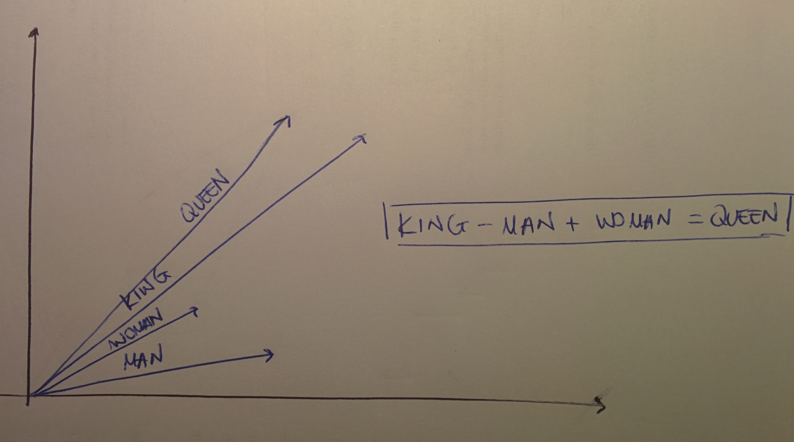
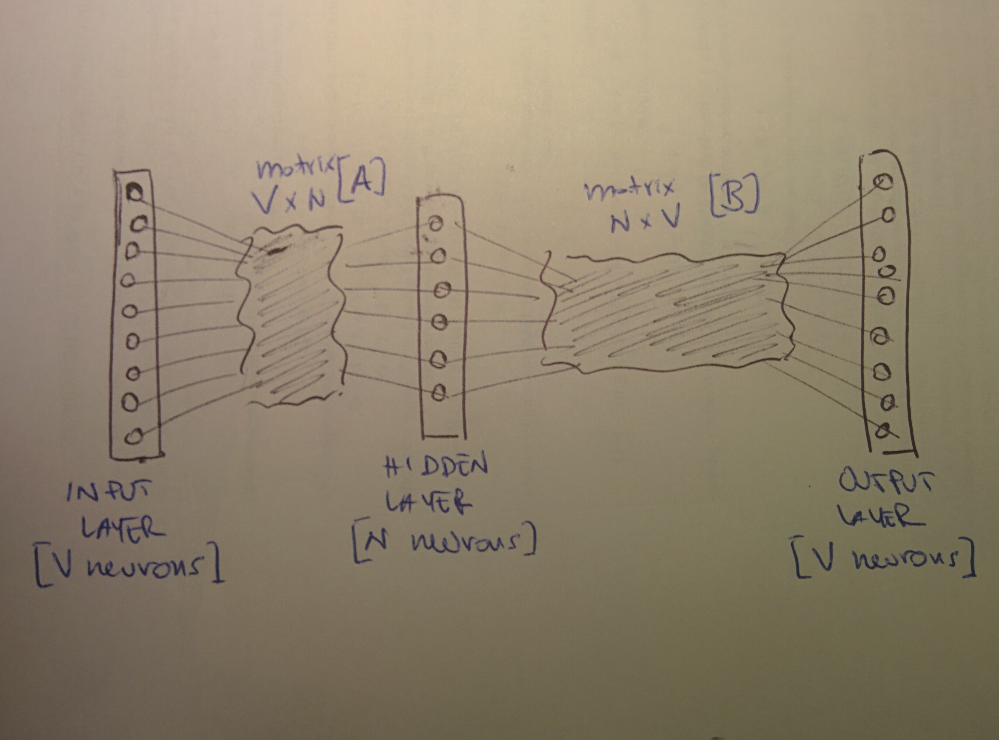
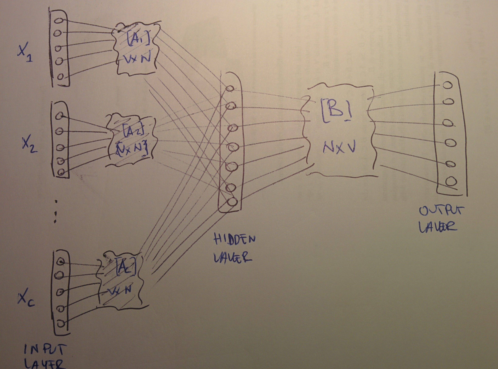
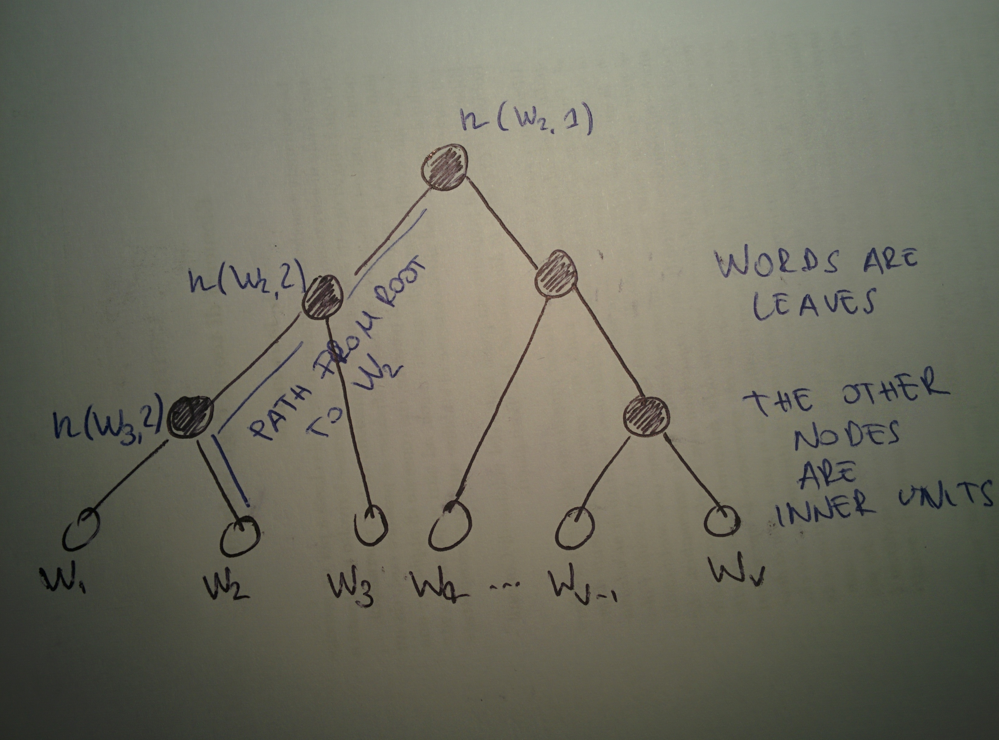

# word2vec

## The gist of it

word2vec, whose original [paper](word2vec.md#references) is is a model based on a shallow neural network for word embeddings, conceived at Google in 2013. It utilises a large corpus of text as its input and maps each unique word to a numerical vector; it relies on the "distributional hypothesis" of linguistics, which basically asserts that a word per se isn't complete without its context \(_"You shall know a word by the company it keeps"_, J R Firth, 1957\).

This is a fancy way of saying that word2vec uses information on the neighbouring words of a given word to derive information. For example, the word "bank" can be either the financial institution or the bank of a river, and context is key. wowrd2vec employs a "window" around a word \(a number of other words on each side\) to capture the information on its context.

The idea of word vectors is often exemplified \(see figure\) by saying that it is capable of performing vector arithmetics such that, say, you can obtain the vector for queen from those of king, man and woman.

word2vec can also be used to translate words from a language to another one, with a rotation matrix.

Google shared a trained model to the world, a network trained on$$10^{11}$$words.

If j is the index of the word at hand and m the context window size \(on each side\), the algorithm uses an objective function which encompasses the logarithm of the probability of any context word given the word at hand:

$$
J(\theta) = \frac{1}{T} \sum_{t=1}^T \sum_{-m \leq j \leq m; j \neq 0} \log{ P( w_{t+j} | w_{t} ) }
$$

## Learning from the context

Let's say we have the sentence _the cat chases the mouse_ and that the word at hand is _chases_, and let's also say that we have a vocabulary V. We want to maximise the likelihood of seeing the context words given the one word we are considering, which is, for each of those context words, of the form $$P( w_c | chases)$$,$$w_c$$being the context word.

For each word, two vectors get built depending on whether the word is in input \($$w_{in}$$\) __or in output \($$w_{out}$$\), so that for instance $$P(w_{out} | w_{in}) = P(chases | the)$$. These probabilities are derived from the cosine similarity, but using a softmax:

$$
P(w_{out} | w_{in}) = \frac{e^{w_{in} \cdot w_{out}}}{\sum_{k \in V} e^{w_{in} \cdot w_k}}
$$

The words vectors get updated via gradient descent as per

$$
w_{in} := w_{in} + \frac{\partial}{\partial w_{in}} P(w_{out} | w_{in})
$$

$$
w_{out} := w_{out} + \frac{\partial}{\partial w_{out}} P(w_{out} | w_{in})
$$

In terms of performance, the denominator in the softmax computation is a $$O(V)$$ as you have $$V$$ operations for each update, then you will have a VC operations for each input word \(C being the context\) and then if N is the size of the vectors you end up with a total$$O(VCN)$$. Now, for a general linearly scaling problem you can always build a tree to make it scale logarithmically instead, and this is what the actual algorithm does, ending up with a complexity$$O(NC \log V)$$, which allows for it to be able to scale to$$10^{11}$$words.

 

In the figure, an example of a word2vec network. The weights are initialised at random, then the idea is to have the network show a high probability for "chases" when "cat" is in input \(cat being the context word in this case\). Errors are backpropagated.

Words in input are one-hot encoded so that each word becomes a vector of V elements with its index in the vocabulary lighted up.

The goal is to produce the probabilities for words in the output layer$$P(w_k | w_{context})   \forall k \in V$$, the sum of neuron outputs in the output layer being 1, where the softmax helps. The training works by using different context-target pairs from the corpus.

Two models have been proposed for the learning: the continuous bag of word model and the skip-gram model.

## Continuous Bag of Words \(CBOW\) learning

 

In the CBOW learning model, the network goes beyond learning relationships between pairs of words and learns using a context made of multiple words. In the example sentence above, words _cat_ and _mouse_ would be context words for _chases_. The network we described above has to be modified in such a way that the input layer gets replicated C times, where C is the number of context words. The hidden layer will perform a division by C.

Each word is again one-hot encoded and the output of the hidden layer will be the average of the word vectors of the context word as input. Other than that, the training mechanism stays the same.

This model can be exemplified as "predict the word given its context".

## Skip-gram learning

In the skip-gram model, the role of target and context words is reversed: the target is fed as an input and the output layer is replicated multiple times, as many as the number of context words. This model can be exemplified as "predict the context given the word".

The name "skip-gram" refers to the fact that training instances can be created by skipping a constant number of words in the context.

## CBOW vs. Skip-gram

On a general basis, the skip-gram architecture gives better results than the CBOW but it is slower. The CBOW model works well on frequent words and needs large training datasets; the skip-gram works well even on rare words and requires just small amounts of training data.

## Tweaks

### Negative sampling

Negative sampling is a method based on the skip-gram model but that optimises a different objective. It makes the whole procedure more efficient as it prevents vectors from having the same values by disallowing some word-context pairs: the idea is to train on a random sample from the context instead of on all of it \(in fact, the computation of the dot product with all words in the context is very slow\). Negative sampling tackles the problem of having too many output vectors to be updated at every iteration by updating just a sample of them, selected via a probability distribution.

The wording "negative" comes from the fact that we call "positive" those words selected for being in the context and "negative" those which are chosen by sampling and deemed too similar to the given word, so excluded. The probability distribution for the sampling can be arbitrarily chosen, it is usually called the _noise distribution_.

### Hyerarchical softmax

 

It ss a more efficient way to compute the softmax; it uses a binary tree to represent all words in the vocabulary. In this representation, words do not gent encoded as vectors because vectors are given for the inner units \(the inner unit$$n(w, j)$$is the j-th units on the path from the root to word$$w$$\). This way, the complexity gets reduced from$$O(V)$$to$$O(\log V)$$ and this tweak can then be used both in the CBOW and in the skip-gram model. The difference with the negative-sampling approach, which reduces the size, is that all context is kept but the computational complexity is reduced.

## How about full sentences?

One could think of extending the word2vc approach beyond words to full sentences, and the easiest way to conceive a vectorial representation of a sentence is by averaging the vectors of the words which compose it. However, better approaches do exist \(doc2vec!\).

## References

1.  T Mikolov, K Chen, G Corrado, J Dean [**Efficient estimation of word representations in vector space**](https://arxiv.org/pdf/1301.3781.pdf), 2013
2. [**Words as vectors**](https://iksinc.wordpress.com/2015/04/13/words-as-vectors/), a blog on the topic

