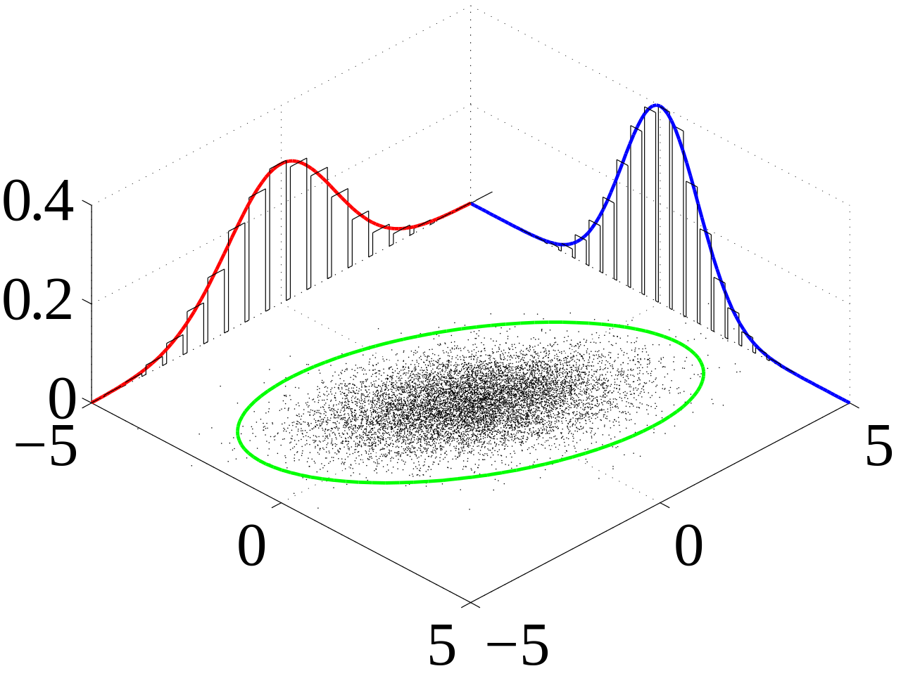

# Independence, joint/marginal/conditional probability, covariance and correlation

## Statistical independence

Two random variables$$X$$and$$Y$$are said to be _independent_ when their joint probability \(see below\) is equal to the product of the probabilities of each:

$$
P(X, Y) = P(X) P(Y) \ .
$$

This means, in terms of conditional probabilities,

$$
P(X | Y) = \frac{P(X, Y)}{P(Y)} = \frac{P(X)P(Y)}{P(Y)} = P(X) \ ,
$$

that is, the probability of$$X$$occurring is not affected by the occurrence of$$Y$$. This is typically how independence is defined, in verbal terms: the occurrence of one event does not influence the occurrence of the other.

### IID variables

I.I.D. stands for _independent_ and _identically distributed_, it's a shortening used all over in statistics. IID variables are [independent](independence.ipynb) but also distributed in the same way.

The concept is the basic assumptions of many foundational results in statistics.

## The joint probability

The joint probability of one or more events is the probability that they happen together. If $$X$$,$$Y$$,$$Z$$, ... are the random variables, their joint probability is written as

$$
P(X, Y, Z, \ldots)
$$

or as

$$
P(X \cap Y \cap Z \ldots)
$$

### The case of independent variables

If the variables are independent, their joint probability reduces to the product of their probabilities: $$P(X1, X_2, \ldots, X_n) = \Pi{i=1}^n P(X_i)$$.

## The marginal probability

If we have the joint probability of two or more random variables, the marginal probability of each is the probability related to that variable and to its own space of events; it expresses the probability of the variable when the value of the other one is not known. It calculated by summing the joint probability over the space of events of the other variable. More specifically, given$$P(X, Y) = P(X=x, Y=y)$$,  

$$
P(X=x) = \sum_y P(X=x, Y=y) \ .
$$

The illustration here \(Image by IkamusumeFan \(own work, released under [CC BY-SA 3.0](https://creativecommons.org/licenses/by-sa/3.0/)\), [via Wikimedia Commons](https://commons.wikimedia.org/wiki/File%3AMultivariate_normal_sample.svg)\) shows points extracted from a joint probability \(the black dots\) and the marginal probabilities as well.

## Covariance and correlation

### Covariance

Given the random variables$$X$$and$$Y$$with respective means$$\mu_x$$and $$\mu_y$$, their _covariance_ is defined as

$$
\text{cov}(X, Y) = \mathbb{E}[(X - \mu_x)((Y - \mu_y)]
$$

It is a measure of how jointly the two variables vary: a positive covariance means that when$$X$$grows,$$Y$$grows as well and a negative covariance means that when$$X$$grows,$$Y$$decreases.

### Correlation

The word _correlation_ is measured by a _correlation coefficient_ which exists in several definitions depending on what is exactly measured; it is always a sort of normalised covariance. The correspondent of the covariance itself is Pearson's definition, which defines the correlation coefficient as the covariance normalised by the product of the standard deviations of the two variables:

$$
\rho_{xy} = \frac{\text{cov}(x, y)}{\sigma_x \sigma_y} = \frac{\mathbb{E}[(x - \mu_x)(y - \mu_y)]}{\sigma_x \sigma_y} \ ,
$$

and it can also be written as

$$
\begin{align}
    \rho_{xy} &= \frac{\mathbb{E}[(xy - x \mu_y - \mu_x y + \mu_x \mu_y)]}{\sigma_x \sigma_y} \\
    &= \frac{\mathbb{E}[xy] - \mu_x\mu_y - \mu_y\mu_x + \mu_x\mu_y}{\sigma_x \sigma_y} \\
    &= \frac{\mathbb{E}[xy] - \mu_x\mu_y}{\sigma_x \sigma_y} \ .
\end{align}
$$

The correlation coefficient has these properties:

* $$-1 \leq \rho_{xy} \leq 1$$ 
* It is symmetric: $$\rho_{xy} = \rho_{yx}$$
* If the variables are independent, then $$\rho_{xy} = 0$$ \(but the reverse is not true\)

### Independence and correlation

Let's expand on the last point there really. We said that if two random variables are independent, then the correlation coefficient is zero. This is easy to prove as it follows directly from the definition above \(also bear in mind [Fubini's theorem](https://en.wikipedia.org/wiki/Fubini%27s_theorem):

$$
\mathbb{E}[XY] = \int_{\Omega_X } \int_{\Omega_Y} \text{d} x \text{d} y \ xy P(x,y) = \int_{\Omega_X } \int_{\Omega_Y} \text{d} x \text{d} y \ xy P(x) P(y) = \mu_x \mu_y \ .
$$

The reverse is not true. Look at this amazing Q&A on [Cross Validated](https://stats.stackexchange.com/questions/12842/covariance-and-independence#) for a well explained counter-example.

### Correlation and the relation between variables

Correlation says "how much" it happens that when$$x$$grows,$$y$$grows as well. It is not a measure of the slope of the linear relation between$$x$$and$$y$$. This is greatly illustrated in the figure above \(from Wikipedia's [page](https://en.wikipedia.org/wiki/Pearson_correlation_coefficient), under [CC0](https://creativecommons.org/publicdomain/zero/1.0/deed.en) \), which reports sets of data points with$$x$$and$$y$$and their correlation coefficient.

In the central figure, because the variance of$$y$$is 0, then the correlation is undefined. In the bottom row, the relation between variables is not linear, the correlation does not capture that.

