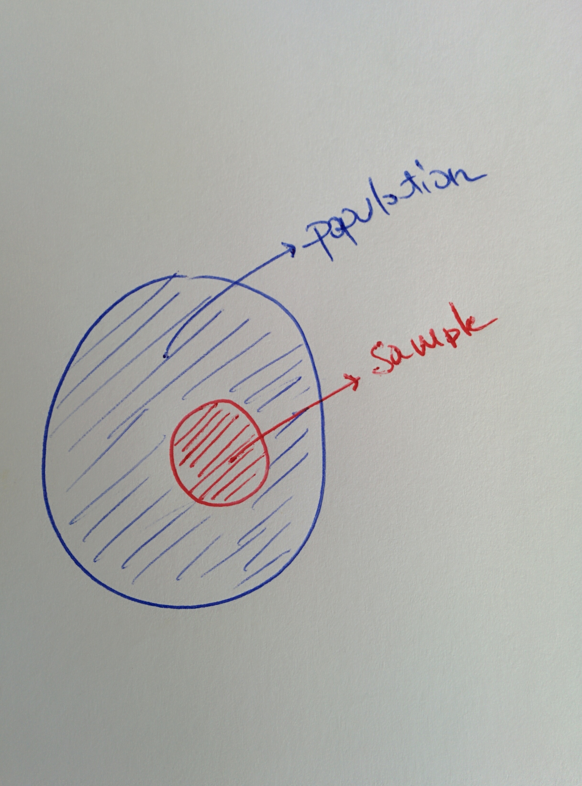
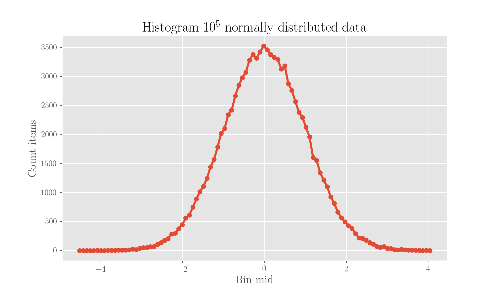
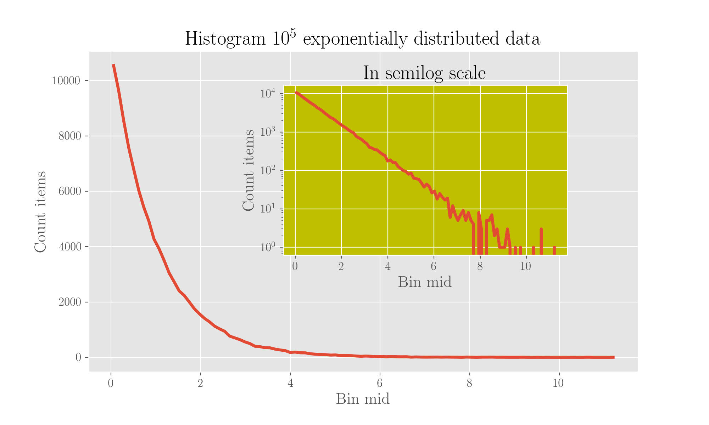
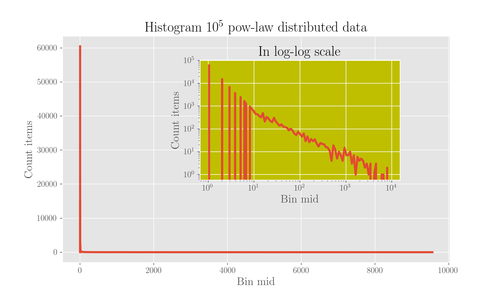

# Moments of a distribution and summary statistics

In the following, we will use $$X$$ to represent a random variable living in sample space \(the space of all possible values it can assume\) $$\Omega$$.

In the discrete case, the probability of each value $$x_i$$ will be represented as $$p_i$$ \(probability mass function\); in the continuous case $$p(x) = P(X=x)$$ will be the probability density function. See [the note on probability functions](probability-functions-and-displaying-data.md).

Let's start with mean and variance and then we'll then give the general definitions. Also, we'll then switch to other quantities beyond moments which help drawing a comprehensive picture of how data is distributed.

For the code, you need to some libraries of the Python data stack first:

```python
import numpy as np
from matplotlib import pyplot as plt
from scipy import stats
```

## Expected value

The **expected value**, or **expectation**, or **mean value** is defined, in the _continuous_ case as

$$
\mathbb{E}[X] = \int_\Omega \text{d} x \ x p(x) \ ,
$$

Similarly, in the _discrete_ case,

$$
\mathbb{E}[X] = \sum_i^N p_i x_i \ ,
$$

The expectation is the average of all the possible values the random variable can assume. It is the arithmetic mean in the case of discrete variables. This is easy to see if the distribution is uniform, that is, all $$N$$ values have the same probability $$\frac{1}{N}$$: the expectation becomes $$\frac{1}{N}\sum_i x_i$$ , which is the exact definition of arithmetic mean. When the distribution is not uniform, the probability is not the same for each value, but the end result is still the arithmetic mean as each different value will be weighted with its probability of occurrence, that is, the count of them over the total of values.

The expected value is typically indicated with $$\mu$$.

### Linearity of the expected value

The expected value is a linear operator:

$$
\mathbb{E}[aX + bY] = a\mathbb{E}[X] + b \mathbb{E}[Y]
$$

_Proof_

We will prove this in the continuous case but it is clearly easily extensible.

$$
\begin{align}
\mathbb{E}[aX + bY] &= \int_{\Omega_X}\limits \int_{\Omega_Y}\limits \text{d} x \ \text{d} y \ (ax + by) p(x, y) \\
&= a \int_{\Omega_X}\limits \int_{\Omega_Y}\limits \text{d} x \ \text{d} y \ x p(x, y) + b \int_{\Omega_X}\limits \int_{\Omega_Y}\limits \text{d} x \ \text{d} y \ y p(x, y) \\
&= a \int_{\Omega_X}\limits \text{d} x \ x p(x) + b \int_{\Omega_Y}\limits \text{d} y \ y p(y) \\
&= a\mathbb{E}[X] + b \mathbb{E}[Y]
\end{align}
$$

This is because $$p(x) = \int_{\Omega_Y}\limits\text{d} y  x p(x, y)$$ because we are effectively summing the PDFs over all the possible values of $$Y$$, hence eliminating the dependency from this random variable. Analogously the other one.

### Expectation over two variables

We have

$$
\mathbb{E}_{x, y}[A] = \mathbb{E}_x[\mathbb{E}_y[A | x]]
$$

_Proof_

By definition

$$
\mathbb{E}_{x, y}[A] = \int \,dx \,dy \, p(x, y) \, A
$$

and from the definition of [conditional and joint probability,](independence-joint-marginal-conditional-probability-covariance-and-correlation.md)

$$
p(x, y) = p(y|x) p(x) \ .
$$

So, we can write

$$
\mathbb{E}_{x, y}[A] = \int \, dx \, dy A \, p(y|x)p(x)
$$

which is exactly the second term in the statement.

## Variance and standard deviation

The variance is the expected value of the squared difference from the expectation:

$$
Var[X] = \mathbb{E}[(X - \mathbb{E}[X])^2] =  \int_{\Omega_X} \text{d} x \ (x - \mathbb{E}[X])^2 p(x)
$$

The variance is the second moment around the mean. It is typically indicated as $$\sigma^2$$, $$\sigma$$ being the **standard deviation**, which gives the measure of error of values from the mean.

### Rewriting the variance

We can also write the variance as

$$
Var[X] = \mathbb{E}[X^2] - \big(\mathbb{E}[X]\big)^2
$$

_Proof_

$$
\begin{align}
Var[X] &= \mathbb{E}[(X - \mu)^2] \\
&= \int_{\Omega_X} \text{d}x \ (x^2 - 2 \mu x + \mu^2) p(x) \\
&= \int_{\Omega_X} \text{d}x \ x^2 p(x) -2 \mu \int_{\Omega_X} \text{d}x \ x p(x) + \mu^2 \int_{\Omega_X} \text{d} x p(x) \\
&= \mathbb{E}[X^2] - 2 \mu^2 + \mu^2 \\
&= \mathbb{E}[X^2] - \big(\mathbb{E}[X]\big)^2
\end{align}
$$

### The variance is not linear

In fact, using the linearity of the expectation

$$
\begin{align}
Var[aX] &= \mathbb{E}[(aX)^2] - \big( \mathbb{E}[aX] \big)^2 \\
&= a^2 \mathbb{E}[X^2] - (a^2 \mu^2) \\
&= a^2 (\mathbb{E}[X^2] - \mu^2) \\
&= a^2 Var[X]
\end{align}
$$

and more in general,

$$
\begin{align}
Var[aX + bY] &= \mathbb{E}[(aX + bY)^2] - \big( \mathbb{E}[aX+bY] \big)^2 \\
&= \mathbb{E}[a^2 X^2 + b^2 Y^2 + 2ab XY] - \big( a \mathbb{E}[X] + b \mathbb{E}[Y] \big)^2 \\
&= a^2\mathbb{E}[X^2] + b^2\mathbb{E}[Y^2] + 2ab\mathbb{E}[XY] - a^2(\mathbb{E}[X])^2 - b^2(\mathbb{E}[Y])^2 - 2ab\mathbb{E}[X]\mathbb{E}[Y] \\
&= a^2 Var[X] + b^2 Var[Y] + 2ab \ \text{cov}(X, Y)
\end{align}
$$

\( $$\text{cov}$$ is the covariance\).

### The unbiased estimator of variance and standard deviation



If we have $$n$$data points, extracted from a population \(so we have a sample, refer to figure\) and we want to calculate its variance \(or standard deviation\), using $$n$$in the denominator would lead to a biased estimation. We would in fact use $$n$$in the case we had the full population, in the case of a sample we have to use $$n-1$$ and this is because the degrees of freedom are $$n-1$$as the mean is computed from $$n$$data points so there is one less.

For the mean, if $$\mu$$is the one computed with the full population and $$\bar x$$ the one computed with the sample, which is the estimator of $$\mu$$ ,

$$
\bar x = \frac{\sum_{i=1}^{i=n} x_i}{n}
$$

For the variance, calling $$\sigma^2$$ the one computed with the full population and $$s^2$$the one computed with the sample, we have

$$
s_n^2 = \frac{\sum_{i=1}^{i=n} (x_i - \bar x)^2}{n}
$$

and

$$
s_{n-1}^2 = \frac{\sum_{i=1}^{i=n} (x_i - \bar x)^2}{n-1}
$$

with subscript $$n$$ or $$n-1$$ indicating, respectively, with which denominator they are calculated.

$$s_n^2$$ _is a biased estimator of the population variance \(it contains the mean, which itself eats one degree of freedom\) and we have_ $$s_n^2<s_{n-1}^2$$ __. This last one is the correct estimator of the population variance when you have a sample.

## Standard deviation and standard error

Refer again to the above about sample and population. The population follows a certain distribution, of which the distribution of the sample is an "approximation". This is why we have to use the sample mean \(the mean of data points in the sample\) as an estimate of the \(unknown\) population mean. The problem is now how to attribute the error to this value.

In general, following definition, what the standard deviation quantifies is the variability of individuals from the mean. Having the sample, the sample standard deviation tells how far away each sample point is from the sample mean.

Now because we're using the sample mean to estimate the mean \(expected value\) of the population, and because if we had another sample extracted from the same population this sample mean would likely be different, in general this sample mean follows its distribution. The _standard error_ \(of the mean, as it can be related to other statistics\), typically indicated by _SE_, is the standard deviation of these means.

The standard error is usually estimated by the sample standard deviation $$s$$ divided by the square root of the sample size $$n$$:

$$
SE = \frac{s}{\sqrt{n}} \ ,
$$

under the assumption of statistical independence of observations in the sample.

In fact, let $$x_1, \ldots, x_n$$ be the sample points extracted from a population whose mean and standard deviation are, respectively, $$\mu$$ and $$\sigma$$, the sample mean is

$$
m = \frac{x_1 + \cdots + x_n}{n} \ .
$$

The variance of this sample mean $$m$$, telling how far away the sample mean is from the population mean, is

$$
Var[m] = Var \left[\frac{\sum_i x_i}{n}\right] = 
\frac{1}{n^2} Var\Big[\sum_i x_i\Big] = \frac{1}{n^2} \sum_i Var[x_i]
= \frac{1}{n^2} n Var[x_1]
= \frac{1}{n} \sigma^2 \ ,
$$

because each point has the same variance and the points are independent. See above for the non-linearity of the variance for the details on this calculation. Following this, the standard deviation of $$m$$ is then $$\frac{\sigma}{\sqrt{n}}$$ and we will use $$s$$ as an estimate for $$\sigma$$, which is, again, unknown.

### When to use which

The Standard Error tells how far the sample mean is from the population mean so it is the error to attribute to a sample mean. The standard deviation again is about the individual data points and it tells how far away they are from the sample mean.

While the standard error goes to 0 when $$n \to \infty$$, the standard deviation goes to $$\sigma$$.

## Moments: general definition

The $$n$$-th **raw moment** of a distribution is the expected value of the $$n$$-th power of the random variable:

$$
\boxed{\mu_n' = \int \text{d} x \ x^n p(x)}
$$

The expected value is then the first raw moment.

The $$n$$ -th **central moment** around the mean is defined as

$$
\boxed{\mu_n = \int \text{d} x (x-\mu)^n p(x)}
$$

The variance is the second central moment around the mean.

Moments get standardises \(normalised\) by dividing for the appropriate power of the standard deviation. The $$n$$ -th **standardised moment** is the central moment divided by standard deviation with the same order power:

$$
\boxed{\tilde \mu_n = \frac{\mu_n}{\sigma^n}}
$$

## Skeweness

The **skeweness** is the third standardised moment:

$$
\gamma = \frac{\mathbb{E}[(X-\mu)^3]}{\sigma^3}
$$

The skeweness quantifies how symmetrical a distribution is around the mean: it is zero in the case of a perfectly symmetrical shape. It is positive if the distribution is skewed on the right, that is, if the right tail is heavier than the left one; it is negative if it is skewed on the left, meaning the left tail is heavier than the right one.

## Kurtosis

The **kurtosis** is the fourth standardised moment:

$$
\kappa = \frac{\mu_4}{\sigma^4}
$$

It measures how heavy the tail of a distribution is with respect to a gaussian with the same $$\sigma$$.

## Further results

### Variance of a matrix of constants times a random vector

In general, with a matrix of constants $$\mathbf{X}$$ and a vector of observations \(random variables\) $$\mathbf{a}$$, using the linearity of the expected value so that $$\mathbb{E}[\mathbf{X a}] = \mathbf{X} \mathbb{E}[\mathbf{a}]$$, we have

$$
\begin{align}
    Var[\mathbf{X a}] &= \mathbb{E}[(\mathbf{X a} - \mathbb{E}[\mathbf{X a}])^2] \\
                      &= \mathbb{E}[(\mathbf{X a} - \mathbb{E}[\mathbf{X a}])(\mathbf{X a} - \mathbb{E}[\mathbf{X a}])^t] \\ 
                      &= \mathbb{E}[(\mathbf{X a} - \mathbf{X}\mathbb{E}[\mathbf{a}])(\mathbf{X a} - \mathbf{X}\mathbb{E}[\mathbf{a}])^t] \\
                      &= \mathbb{E}[(\mathbf{X a} - \mathbf{X}\mathbb{E}[\mathbf{a}])((\mathbf{X a})^t - (\mathbf{X}\mathbb{E}[\mathbf{a}])^t)] \\
                      &= \mathbb{E}[\mathbf{Xa}\mathbf{a}^t\mathbf{X}^t - \mathbf{Xa} \mathbb{E}[\mathbf{a}]^t \mathbf{X}^t - \mathbf{X} \mathbb{E}[\mathbf{a}]\mathbf{a}^t\mathbf{X}^t + \mathbf{X} \mathbb{E}[\mathbf{a}] \mathbb{E}[\mathbf{a}]^t\mathbf{X}^t] \\
                      &=  \mathbf{X} \mathbb{E}[\mathbf{a}\mathbf{a}^t] \mathbf{X}^t - \mathbf{X} \mathbb{E}[\mathbf{a}] \mathbb{E}[\mathbf{a}]^t \mathbf{X}^t - \mathbf{X} \mathbb{E}[\mathbf{a}] \mathbb{E}[\mathbf{a}^t] \mathbf{X}^t + \mathbf{X} \mathbb{E}[\mathbf{a}] \mathbb{E}[\mathbf{a}^t] \mathbf{X}^t \\
                      &= \mathbf{X} \mathbb{E}[\mathbf{a}\mathbf{a}^t] \mathbf{X}^t - 2 \mathbf{X} \mathbb{E}[\mathbf{a}] \mathbb{E}[\mathbf{a}]^t \mathbf{X}^t + \mathbf{X} \mathbb{E}[\mathbf{a}] \mathbb{E}[\mathbf{a}^t] \mathbf{X}^t = \\
                      &= \mathbf{X} (\mathbb{E}[\mathbf{a} \mathbf{a}^t] - \mathbb{E}[\mathbf{a}] \mathbb{E}[\mathbf{a}^t]) \mathbf{X}^t = \\
                      &= \mathbf{X} Var[\mathbf{a}] \mathbf{X}^t
\end{align}
$$

## Let's see all this on some known distributions!

We will extract $$n$$ values from several distributions, one at a time, and see what happens to the moments.

Refer to the page about some famous distributions for  who these guys are



```python
n = 100000                                          # the number of points to extract

g = np.random.normal(size=n)                        # gaussian
e = np.random.exponential(size=n)                   # exponential
p = np.random.power(a=0.5, size=n)                  # power-law x^{0.5}, or a sqrt
z = np.random.zipf(a=2, size=n)                     # Zipf (power-law) x^{-2}
```

### The gaussian

The gaussian will be the comparison distribution we refer to. Why? Because it's the queen of distributions!

```python
# Use 100 bins
bins = 100    

hist = np.histogram(g, bins=bins)
hist_vals, bin_edges = hist[0], hist[1]
bin_mids = [(bin_edges[i] + bin_edges[i+1])/2 for i in range(len(bin_edges) -1)]     # middle point of bin
  
plt.plot(bin_mids, hist_vals, marker='o')

plt.title('Histogram $10^5$ normally distributed data')
plt.xlabel('Bin mid')
plt.ylabel('Count items')
plt.show();
```



Clearly, the mean is 0 \(we've taken values this way!\); the skeweness is also 0 as the data is normally distributed, hence symmetrical, and the kurtosis comes as 0 because Scipy gives, [by default](https://docs.scipy.org/doc/scipy/reference/generated/scipy.stats.kurtosis.html), the Fisher version of it, which subtracts 3 so that a normal distribution has 0 kurtosis.

### The exponential

Same plot as for the gaussian, except that we will also plot it in semilog scale \(on the $$y$$\), where the distribution appears linear.

```python
# Use 100 bins
bins = 100    

hist = np.histogram(e, bins=bins)
hist_vals, bin_edges = hist[0], hist[1]
bin_mids = [(bin_edges[i] + bin_edges[i+1])/2 for i in range(len(bin_edges) -1)]     # middle point of bin

# Main plot: in linear scale
plt.plot(bin_mids, hist_vals)
plt.xlabel('Bin mid')
plt.ylabel('Count items')
plt.title('Histogram $10^5$ exponentially distributed data')

# Inset plot: in semilog (on y)
a = plt.axes([.4, .4, .4, .4], facecolor='y')
plt.semilogy(bin_mids, hist_vals)
plt.title('In semilog scale')
plt.ylabel('Count items')
plt.xlabel('Bin mid')

plt.show();
```



With 

```python
'The mean is %s, the std %s' % (np.mean(e), np.std(e))
'The skeweness is %s, the kurtosis %s' % (stats.skew(e), stats.kurtosis(e))
```

you get a mean and std of 1, a skeweness of 2 and a kurtosis of 6 - you see that this time the distribution is wildly non-symmetrical.

### The power law

We chose to extract numbers from a power law with exponent 0.7 \(see the [docs](https://docs.scipy.org/doc/numpy/reference/generated/numpy.random.power.html#numpy.random.power) in Scipy\). Because of this, it is so much better to bin logarithmically, that is, with a bin width growing logarithmically. If we also choose a log-log scale, we get a line. Let's do it.

```python
# Use 100 bins
bins = np.logspace(0, 4, num=100)    

hist = np.histogram(z, bins=bins)
hist_vals, bin_edges = hist[0], hist[1]
bin_mids = [(bin_edges[i] + bin_edges[i+1])/2 for i in range(len(bin_edges) -1)]     # middle point of bin

# Main plot: in linear scale
plt.plot(bin_mids, hist_vals)
plt.xlabel('Bin mid')
plt.ylabel('Count items')
plt.title('Histogram $10^5$ pow-law distributed data')

# Inset plot: in semilog (on y)
a = plt.axes([.4, .4, .4, .4], facecolor='y')
plt.loglog(bin_mids, hist_vals)
plt.title('In log-log scale')
plt.ylabel('Count items')
plt.xlabel('Bin mid')

plt.show();
```



The mean here is about 37, the std 7991, the skeweness 299 and the kurtosis 92083! This is a heavy-tail and the kurtosis is very vocal about it.

## Mode

The mode of a distribution is simply its most frequent value.

## Quantiles

Quantiles are the values which divide a probability distribution into equally populated sets, how many, you decide. As special types of quantiles you got

* _deciles_: 10 sets, so the first decile is the value such that 10% of the observations are smaller and the tenth decile is the value such that 90% of the observations are smaller 
* _quartiles_: 4 sets, so the first quartile is such that 25% of the observations are smaller
* _percentile_: 100 sets, so the first percentile is such that 1% of the observations are smaller

The second quartile, corresponding to the fifth decile and to the fiftieth percentile, is kind of special and is called the _median_. Note that unlike the mean, the median is a measure of centrality in the data which is non-sensible to outliers.

This all means you can use the percentile everywhere as it's the most fine-grained one, and calculate the other splits from them. This is in fact what Numpy does, for this reason, and we'll see it below.

Quartiles are conveniently displayed all together in a box plot, along with outliers.

### Trying them out

Let's extract 1000 numbers from a given distribution and let's compute the quartiles. We use `numpy.percentile(array, q=[0, 25, 50, 75, 100])`. Note that the quartile 0 and the quartile 100 correspond respectively to the minimum and maximum of the data.

#### On a uniform distribution, between 0 and 1 

You can play around with this code to see the quartiles of some known distributions:



```python
u = np.random.uniform(size=1000)

np.percentile(u, q=[0, 25 , 50, 75, 100])
min(u), max(u)
```



```python
g = np.random.normal(size=1000)

np.percentile(g, q=[0, 25 , 50, 75, 100])
```



```python
p = np.random.power(0.7, size=1000)

np.percentile(p, q=[0, 25 , 50, 75, 100])
```



### The inter-quartile range \(IQR\)

It is the difference between the third and first quartile and gives a measure of dispersion of the data. It is also sometimes called _midspread_. Note that it is a robust measure of dispersion specifically because it works on quartiles.

$$
IQR = Q_3 - Q-1
$$

The IQR can be used to _test the normality of a distribution_ at a simple level, because the quartiles of a normal \(standardised\) distribution are known so calculated ones can be compared to them.

It is also used in _spotting outliers_: the Tukey's range test defines outliers as those points that fall below  $$Q_1 - 1.5 IQR$$ and above $$Q_3 + 1.5 IQR$$.

