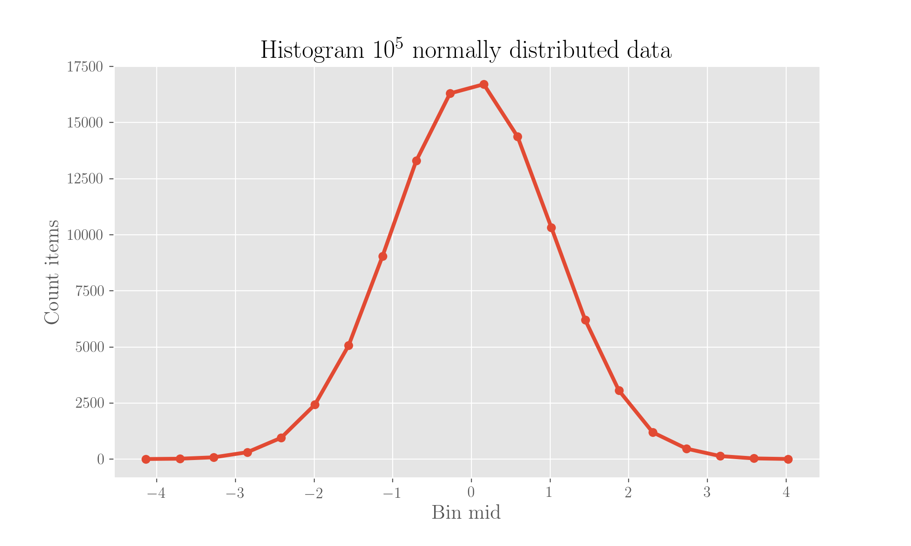

# Probability functions and displaying data

How probability is best formalised and represented, mathematically as well as visually, depends on the type of data you have.

In the following, we will use$$X$$to indicate a random variable taking values in the space of events$$\Omega$$. To mathematically express probabilities attached to certain values in$$\Omega$$, people use the _probability mass function_ in the case of discrete variables and _probability density functions_ in the case of continuous variables. Let's see them both in the following. We will also illustrate how to draw _histograms_ of data extracted from some distributions and what are _boxplots_.

For the code, run these imports first:

```python
import numpy as np
import random
from matplotlib import pyplot as plt
```

## The Probability Mass Function

The _probability mass function_, aka **pmf**, expresses, at each possible value of a discrete random variable, the probability related to it. We'll call it$$p_m$$. So, the pfm expresses the probability that $$X$$takes a given value $$x$$ :

$$
p_m(x) = P(X=x) \ ,
$$

and by the normalisation property of probability it obeys

$$
\sum_{x \in \Omega} p_m(x) = 1 .
$$

## The Probability Density Function

The **pdf**, _probability density function_, which we'll here call $$p_d(x)$$, expresses the probability for a _continuous_ random variable$$X$$to take values within a certain range, so it is effectively a density of probability.

What this means is that taken range of values $$[x_a, x_b]$$, we have

$$
P(x_a \leq X \leq x_b) = \int_{x_a}^{x_b} \text{d} x \ p_d(x) \ ,
$$

and by the normalisation property of probability we have

$$
\int_\Omega \text{d} x \ p_d(x) = 1 .
$$

## Some distributions and using histograms

Histogramming data means segmenting it into ranges \(_bins_\) and counting how many data points fall in each range. It is what you typically do when you have many data points and you need to understand how they are is distributed. We'll show all this in code, which you can also look in the repo notebook linked at the [bottom](probability-functions-and-displaying-data.md#references).

### A uniform distribution

In a uniform distribution all values are equiprobable. Let's say we uniformly extract $$10^5$$ integer data points in the interval $$[0, 10)$$ :

```python
n = 100000

data = [random.randint(0, 9) for i in range(n)]
```

and then let's compute, for each of the 10 possible values, how many of these points are there, which is equivalent to say that we are binning with a bin width of 1:

```python
bins = np.arange(0, 11, 1)

# Count the number of items falling in each bin
bin_counts = [data.count(item) for item in range(0, 10)]
    
plt.bar(range(0, 10), bin_counts, width=1, edgecolor='k')
plt.xticks(bins)
plt.title('Histogram of $10^5$ uniformly distributed data, counts')
plt.xlabel('Value')
plt.ylabel('Count items')
plt.savefig('uniform-dist.pdf')
plt.show();
```


It's plain visible that bins contain pretty much the same number of values, namely around $$10^4$$ , which is our total divided by the number of bins itself. Indeed, the difference between the highest and the lowest counts in a bins is

```python
max(bin_counts) - min(bin_counts)
```

giving 210, corresponding to a proportion of the total number of points equal to

```python
(max(bin_counts) - min(bin_counts) ) / n
```

which is 0.0021, very little! This histogram is doing a good job in showing us the data is uniformly distributed. What we have shown is, again, the _number_ of values in each bin, which is not the probability.

In order to have a PMF instead, we'd have to ideally take, for each of the values extracted, its count and then divide it by the total number of values to obtain frequency counts. Note that these are the probabilities of each possible value and they sum up to 1:

```python
freq_counts = [item / n for item in bin_counts]
sum(freq_counts)
```

which gives 1. Success. Then we can easily plot them to obtain the PMF histogram:


### A gaussian distribution

Now let's consider a gaussian distribution instead, taking the same amount \($$10^5$$\) of numbers and plotting the bins counts again. This time we extract float numbers, randomly sampled from a gaussian distribution of mean 0 and standard deviation 1. We then separate the range in 20 bins and plot the histogram of the counts of each bin as above. We use a line to signify that effectively our variable is meant to be continuous.

We attribute counts for a bin to the middle point of the bin.

```python
data = np.random.normal(size=n)
```

```python
bins = 20                                                                            # choose to separate into 20 bins
hist = np.histogram(data, bins=bins)
hist_vals, bin_edges = hist[0], hist[1]
bin_mids = [(bin_edges[i] + bin_edges[i+1])/2 for i in range(len(bin_edges) -1)]     # mids of bins again
  
plt.plot(bin_mids, hist_vals, marker='o')
plt.title('Histogram $10^5$ normally distributed data')
plt.xlabel('Bin mid')
plt.ylabel('Count items')
plt.savefig('gaussian-dist.png', dpi=200)
plt.show();
```



Each bin is large

```python
bin_edges[1] - bin_edges[0]
```

which gives about 0.45.

So, it is quite clear from the plot that the mean is indeed at 0. We can also do the same histogram but showing the pdf instead:

```python
bins = 20
hist = np.histogram(data, bins=bins, density=True)
hist_vals, bin_edges = hist[0], hist[1]
bin_mids = [(bin_edges[i] + bin_edges[i+1])/2 for i in range(len(bin_edges) -1)]

plt.plot(bin_mids, hist_vals, marker='o')
plt.title('Histogram $10^5$ normally distributed data')
plt.xlabel('Bin mid')
plt.ylabel('PDF')
plt.savefig('pdf-gaussian.png', dpi=200)
plt.show();
```


Because what we plotted above here^ is a density of probability, what sums up to 1 is not those values but the product of value times the bin width:

```python
sum([(bin_edges[i+1] - bin_edges[i]) * hist_vals[i] for i in range(len(hist_vals))])
```

which is 1. Effectively indeed, if we take for instance the first bin, its density represents the probability of being in that bin divided by the bin width itself, which is:

```python
hist_vals[0]
```

## Using boxplots as a visualisation tool

Another very useful and quite comprehensive way to display distributions is through the use of _boxplots_. Boxplots let you see, in one go, the quartiles, the mean and the potential outliers in a distribution.

To start off with, let's generate$$10^5$$random numbers extracting them from a \(in order\):

* uniform distribution
* gaussian distribution with mean 0 and standard deviation 1
* exponential distribution
* Zipf distribution $$\propto x^{-2}$$ 

Note that for the notes on some famous distributions you can head to this page:



Let's set the styles of our boxplots: the mean will be a red romboid point, the median a red line, the outliers blue circles.

Also, we identify as outliers those points which exceed the first or the third quartiles \(on the respective sides\) by 1.5 their value, according to [Tukey's criterion](probability-functions-and-displaying-data.md#references).

Following on, we create boxplots for each of our distributions.

```python
# Extract the random points

n = 100000                                     # the number of points to extract

u = np.random.uniform(size=n)                  # uniform
g = np.random.normal(size=n)                   # gaussian
e = np.random.exponential(size=n)              # exponential
z = np.random.zipf(a=2, size=n)                # Zipf (power-law) x^{-2}

# Set style of the plot

# Style of the point for the mean
meanpointprops = dict(marker='D', markeredgecolor='black', markerfacecolor='firebrick')

# Style of the outliers points
flierpointprops = dict(marker='o', markeredgecolor='blue', linestyle='none')

# Style of the median line
medianlineprops = dict(linewidth=2.5, color='firebrick')
```

```python
# Uniform distribution - boxplotting

ax = plt.subplot()

ax.boxplot(u, whis=1.5, showmeans=True, vert=False,
           meanprops=meanpointprops, flierprops=flierpointprops, medianprops=medianlineprops)

plt.title('Box plot of a uniform distribution')
plt.savefig('uniform-box.png', dpi=200)
plt.show();
```


Clearly the mean is in the middle of values and there are no outliers.

```python
# The gaussian distribution

ax = plt.subplot()

ax.boxplot(g, whis=1.5, showmeans=True, vert=False,
           meanprops=meanpointprops, flierprops=flierpointprops, 
           medianprops=medianlineprops)

plt.title('Box plot of a gaussian distribution with mean 0 and std 1')
plt.show();
```


The symmetrical tail of "outliers" is visibile.

```python
# The exponential distribution

ax = plt.subplot()

ax.boxplot(e, whis=1.5, showmeans=True, vert=False,
           meanprops=meanpointprops, flierprops=flierpointprops, medianprops=medianlineprops)

plt.title('Box plot of an exponential distribution')
plt.savefig('exp-box.png', dpi=200)
plt.show();
```


This time the distribution is heavily non-symmetrical and the tail of exceeding values is clear.

```python
# The Zipf distribution

ax = plt.subplot()

ax.boxplot(z, whis=1.5, showmeans=True, vert=False,
           meanprops=meanpointprops, flierprops=flierpointprops, medianprops=medianlineprops)

plt.title('Box plot of a Zipf distribution')
plt.savefig('zipf-box.png', dpi=200)
plt.show();
```


## References

1. The [notebook](https://nbviewer.jupyter.org/github/martinapugliese/tales-science-data/blob/master/probability-statistics-and-data-analysis/foundational-concepts-on-distribution-and-measures/notebooks/displaying-data-histograms-boxplots.ipynb) with code for this page
2. A good [page](http://www.physics.csbsju.edu/stats/box2.html) on boxplots and Tukey's criterion

