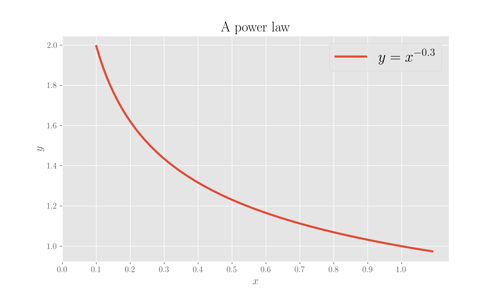

# \(Some of\) the most famous distributions

## Easy-peasy: the uniform

Let's go look at some of the most famous/common distributions you can see around. Not exhaustive and maybe you could even say that what's most popular is a matter of who you are.

Now that we're at it, let's also calculate expected value and variance \(at least\) for these ones. 

Given a continuous variable $$X $$ taking values in interval $$[a, b]$$, a _uniform_ distribution is one where every possible value has the same probability. Its pdf is simply


$$
p(x) = \frac{1}{b-a} ,
$$

because you have 1 case over the total possible cases, which is the width of the interval.

The expected value is

$$
\mathbb{E}[X] = \int_a^b \text{d}x \ \frac{1}{b-a} = \frac{b+a}{2} \ ,
$$

which, as expected \(!\), corresponds to the middle point of the interval because given that every point is equiprobable, this is where we fall by averaging values.

The variance is

$$
\begin{align} Var[X] &= \int_a^b \text{d} x \ x \Big(x - \frac{1}{b-a}\Big)^2 \\ &= \int_a^b \text{d} x \ x^3 - 2x^2\frac{1}{b-a} + \frac{x}{(b-a)^2} \\ &= \frac{b^4 - a^4}{4} - \frac{2}{3} \frac{b^3 - a^3}{b-a} + \frac{b^2-a^2}{2(b-a)^2} \\ &= \frac{(b^2 - a^2)(b^2 + a^2)}{4} - \frac{2}{3} \frac{(b-a)(b^2 + ab + a^2)}{b-a} + \frac{b+a}{2(b-a)} \\ & = \ \frac{(b-a)^2}{12} \ . \end{align}
$$

## Success or failure: the Bernoulli

Let's consider a binary variable  $$X \in \{0, 1\}$$, so that it can take the two values 1 \(which we'll call the _success_\) or 0 \(which we'll call the _failure_\). The prototype of this is the result of flipping of a coin. Let's also call $$\mu$$ the probability of the success so that, by definition

$$
P(X=1) = \mu \ ; P(X=0) = 1 - \mu \ ,
$$

so that the pmf \(it is a discrete variable\) can be expressed as

$$
p(x;\mu) = \mu^x(1-\mu)^{1-x}
$$

because when we have $$x=1$$ we are left with $$\mu$$ and when we have $$x=0$$we are left with $$1-\mu$$.

Said distribution has expected value

$$
\mathbb{E}[X] = \sum_{x \in \{0,1\}} x \mu^x(1-\mu)^{1-x} = 0 + 1\mu(1-\mu)^0 = \mu
$$

and variance

$$
Var[X] = \sum_{x \in \{0,1\}} x^2 \mu^x(1-\mu)^{1-x} - \mu^2 = \mu - \mu^2 = \mu(1-\mu)
$$

The Bernoulli distribution is a special case of a binomial distribution for a single observation, see below!

## More successes and more failures: the Binomial

The binomial distribution describes the probability of observing $$k$$ occurrences of $$x=1$$ in a set of $$n$$ samples from a Bernoulli distribution. $$\mu$$ is the probability of observing $$x=1$$ . The pmf will be then

$$
p(x;\mu) = {{n}\choose{k}} \mu^k (1-\mu)^{n-k} \ ,
$$

because we have $${{n}\choose{k}}$$ ways of creating groups of $$k$$ from $$n$$ values and because each extraction is a Bernoulli.

The expected value is

$$
\mathbb{E}[X] = n \mu
$$

and the variance is

$$
Var[X] = n \mu (1- \mu)
$$

Head to [Wikipedia](https://en.wikipedia.org/wiki/Binomial_distribution) for the proofs.

## Extending all that^: the Multinomial

It is a multivariate generalisation of the binomial and gives the distribution over counts $$m_k$$ for a $$k$$ -state discrete variable to be in state $$k$$ given a total of observations $$n$$.

An example is the extraction of $$n$$ balls of $$k$$ different colours from a bag, replacing the extracted ball after each draw. The pmf reads

$$
p(m_1, m_2, \ldots, m_k, \mu_1, \mu_2, \ldots, \mu_k, n) = {{n}\choose{m_1 m_2 \ldots m_k}} \mu_1^{m_1} \mu_2^{m_2} \ldots \mu_k^{m_k}
$$

and we have

$$
\mathbb{E}[m_k] = n \mu_k \ , Var[m_k] = n \mu_k(1-\mu_k)
$$

## Her majesty the Gaussian

The gaussian distribution \(after C F Gauss\) is also called a _normal_ distribution or, in some cases, bell curve \(from its shape\). Let $$\mu$$ be the expected value and $$\sigma$$ the standard deviation,

$$
p(x; \mu, \sigma) = \frac{1}{\sqrt{2 \pi \sigma^2}} e^{-\frac{1}{2 \sigma^2} (x-\mu)^2}
$$

It is usually indicated as $$\mathcal N(\mu, \sigma^2)$$, where the $$\mathcal N$$ stands for "normal".

## The Beta

Given a continuous variable $$x \in [0, 1]$$, the distribution is parametrised by $$\alpha, \beta > 0$$ which define its shape.

$$
p(x; \alpha, \beta) = N x^{\alpha-1}(1-x)^{\beta-1} \ ,
$$

where $$N$$ $\mathcal{N}$ is the normalisation constant:

$$
N = \frac{\Gamma(\alpha + \beta)}{\Gamma(\alpha) \Gamma(\beta)} = \frac{1}{\int d u u^{\alpha -1}(1-u)^{\beta-1}} \ ,
$$

with $$\Gamma$$ the gamma function \(extension of the factorial to real and complex numbers\), defined as

$$
\Gamma(t) = \int_0^\infty x^{t-1} e^{-x} dx
$$

and

$$
\frac{\Gamma(\alpha + \beta)}{\Gamma(\alpha) \Gamma(\beta)} = \frac{1}{B(\alpha, \beta)} \ ,
$$

$$B$$ being the beta function.

The beta distribution is the conjugate prior of the Bernoulli distribution for which $$\alpha$$ and $$\beta$$ are the prior number of observations $$x=1$$ and $$x=0$$. When $$\alpha=\beta=1$$, it reduces to a uniform distribution.

## The Student's t

_Student_ was the pseudonym of W Gosset, which we can all consider ourselves very grateful to, given all his seminal work in Statistics. He was working at the Guinness brewery in Dublin and produced various intellectual findings while working with beer data, but had to publish under a false name due to company's regulations, and he chose "Student".

This distribution arises when estimating the mean of a normally distributed population in situations where the sample size is mall and the population standard deviation is unknown. Hence, it describes a sample extracted from said population: the larger the sample, the more the distribution resembles the normal.

$$
p(x; \nu) = \frac{\Gamma(\frac{\nu+1}{2})}{\sqrt{\nu \pi} \Gamma(\frac{\nu}{2})} \Big(1 + \frac{x^2}{\nu}\Big)^{-\frac{\nu+1}{2}}
$$

$$\nu$$ is the number of degrees of freedom. For $$\nu=1$$, the distribution reduces to the Cauchy distribution.

## The elegant Chi-squared, $$\chi^2$$

It is the distribution \(with $$k$$degrees of freedom\) of the sum of the squares of $$k$$independent standardised normal variables $$z_i$$ \(that is, normal variables standardised to have mean 0 and standard deviation 1\). It is a special case of the $$\Gamma$$ distribution.

$$
Q = \sum_1^k z_i^2 \ ,
$$

So

$$
Q \sim \chi^2(k)
$$

and depends on the degrees of freedom.

## The Poisson: events in time or space

It is a discrete probability distribution and describes the probability that a given number of events occurs in a fixed interval of time and/or space if they are known to occur with a certain \(known\) average rate and independently of the time and/or distance of the last event.

An example is the mail you receive per day. Suppose on average you receive 4 mails per day. Assuming that the events "mail arriving" are independent, then it is reasonable to assume that the number of mails received each day follows a Poissonian. Other examples are the number of people in a queue at a given time of the day or the number of goals scored in a world cup match, see below.

$$
P(k) = \frac{\lambda^k e^{-\lambda}}{k!} \ ,
$$

where $$k = 0, 1, 2, \ldots$$is the number of events in an interval and $$\lambda$$ the average number of such events in the same interval.

The expected value is

$$
\mathbb{E}[k] = \sum_{k \geq 0} k \frac{\lambda^k e^{-\lambda}}{k!} = \sum_{k \geq 1} \lambda \frac{\lambda^{k-1}}{(k-1)!} e^{-\lambda} = \lambda e^{-\lambda} e^\lambda = \lambda
$$

and the variance is

$$
\begin{align*} Var[k] &= \mathbb{E}[k^2] - \mathbb{E}^2[k] \\ &= \sum^{k \geq 0} k^2 \frac{\lambda^k e^{-\lambda}}{k!} - \lambda^2 \\ &= \lambda e^{-\lambda} \sum_{k \geq 1} k \frac{\lambda^{k-1}}{(k-1)!} - \lambda^2 \\ &= \lambda e^{-\lambda} \Big[ \sum_{k \geq 1} (k-1) \frac{\lambda^{k-1}}{(k-1)!} + \sum_{k \geq 1} \frac{\lambda^{k-1}}{(k-1)!} - \lambda^2 \Big] \\ &= \lambda \Big[ \lambda \sum_{k \geq 2} \frac{1}{(k-2)!} \lambda^{k-2} + \sum_{k \geq 1} \frac{1}{(k-1)!} \lambda^{k-1} - \lambda^2 \Big] \\ &= \lambda e^{-\lambda} \Big[ \lambda \sum_{k \geq 2} \frac{1}{(k-2)!} \lambda^{k-2} + \sum_{k \geq 1} \frac{1}{(k-1)!} \lambda^{k-1} - \lambda^2\Big] \\ &= \lambda e^{-\lambda} \Big[ \lambda \sum_{i \geq 0} \frac{1}{i!}\lambda^i + \sum_{j \geq 0} \frac{1}{j!} \lambda^j \Big] \\ &= \lambda e^{- \lambda} [\lambda e^\lambda + e^\lambda] - \lambda^2 = \lambda^2 + \lambda - \lambda^2 = \lambda \end{align*}
$$

So expected value and variance are the same and equal to the average rate of occurrence.

The Poisson distribution is appropriate if

* the events are independent, _i.e._, the occurrence of one of them does not affect the probability that a second one occurs;
* the rate with  which events occur is constant;
* two events cannot occur at the same time;
* the probability of an occurrence of an event in an interval is proportional to the length of the interval

### **Example**

Knowing from historical data that the average number of goals scored in a world football match is 2.5, and because the phenomenon can be described by a Poissonian, we have

$$
P(k \text{ goals in a match}) = \frac{2.5^k e^{-2.5}}{k!} \
$$

and we can calculate the expected value and the variance as above.

An example of a phenomenon which violates the Poissonian assumptions would be the number of students arriving at the student union: the rate is not constant \(as it is low during class time and high between class times\) and events are co-occurring \(students tend to come in groups\).

## The Dirichlet

It is a continuous multivariate distribution and the generalisation of the beta distribution, typically denoted as $$\text{Dir}(\alpha)$$, $$\alpha$$ being the parametrising vector such that $$\alpha = (\alpha_i), \alpha_i \in \mathbb{R}, \alpha_i > 0 \forall i$$. It is usually used as a prior in bayesian statistics as it is the conjugate prior of the multinomial distribution.

A Dirichlet distribution of order $$k \geq 2$$ with parameters $$\alpha_i$$ has the probability density function

$$
f(x_1, \ldots, x_k; \alpha_1, \ldots, \alpha_k) = \frac{1}{B(\alpha)} \Pi_{i=1}^k x_i^{\alpha_i - 1}
$$

with $$B$$being the beta function in $$\mathbb{R}^{k-1}$$ and $$x$$ living on the open $$(k-1)$$-dimensional simplex $$x_1, \ldots, x_k > 0$$ , $$x_1 + \ldots + x_{k-1} < 1$$ , $$x_k = 1 - x_1 - \ldots - x_{k-1}$$ .

## The power of the power-law

The power-law is a great one, a deserves a bit of commentary.

### What's a power law, in general

A power law is, in general, a mathematical function of type

$$
f(x) \propto x^\alpha \ ,
$$

so that in a log-log plot it will appear as a straight line because

$$
f(x) = Ax^\alpha \Rightarrow \log(f(x)) = \log A + \alpha \log x \ .
$$

Let's look at it.

```python
# Plotting a power function 

x = np.array([i for i in np.arange(0.1, 1.1, 0.01)])
y = np.array([item**-0.3 for item in x])

plt.plot(x, y, label='$y = x^{-0.3}$')
plt.xlabel('$x$')
plt.ylabel('$y$')
plt.xticks([i for i in np.arange(0, 1.1, 0.1)])
plt.title("A power law")
plt.legend()
plt.show();
```



### Power law distributions <a id="Power-law-distributions"></a>

Newman's paper in [\[1\]](some-of-the-most-famous-distributions.md#References) is a great source about the topic and lots of what will be presented here is re-elaborated from there. It is also a very clearly written and enjoyable paper. The Wikipedia page [\[3\]](some-of-the-most-famous-distributions.md#References) on the topic is also quite well written.

We talk of data distributed power law when the quantity we are measuring has a probability which is a power of the quantity itself, so that a power-law distribution has a probability density function typically written as

$$
p(x) = A x^{-\alpha} \ ,
$$

where $$A$$ is the normalisation constant.

We put a minus sign in front of the exponent \(with respect to what we wrote above for a generic power-law function\) as we're thinking of a decreasing relation.

There must be a minimum value $$x_{min}$$, otherwise it wouldn't be normalisable \(the area under the curve would diverge, see figure above\).

As for the exponent, we need to have $$\alpha>1$$ for it to be a pdf, hence integrable, because by definition,

$$
\begin{align} 1 &= \int_{x_{min}}^\infty p(x) \text{d} x \\ &= A \int_{x_{min}}^\infty x^{-\alpha} \text{d} x \\ &= \frac{A}{-\alpha + 1} \Big[x^{-\alpha + 1}\Big]_{x_{min}}^\infty \\ \end{align}
$$

which is only non-diverging when $$\alpha>1$$. From here, the normalisation constant is $$A=(\alpha-1)\ x_{min}^{\alpha-1}$$.

#### Where you find them <a id="Where-you-find-them"></a>

Many observed phenomena in several disciplines follow power-law distributions, examples are the Zipf in _linguistics_, the Pareto in _economics_, the _Taylor_ in ecology, ... In a typical situation though, it is the tail of a distribution which is power-law.

In [\[5\]](some-of-the-most-famous-distributions.md#References) Mandelbrot and Taleb exquisitely talk about when using a gaussian paradigm for a power law phenomenon can lead to disaster in finance.

#### What makes them interesting <a id="What-makes-them-interesting"></a>

* the absence of a typical _scale_: while other distributions \(the gaussian being the king example\) will have a typical value which can be used as representative of the distribution \(along with an error\), power laws are scale-free: values can span several orders of magnitude
* _scale invariance_: if the independent variable is rescaled by a factor, the law only gets affected by proportional scaling, so a consequence, this means that all power laws with the same exponents are rescaled versions of each other:

$$
p(cx) = A (cx)^{-\alpha} = A c^{-\alpha} x^{-\alpha} \ ,
$$

* _long tail_: in a power law, the tail is fat, meaning that the frequency of the highly frequent items is higher than it would be in other distributions This is brilliantly explained in this blog post by Panos Ipeirotis[ \[4\]](some-of-the-most-famous-distributions.md#References), where he points out that despite the fact that a power law is often described as a distribution where "there are a lot of very unfrequent items and a few very frequent ones", this is a distortion of reality: what is striking of a power law is that actually the very frequent items occur much more frequently than they would in other distributions.

#### Moments <a id="Moments"></a>

The _mean_ of a power law is only defined when $$\alpha>2$$:

$$
\begin{align} \mathrm{E}[x] = \bar x &= A \int_{x_{min}}^\infty x x^{-\alpha} \text{d} x \\ &= A \int_{x_{min}}^\infty x^{-\alpha + 1} \text{d} x \\ &= \frac{A}{-\alpha + 2} \Big[x^{-\alpha + 2}\Big]_{x_{min}}^\infty \end{align}
$$

The _variance_ of a power law is only defined when $$\alpha>3$$:

$$
\begin{align} \mathrm{Var}[x] &= A \int_{x_{min}}^\infty (x-\bar x)^2 x^{-\alpha} \text{d} x \\ &= A \int_{x_{min}}^\infty x^{-\alpha + 2} + (\bar x)^2 x^{-\alpha} - 2 x^{-\alpha-1} \bar x \text{d} x \end{align}
$$

#### Plotting it <a id="Plotting-it"></a>

A simple plot in log-log scale of the histogram of data helps the eye spot potential power-law behaviours, but this alone is a very unreliable way of identifying the distribution. Because there is much less data in the tail than there is in the head of the distribution, the tail will appear very noisy.

A better way is to plot the data histogrammed, but with logarithmic binning, and in log-log scale. This helps reduce the noisy tail problem.

### References[¶]() <a id="References"></a>

_To be honest these are all about power-laws._

1.  M E Newman, [Power laws, Pareto distributions and Zipf’s law](https://arxiv.org/abs/cond-mat/0412004), _Contemporary physics_ 46.5, 2005
2.  J Alstott, E Bullmore, D Plenz, [powerlaw: a Python package for analysis of heavy-tailed distributions](http://journals.plos.org/plosone/article?id=10.1371/journal.pone.0085777), _PloS ONE_ 9.1, 2014
3.  [Wikipedia on power laws](https://en.wikipedia.org/wiki/Power_law)
4.  P Ipeirotis, [Misunderstandings of power laws](http://www.behind-the-enemy-lines.com/2008/01/misunderstandings-of-power-law.html)
5.  B Mandelbrot, N N Taleb, [How the Finance Gurus Get Risk All Wrong](http://archive.fortune.com/magazines/fortune/fortune_archive/2005/07/11/8265256/index.htm), Fortune magazine, Jul 2005

