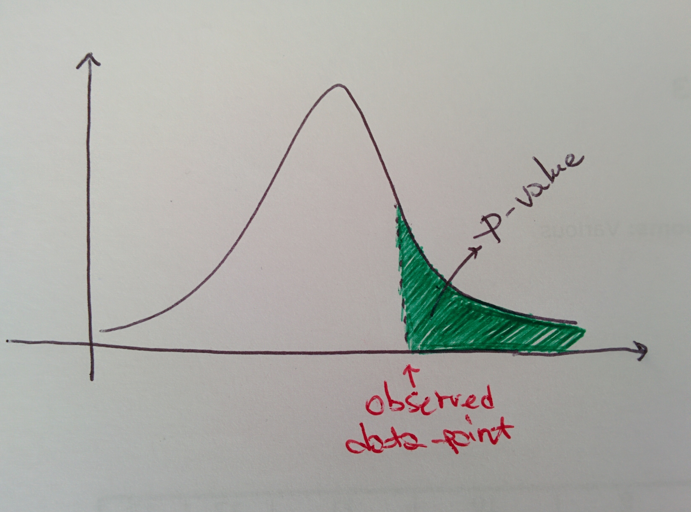

# Feeling confident on a test result?

## Confidence and significance levels

The confidence level gives the probability that a value falls in a specified interval and is typically \(and traditionally\) set at, in order how "how safe you want to be", 90%, 95%, 99%.

It is indicated by$$1-\alpha$$,$$\alpha$$being the float to be subtracted from probability 1 to get the above levels, hence 0.1, 0.05, 0.01 respectively. $$\alpha$$ is called the _significance level_.

In general, the confidence level describes the uncertainty associated with a sampling method of our variable of interest.

## The $$p$$-value

 

If I am taking a measurement, and observe a certain data point, this data point would be one of the many I could observe given the probability distribution of the variable I am measuring.

The$$p$$-value is the probability of obtaining a result equal or greater than the point which was actually observed, under the assumption of hypothesis$$\mathcal{H}$$. The figure here illustrates the concept.

In statistical testing, the null hypothesis$$\mathcal{H_0}$$is rejected if the $$p$$-value of the experiment does _not_ pass the threshold$$\alpha$$at the chosen confidence level, which translated means if $$p \leq \alpha$$, $$\mathcal{H_0}$$can be rejected.

See the page on the$$\chi^2$$test for an example of use of these concepts.



### Pinch of salt

The $$p$$-value, when used in statistical testing contexts, ought not to be taken as a definitive source of truth. In fact, it was not meant to be when conceived. See the brilliant [Nature article](feeling-confident-on-a-test-result.md#references) on this for an extensive comment on the topic.

## The error margin

If you have a statistic to be used to describe the quantity of interest, say for instance \(and typically\) the sample mean of a series of measurements, to compute an error margin against if you'd

1. First, choose the desired confidence level, usual choices are 90%, 95% or 99%
2. Check whether the population standard deviation$$\sigma$$is known or not: if it is, compute a z score; if it isn't, compute a t score

The margin of error will be given by

$$
(z/t) \frac{\sigma/s}{\sqrt{n}} ,
$$

where if$$\sigma$$is known you'd use $$\sigma$$ and $$z$$ , otherwise you'd use $$s$$ \(the sample mean\) and $$t$$ . It will then, and quite intuitively, depend on how many data points you've got. The result is meant to be interpreted as _you are, at the chosen confidence level CL, CL% confident that the estimate of your variable lies within the error margin_.

## An application: the minimum sample size in the binomial parameter

The binomial parameter is $$p = \frac{k}{n}$$, where $$k$$ is the number of successes and $$n$$ the number of trials. How good is this parameter \(which is computed on a _sample_ of size $$n$$\) as an estimate of the real _population_ parameter? Translated: how big does $$n$$ have to be for $$p$$ to be reliable?

### Intro: the De Moivre-Laplace theorem and how we use it

**Statement**: the binomial distribution is approximated by a gaussian distribution when $$n \to \infty$$, this gaussian having mean $$np$$ and standard deviation $$\sqrt{np(1-p)}$$.

**Proof**: go see [Wikipedia](feeling-confident-on-a-test-result.md#references).

For our purposes here, we're focused on the binomial parameter, not the count of successes. By the linearity of the mean and standard deviation, we infer that when $$n$$ is large enough the distribution of the binomial parameter becomes a gaussian with mean $$\mu=p$$and standard deviation $$\sigma=\sqrt{\frac{p(1-p)}{n}}$$. That's pretty much what we will use to answer our question.

### Choosing the margin of error and confidence level

The "how big the sample size has to be" depends entirely on our choice of the error margin we want to allow around $$p$$ and the confidence level we want to have, that is, how sure we want to be about it. There is no number without an error.

First of all, let us choose the desired margin of error we want. Say we want $$p$$ to fluctuate within a range of 0.01, it'll then mean that we can write

$$
p \pm 0.01
$$

Second of all, we need to decide the confidence level we want to apply. We use the statement from the De Moivre-Laplace theorem above and the z-score to affirm that the error margin $$e$$ is

$$
e = z_{\alpha/2} \sqrt{\frac{p(1-p)}{n}}
$$

### Proving what we said here^

The main source I used for this is a page by [PennState](https://onlinecourses.science.psu.edu/stat500/node/30).

From the notion of confidence level, we can write that, setting our confidence level as $$1-\alpha$$ and being $$x$$ our random variable of interest, namely the binomial parameter distributed with a gaussian of mean $$p$$ and standard deviation $$\sqrt{\frac{p(1-p)}{n}}$$,

$$
P \left(-z_{\alpha/2} \leq \frac{x - p}{\sqrt{\frac{p(1-p)}{n}}} \leq z_{\alpha/2}\right) = 1 - \alpha \ ,
$$

which turns into

$$
p - z_{\alpha/2}\sqrt{\frac{p(1-p)}{n}} \leq x \leq p + z_{\alpha/2} \sqrt{\frac{p(1-p)}{n}} \ ,
$$

so that stated above is the margin or error.

### Calculating the minimum $$n$$

So from what we said above, setting both the margin of error and the confidence level desired, we can easily compute the minimum required $$n$$ as

$$
n_{\text{min}} = \frac{z_{\alpha/2}^2 p(1-p)}{e^2} \ .
$$

In a stricter, more conservative case, we'd use the maximum of $$p(1-p)$$ \(which is $$\frac{1}{2}$$\) instead, so that

$$
n_{\text{min}} = \frac{z_{\alpha/2}^2 \frac{1}{2} \frac{1}{2}}{e^2} \ .
$$

## References

1. A fantastic [**Nature feature article**](http://www.nature.com/news/scientific-method-statistical-errors-1.14700) on the overspread and misuse of the p-value in data analysis
2. [Wikipedia](https://en.wikipedia.org/wiki/De_Moivre–Laplace_theorem) on the De Moivre - Laplace theorem
3. This great [page](https://onlinecourses.science.psu.edu/stat500/node/30) from PennState on the topic

