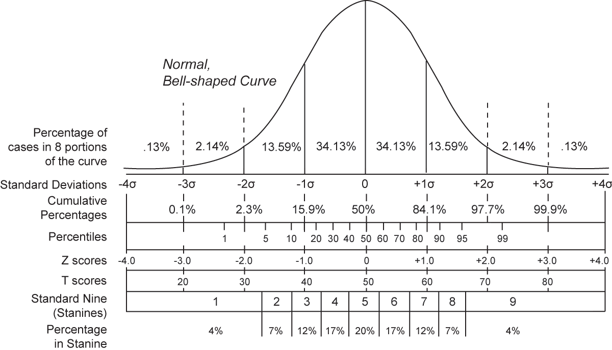
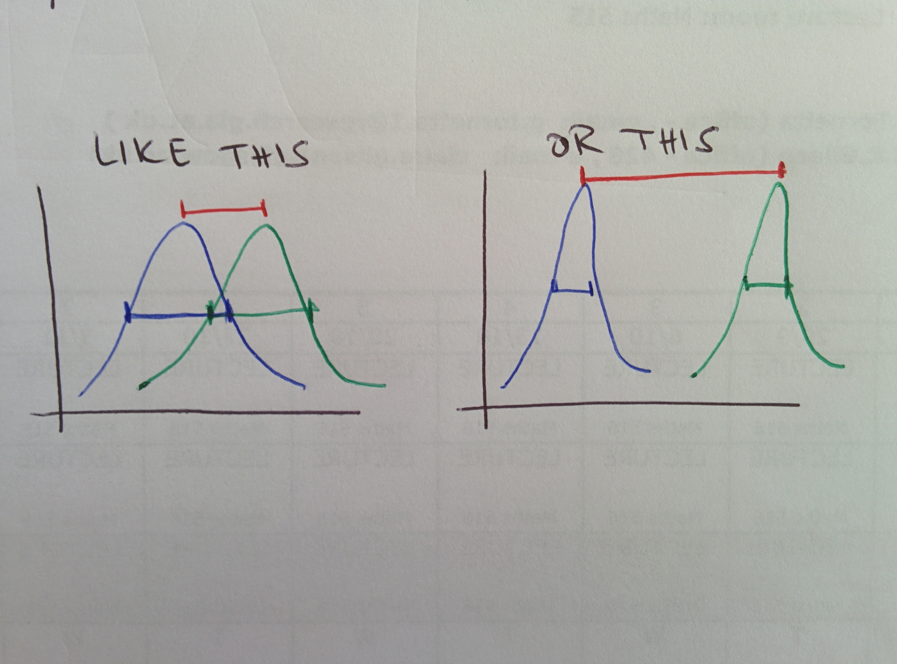

# Testing if datasets are different

## Prologue: $$t$$-score and $$z$$-score

### The $$z$$-score

Let $$x$$ be the value taken by a random variable $$X$$ with a probability distribution whose mean is $$\mu$$ and whose standard deviation is $$\sigma$$\(population values\). The _z-score_, also called _standard score_, is defined as

$$
z = \frac{x - \mu}{\sigma} \ ,
$$

and tells the number of \(signed\) standard deviations $$x$$is away from the mean. It is basically $$x$$ standardised.

 This figure illustrates the concept of the z-score for a normal distribution. You can see that $$34.13 \% \cdot 2 = 68.26 \%$$ of the items are located at a distance of $$1 \sigma$$ from the mean, then $$34.13 \% \cdot 2 + 13.59 \% \cdot 2 = 95.44 \%$$ are located at $$2 \sigma$$, and so on.

### The $$t$$-score

When the population mean and standard deviation are not known, a $$t$$ -score can be calculated, as

$$
t = \frac{x - \bar x}{s/\sqrt{n}} \ ,
$$

$$\bar x$$ being the sample mean, $$s$$ the sample standard deviation and $$n$$ the number of samples.

## The $$t$$-test

The t-test tests, in the two samples variant, if two datasets are significantly different, that is, if their means are really different, the null hypothesis being that they are not. In the one sample variant, the test tests whether the mean is significantly different from the one coming from the null hypothesis.

It was originally published by W S Gosset, known as Student, in [Biometrika](testing-if-datasets-are-different.md#references) in 1908. \(Proto\)typical applications are in medicine, to test whether a treatment is effective or not in curing an illness, or in testing whether girls outperform boys in a school exam, and so on. It is a widely used statistical test.

### The gist of it

 The test statistic used in this test is distributed according to Student's t distribution under the null hypothesis, which means it would follow a normal distribution if the sample size were bigger. When the data cannot be assumed to be normally distributed, the t-test can't be used, but the [Mann-Whitney U test](https://en.wikipedia.org/wiki/Mann–Whitney_U_test) covers for this case.

The t-test evaluates the difference between the means of the distributions with respect to their spread \(variability\). In the figure, the distributions have the same means difference but very different variabilities.

In the following, the null hypothesis will be indicated with $$H_0$$.

### How it works

#### **Two samples t-test**

Given two sets of data indicated by indices 1 and 2, whose means are respectively $$m_1$$ and $$m_2$$ and whose standard deviations $$s_1$$ and $$s_2$$ \(we use $$m$$and $$s$$ to stress these are sample and not population values\) the $$t$$ statistics is calculated as

$$
t = \frac{m_1 - m_2}{s_{m_1 - m_2}} \ ,
$$

The denominator is the standard error of the difference of such means:

$$
s_{m_1 - m_2} = \sqrt{\frac{s_1^2}{n_1} + \frac{s_2^2}{n_2}} \ .
$$

where $$s_i$$ is the unbiased estimator of the sample variance and $$n_i$$ is the number of points in the sample.

The $$t$$ statistics, so calculated, has to be checked against the table of values of the distribution of the Student's t to get the $$p$$-value so that if said $$p$$-value falls below the chosen threshold for significance, $$H_0$$ gets rejected.

#### **One sample t-test**

In the one-sample t-test, we test the null hypothesis that the mean $$m$$ is equal to a specified value $$\mu_0$$. In this case the t statistics to use is

$$
t = \frac{\bar{x} - \mu_0}{\frac{s}{\sqrt{n}}} \ ,
$$

with $$s$$ being the standard deviation of the sample and $$n$$ the sample size.

**Paired t-test**

In the paired t-test, we compare two population means where we have two samples and the observations in them are paired.

For example, we have observations before and after performing some action on the same individual \(example: students' results before and after a course or two medical treatment results on the same individual\). The observations are then not independent so a 2-sample t-test is not appropriate.

A paired t-test is performed by testing the difference of the two measurements in a 1-sample t-test, so the difference of pairs does not follow a symmetric distribution around 0.

Steps are

1. $$\forall i$$ , we calculate $$|x{1, i} - x{2, i}|$$ and $$sng(x{1, i} - x{2, i})$$ 
2. we exclude pairs with such difference being 0, so we have the reduced sample size $$N_r$$ 
3. Order the $$N_r$$ pairs by the absolute differences ascending 
4. Rank the pairs so that the smallest gets rank 1, ties are ranked with rank equal to the average of the ranks spanned
5. Calculate the test statistics $$w = \sum{i=1}^{N_r} sgn(x{1, i} - x_{2, i}) R_i$$ where $$R_i$$ is the rank of the pair
6. Under the null hypothesis $$H_0$$, __$$w$$ follows a specific distribution \(there is no simple expression\) with expected value 0 and variance $$\frac{N_r (N_r + 1)(2 N_r + 1)}{6}$$ , so $$w$$ can be compared to table values and $$H_0$$ gets rejected if $$|w| \geq W{critical, N_r}$$ 
7. As $$N_r$$ increases, the distribution of $$w$$ converges to a gaussian, thus a [z-score](testing-if-datasets-are-different.md#the-score) can be calculated as $$z = \frac{w}{\sigma_w}$$ , where $$\sigma_w$$ is the standard deviation, so if $$|z| \geq z_{critical}$$ we reject $$H_0$$ 

## The $$z$$ -test

The z-test uses the z-score in much the same way as the t-test uses the t-score. In fact, it is the analog of the t-test for the situation when the parameters of the underlying population are known, rather than estimated from a sample.

It is a test in which the statistic follows a normal distribution:

* in the one-sample z-test one tests the null hypothesis that the population mean is equal to $$\mu_0$$ 
* in the two-samples z-test two means are compared

## References

1. The Wikipedia [page](https://en.wikipedia.org/wiki/Standard_score) on the standard score
2. Student, ****[**The probable error of a mean**](http://seismo.berkeley.edu/~kirchner/eps_120/Odds_n_ends/Students_original_paper.pdf), _Biometrika_, 6:1, 1908

