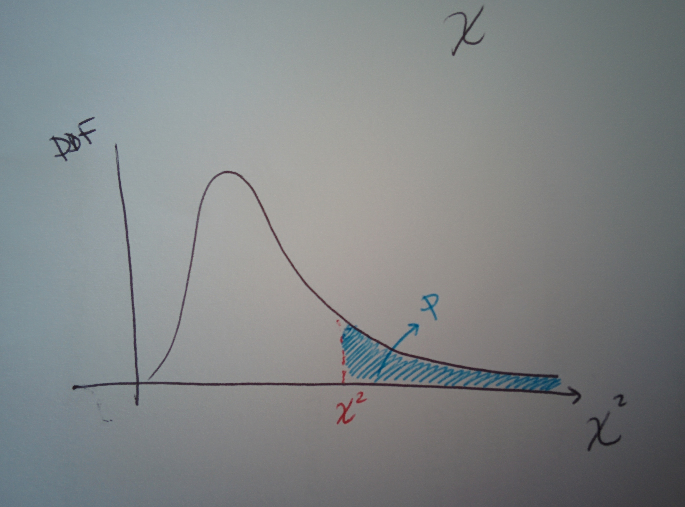

# The chi squared test

## What is



The $$\chi^2$$ test is a statistical hypothesis test in which the distribution of the test statistic calculated on the data is a $$\chi^2$$ distribution \(see page above\) under null hypothesis. The assumption is that data is normally distributed and independent so the $$\chi^2$$ test can also be used to reject the hypothesis that data are independent.

 It is used with categorical data to see if the number of individuals in each category is consistent with the expected values. In practice, the test is used to determine if there is a significant difference between the expected frequencies and the observed frequencies of the outcomes of an experiment in one or more categories, that is, if the observed differences are due to chance. The idea is: is the number of individuals falling into each category significantly different from the number you would expect under the null hypothesis? Is this difference between expected and observed data due to sampling or is it real?

The $$\chi^2$$ is defined as

$$
\chi^2 = \sum_i \frac{(o_i - h_i)^2}{h_i} \ ,
$$

where $$o_i$$is the observed value and $$h_i$$ the null hypothesis value.

The computed $$\chi^2$$ has to be compared to [table values](the-chi-squared-test.md#references) for the $$\chi^2$$ distribution at the chosen level of significance and for given degrees of freedom one has in order to decide if the null hypothesis can be rejected or not, using the $$p$$ -value \(see page\).



## An example

This simple example has been adapted from [here](the-chi-squared-test.md#references).

Let's say that we have a \(6-faces\) dice and we want to know if it is fair, that is, if each of the faces is equiprobable or if there is any bias towards a face. We throw the dice 60 times: in the case of a fair dice we would have each face appearing 10 times \(60/6 where 6 is the number of possible results\). This will be the null hypothesis.

We build a table containing the actual counts we get for each face, and said null hypothesis:

| Dice observations | Face 1 | Face 2 | Face 3 | Face 4 | Face 5 | Face 6 |
| :--- | :---: | :---: | :---: | :---: | :---: | :---: |
| **Observations** | 5 | 8 | 9 | 8 | 10 | 20 |
| **Null Hypothesis** | 10 | 10 | 10 | 10 | 10 | 10 |

The $$\chi^2$$ gets calculated as

$$
\begin{align} \chi^2 = \frac{(5-10)^2}{10} + \frac{(8-10)^2}{10} + \frac{(9-10)^2}{10} &+& \ \frac{(8-10)^2}{10} + \frac{(10-10)^2}{10} + \frac{(20-10)^2}{10} = 13.4 \end{align}
$$

The number of degrees of freedom is the number of terms minus 1 , so 6-1=5. Looking up for the values of the $$\chi^2$$ distribution at this number of degrees of freedom and for a confidence level of 95% we get a value of 11.070. Because our calculated $$\chi^2$$ exceeds the table value, this means that the $$p$$ -value associated to it is smaller than 0.05, so we can discard the null hypothesis at that significance level.

Nevertheless, note that if we choose a confidence level of 99% instead, so want to be safer, we cannot discard the null hypothesis as the table value for the $$\chi^2$$ at that level is 15.086, bigger than our calculated one, hence the $$p$$ -value does pass the required threshold of 0.01.

## A typical use case: the goodness of a distribution fit

The $$\chi^2$$ test is widely used to determine how good a fit is, that is, how well a statistical model describes \(fits\) the observational points. The number of degrees of freedom to be used to retrieve the comparison with table values is the total number of observations minus the number of fit parameters.

### Fitting a uniform distribution

Let's say we have $$n$$ data points and we bin them into $$b$$ bins, the expected occurrence frequency of each bin \(the number per bin expected\) would be, given that the distribution is uniform,

$$
h_i = \frac{n}{b} \ \ \forall i \ ,
$$

$$i$$ being the index of the bins.

Our $$\chi^2$$ test statistic is

$$
\chi^2 = \sum_{i=1}^b \frac{(o_i - h_i)^2}{h_i}
$$

where $$o_i$$ is the observed number of data points in the bin.

### Fitting a non-uniform distribution

In that case the hypothesis values have to be computed from the hypothesis distribution.

## References

1. The $$\chi^2$$ [distribution table](https://people.smp.uq.edu.au/YoniNazarathy/stat_models_B_course_spring_07/distributions/chisqtab.pdf)
2. The [original source](http://ccnmtl.columbia.edu/projects/qmss/the_chisquare_test/about_the_chisquare_test.html) for the dice example

