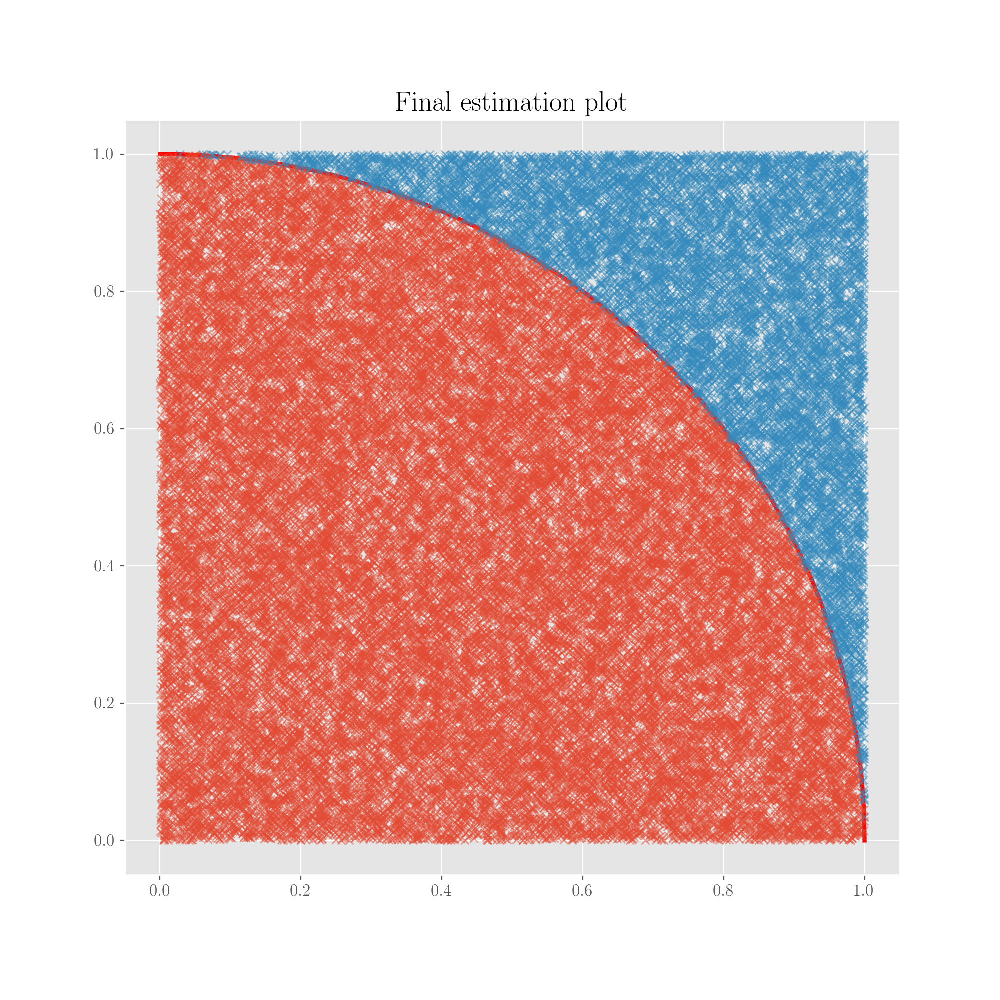

# Monte Carlo

## What is

The Monte Carlo is a probability-based method, very popular in Physics circles, to perform numerical estimations of quantities. It relies on the very simple idea of _repeated random sampling_ and is often used to estimate integrals. In practice, what you do is drawing a lot of random numbers, and observing the number of them which respect a certain property, property that will give you the estimate of the quantity you're looking for and that is difficult to calculate analytically.

The method is a very simple and elegant one, and this is why it's one of the silver bullets of Physics. It was proposed by S Ulam while working on military-related projects at the Los Alamos labs in 1940 and became a big contributor to the work of the Project Manhattan, see this historical review [paper](monte-carlo.md#references) for a dive into those times. The name is a clear reference to the casino in Monaco.

Monte Carlo estimations are regularly used in problems of

* optimisation
* numerical integration
* drawing from a probability distribution

The basic idea can be visualised by imagining that we can estimate the surface area of a lake by throwing stones across and counting the number of those which fall in the lake with respect to those that fall outside.

The Monte Carlo method is fundamentally based on the law of large numbers \(see page\).



## Numerical integration: an example estimating $$\pi$$ 

A notebook with the code presented here can be seen [here](https://nbviewer.jupyter.org/github/martinapugliese/tales-science-data/blob/master/probability-statistics-and-data-analysis/methods-theorems-and-laws/notebooks/monte-carlo-pi.ipynb).

This is a pedagogical example, cited in many places, for instance [Wikipedia](monte-carlo.md#references). Because of the relation linking $$\pi$$ to the area $$A$$ of a circle of radius $$r$$, namely

$$
A = \pi r^2 \ ,
$$

we can easily estimate $$\pi$$ via considering a circle inscribed in a square. The area of the square would simply be $$r^2$$ , hence the ratio of the two areas comes down to $$\pi$$ . With a similar argument, we can consider a quarter of a circle inscribed in a square of side 1. The ratio of the areas would be $$\frac{\pi}{4}$$ , so this ratio, found numerically, multiplied by 4 would give us the sought estimate of $$\pi$$ .

For other examples, see the [reference below](monte-carlo.md#references).

```python
def f_quartercircle(x):
    """Quarter of a cirle in the first quadrant."""
    return np.sqrt(1-x**2)


# get 1000 numbers between 0 and 1, equally spaced, and the quarter circle function on them
x = np.linspace(0, 1, num=1000)
y = [f_quartercircle(item) for item in x]

# loop over the number of extracted points, and extract them uniformly between 0 and 1, both x and y
for n in [100, 1000, 5000, 10000, 20000, 30000, 50000]:
    
    points = np.random.uniform(0, 1, size=(n, 2))     # n points in the plane, randomly (uniformly) extracted in [0,1]
    
    under_points = []
    over_points = []
    
    # select if point is below or above the circle
    for point in points:
        if point[1] <= f_quartercircle(point[0]):
            under_points.append(point)
        else:
            over_points.append(point)

    # estimate pi as the ratio of number of points below circle to total
    est_pi = float(len(under_points)) / n * 4
    
    # compute the relative error to the real pi, in percentage
    perc_err = abs(float(est_pi - np.pi))/np.pi
    print('Estimated pi at %d points: %f, with relative error %f' %(n, est_pi, perc_err))
```

This will print the estimation of $$\pi$$ with decreasing relative error.

```python
plt.figure(figsize=(10, 10))

plt.title('Final estimation plot')
plt.plot(x, y, color='r', lw=3)
plt.plot([point[0] for point in under_points], [point[1] for point in under_points], 'x', alpha=0.5)
plt.plot([point[0] for point in over_points], [point[1] for point in over_points], 'x', alpha=0.5)
plt.show();
```



## Distribution sampling

Using Monte Carlo for distribution sampling means doing this:

1. generate some independent datasets under the condition of interest
2. computer the numerical value of the estimator for each dataset, that is, the test statistic
3. compute summary statistics over all the dataset test statistic computed

If for instance we want to estimate the mean and standard deviation of a random variable $$Y$$, and we have a sample of $$N$$values of it, the sample mean and the sample standard deviation are effectively Monte Carlo estimations of those which by the law of large numbers we expect to converge to the population ones when $$N$$is big enough.

## References

1. [Stan Ulam, John Von Neumann and the Monte Carlo method](http://www-star.st-and.ac.uk/~kw25/teaching/mcrt/MC_history_3.pdf), _Los Alamos Science special issue_, 1987
2. [Wikipedia](https://en.wikipedia.org/wiki/Monte_Carlo_method) on the Monte Carlo method
3. Some useful [slides](https://www.unige.ch/sciences/astro/files/2713/8971/4086/3_Paltani_MonteCarlo.pdf) on the method, with examples, from the University of Geneva

