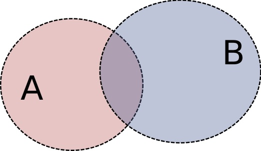

# Bayes' theorem and conjugate distributions

## What is

The Bayes' theorem, theorised by minister Thomas Bayes in the second half of the eighteenth century, relates the probability of an event to prior knowledge around it.

We'll call $$E$$ and $$H$$ respectively the _evidence_ \(what we see happening, the measurement\) and the _hypothesis_, whose probability will be affected by gathering the evidence. Bayes' theorem states that the probability of $$H$$ after observing $$E$$ is computed as the ratio of the probability of $$E$$ given $$H$$ to the probability of $$E$$ :

$$
P(H|E) = \frac{P(E|H)P(H)}{P(E)} \ .
$$

Specifically,

* $$P(H|E)$$ is the _posterior_: the probability of observing the hypothesis given the evidence, that is, after data is collected;
* $$P(E|H)$$ is the probability of observing the evidence given the hypothesis; it is, as a function of $$E$$ with fixed $$H$$ the _likelihood_;
* $$P(H)$$ is the _prior_, that is, the probability of the hypothesis before gathering the evidence; it is one's estimate that $$H$$ is true before observing the data

The bit $$\frac{P(E|H)}{P(E)}$$ quantifies the impact of $$E$$ on the probability of $$H$$ and is called the _marginal likelihood_ or _model evidence_.

The denominator, which is the probability of observing what we observe, can be written as the integration over all the possible hypotheses $$H'$$ of the terms $$P(E|H')P(H')$$ , so that a rewriting of the theorem reads as

$$
P(H|E) = \frac{P(E|H)P(H)}{\sum_{H'}P(E|H')P(H')} \ .
$$

Note that the hypothesis is encoded as a statistical model, that is, through its parameters.

For the definition of conditional probability, refer to page:



## Proof

Can be derived from the definition of conditional probability \(see page linked above\):

$$
P(A | B) =  \frac{P(A \cap B)}{P(B)}  \ \ \ \text{if} \ \ \ P(B)\neq 0
$$

and

$$
P(B | A) =  \frac{P(A \cap B)}{P(A)}  \ \ \ \text{if} \ \ \ P(A)\neq 0
$$

Now, the intersection is commutative, so that $$P(A \cap B) = P(B \cap A)$$ , so

$$
P(A \cap B) = P(A | B)P(B) = P(B | A)P(A) \ ,
$$

which leads to

$$
P(A | B) = \frac{P(B | A) P(A)}{P(B)} \ .
$$

## Examples

### Example: flipping a \(fair\) coin

The prior is 50% to get H or T as our coin is fair. Flipping the coin several times and recording the observed outcomes will change the degree of belief \(so that if the coin was unfair the posterior would be different from the prior\).

### Example: Testing for a disease

Let's assume to have a testing method developed to test for a disease and to know that it is correct 99% of the times in determining that you have or not have the disease.

This means that if you have the disease it will output YES with probability 99% and if you don't have the disease it will output NO with probability 99%. This is the likelihood. Let's say we also know that such disease occurs in the general population in one over $$10^4$$ people. This is the prior.

Question now is, if you take the test, and it comes up positive, what is the probability that you actually have the disease?

$$P(E)$$ at the denominator can be written as a sum of the joint probabilities of observing the evidence and the event over all the possible events \(all the possible hypotheses\):

* Event A: you have the disease;
* Event B: you don't have the disease

$$
P(E) = P(E|A)P(A) + P(E|B)P(B) = \sum_{\bar H} P(E|\bar H) P(\bar H)
$$

and by plugging in the numbers, the desired posterior is equal to 1%.

## Conjugate distributions

The Bayes' theorem links the prior probability to the posterior probability, through the likelihood. For certain priors, posterior and prior belong to the same probability family of distributions, hence they are called _conjugate distributions_. A _conjugate prior_ is a very handy mathematical convenience.

### Example: the gaussian

The gaussian distribution is conjugate to itself with respect to a gaussian likelihood: if the likelihood is gaussian, choosing a gaussian prior over the mean will ensure that the posterior is also gaussian.

### Example: Bernoulli trials

A binomial likelihood, with a Beta prior leads to a Beta distribution for the posterior as well.

## References

1. Some more examples on [Wikipedia](https://en.wikipedia.org/wiki/Bayes'_theorem#Examples)

