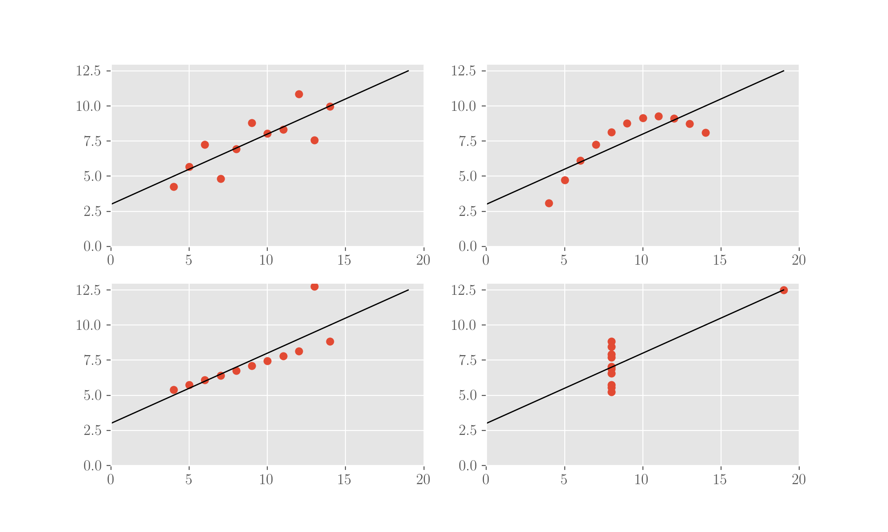

# The Anscombe's quartet

Anscombe, in [here](the-anscombes-quartet.md#references) \(a brilliant paper by the way, one of the cases which deserves an "_old but gold"_\), makes the case for inspecting data, through visualisation, on top of looking at aggregated statistics. It's the famous concept of the "Anscombe's" quartet, four sets of data with the same statistical metrics and that then fit to the same regression but that look quite different when plotted.

Anscombe makes the point that it's always a good idea to inspect the data visually beyond running aggregated analyses on it, so that a little exploratory work can inform better. In the specifics, you can see what is wrong here: even if the datasets respond to the same regression results, in reality only the first one fits the data well.

You will find the code presented here in this notebook. You will need to run some preliminary library imports:

```python
import numpy as np
from sklearn.linear_model import LinearRegression
from matplotlib import pyplot as plt
```

## The four datasets

From the original paper.

```python
x1 = np.array([10, 8, 13, 9, 11, 14, 6, 4, 12, 7, 5])
y1 = np.array([8.04, 6.95, 7.58, 8.81, 8.33, 9.96, 7.24, 4.26, 10.84, 4.82, 5.68])

x2 = x1.copy()
y2 = np.array([9.14, 8.14, 8.74, 8.77, 9.26, 8.10, 6.13, 3.10, 9.13, 7.26, 4.74])

x3 = x1.copy()
y3 = np.array([7.46, 6.77, 12.74, 7.11, 7.81, 8.84, 6.08, 5.39, 8.15, 6.42, 5.73])

x4 = np.array([8, 8, 8, 8, 8, 8, 8, 19, 8, 8, 8])
y4 = np.array([6.58, 5.76, 7.71, 8.84, 8.47, 7.04, 5.25, 12.50, 5.56, 7.91, 6.89])
```

## Their aggregated statistics

```python
np.mean(x1), np.mean(x2), np.mean(x3), np.mean(x4)
np.mean(y1), np.mean(y2), np.mean(y3), np.mean(y4)

np.std(x1), np.std(x2), np.std(x3), np.std(x4)
np.std(y1), np.std(y2), np.std(y3), np.std(y4)
```

This gives, for all the x sets a mean of 9 and a STD of 3.16; for all the y sets a mean of 7.5 and an STD of 1.94. 

## Fit a linear regression for each

A linear regression will look for a linear dependency of y from x \(the topic will be explored in detail in the Machine Learning chapters here\). Let's fit one for each set and look at the parameters of the fits \(slope and intercept\).

```python
l1 = LinearRegression()
l1.fit(x1.reshape(11, 1), y1)

l2 = LinearRegression()
l2.fit(x2.reshape(11, 1), y2)

l3 = LinearRegression()
l3.fit(x3.reshape(11, 1), y3)

l4 = LinearRegression()
l4.fit(x4.reshape(11, 1), y4)

l1.coef_, l1.intercept_
l2.coef_, l2.intercept_
l3.coef_, l3.intercept_
l4.coef_, l4.intercept_
```

Slopes and intercepts come at 0.5 and 3 respectively. So the four sets have the same test statistics and yield the same regression values when fitted.

## Plot both the sets and the regression lines

As per above, the sets appear to have the same test statistics. However, when simply looking at the data via plotting it, we realise how wildly different they appear.

```python
f, ((ax1, ax2), (ax3, ax4)) = plt.subplots(2, 2)

ax1.scatter(x1, y1)
ax1.plot(np.arange(0, 20), l1.intercept_ + l1.coef_ * np.arange(0, 20), c='k', lw=1)
ax1.set_xlim([0, 20])
ax1.set_ylim([0, 13])

ax2.scatter(x2, y2)
ax2.plot(np.arange(0, 20), l2.intercept_ + l2.coef_ * np.arange(0, 20), c='k', lw=1)
ax2.set_xlim([0, 20])
ax2.set_ylim([0, 13])

ax3.scatter(x3, y3)
ax3.plot(np.arange(0, 20), l3.intercept_ + l3.coef_ * np.arange(0, 20), c='k', lw=1)
ax3.set_xlim([0, 20])
ax3.set_ylim([0, 13])

ax4.scatter(x4, y4)
ax4.plot(np.arange(0, 20), l4.intercept_ + l4.coef_ * np.arange(0, 20), c='k', lw=1)
ax4.set_xlim([0, 20])
ax4.set_ylim([0, 13])

plt.show();
```



## References

1. F J Anscombe, [**Graphs in Statistical Analysis**](http://ww.w.lithoguru.com/scientist/statistics/Anscombe_Graphs%20in%20Statistical%20Analysis_1973.pdf)**,** _The American Statistician_, 27, 1, 1973

