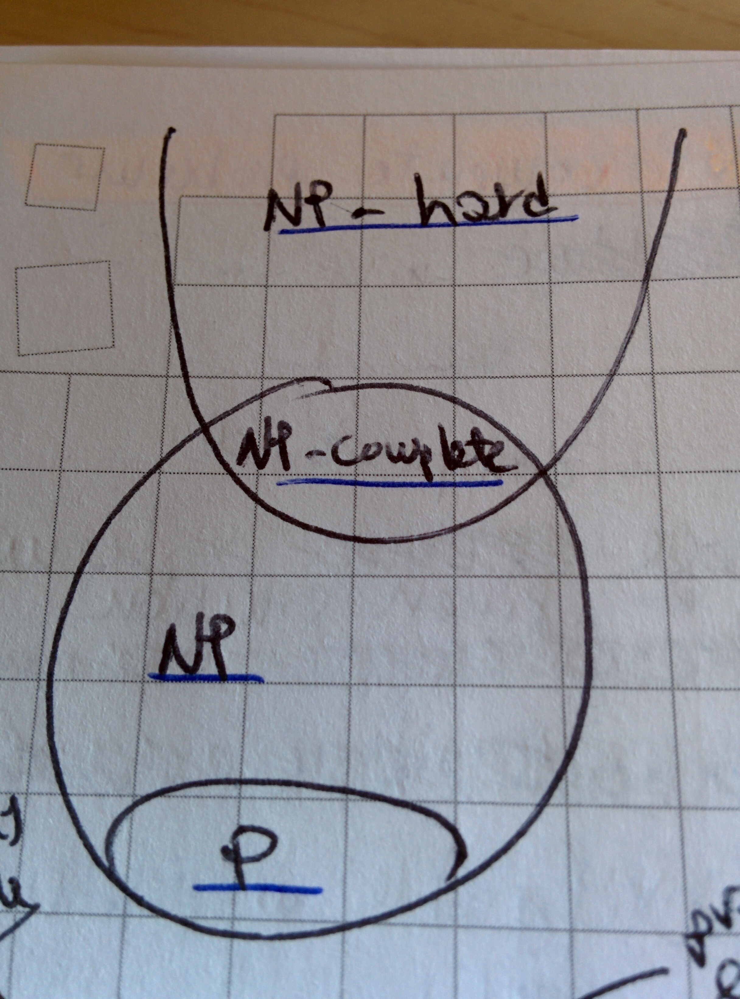

# Computational models and algorithmic complexity

## The Turing Machine

The Turing machine is an idealisation of a computational device, effectively a mathematical representation. It is composed by an infinite tape where symbols are sequentially written, a scanning element that reads what is in the current location of the tape, and a set of instructions \(rules\) to be followed. The rules specify what to do when a certain symbol is encountered: the machine can overwrite it with another one, erase it or do nothing. It is conceived as a model for computation as it can perform any algorithm.

A _universal Turing machine_ is capable of simulating any Turing machine on any possible input.

### Deterministic and non-deterministic cases

The Turing machine is deterministic when the rule applied to the same situation is always the same. It is non-deterministic when the rule for the same situation is not unique.

## Complexity classes of algorithms

 

### P class

The _P_ complexity class is the class of all computational problems that are efficiently solvable, that is, solvable in polynomial time by a deterministic Turing Machine. It's not necessarily straightforward to prove that a problem can be solved deterministically in polynomial time, and research in the field is still very much active: the [Agrawal paper](computational-models-and-algorithmic-complexity.md#references) proved \(in 2004\) that detecting if a number is prime is P.

### NP, NP-hard and NP-complete classes

The _NP_ \(non-deterministic polynomial\) class is that of all computational problems for which a solution can be found in polynomial time by a non-deterministic Turing machine. An equivalent definition is that NP problems are those verifiable efficiently, that is in polynomial time with deterministic computation. It can be shown that the two definitions are equivalent. _NP-hard_ problems are those which are at least as hard as the hardest problems in the NP class. The _NP-complete_ problems are those problems which are both NP and NP-hard.

### P versus NP

The P problems are those "efficiently solvable", the NP ones are those "efficiently verifiable" \(given the solution, it can be verified\); efficiently here means in polynomial time and with deterministic computation. The _P versus NP_ is an open question in computer science: can all problems which can be efficiently verified also be efficiently solved? Head to the [Fortnow paper](computational-models-and-algorithmic-complexity.md#references) for a very readable explanation and review of the efforts in the area.

## References

1.  A page from [**Cambridge University**](https://www.cl.cam.ac.uk/projects/raspberrypi/tutorials/turing-machine/one.html#one-three) on the Turing machine
2.  Some [**lecture notes**](http://jeffe.cs.illinois.edu/teaching/algorithms/notes/models/09-nondeterminism.pdf) on non-deterministic Turing machines by J Erickson
3.  M Agrawal, N Kayal, N Saxena, [**PRIMES** is in P](https://www.cse.iitk.ac.in/users/manindra/algebra/primality_v6.pdf), _Annals of Mathematics_, 160:2, 2004
4.  L Fortnow, [**The status of the P versus NP problem**](http://people.cs.uchicago.edu/~fortnow/papers/pnp-cacm.pdf), _Communications of the ACM_, 52:9, 2009

