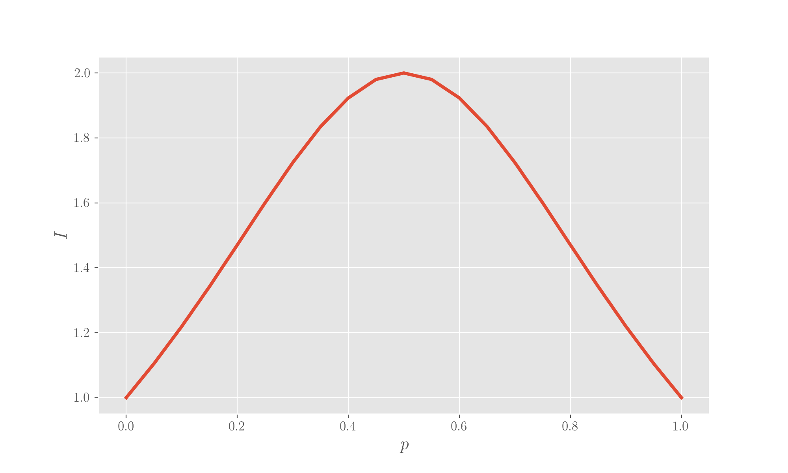

# Cross-field concepts

Cross-fields concepts are mathematical concepts shared across multiple fields or study, which are employed in Data Science as well.

To run the code here, you just need some imports:

```python
import numpy as np
from matplotlib import pyplot as plt
```

## Entropy

In _thermodynamics_, the entropy is defined as

$$
\Delta S = \int \frac{\delta q}{T}
$$

In _statistical mechanics_, Boltzmann gave the definition as a measure of uncertainty and demonstrated that it is equivalent to the thermodynamics definition:

_the entropy quantifies the degree to which the probability of the system is spread over different microstates and is proportional to the logarithm of the number of possible microconfigurations which give rise to the macrostate._

Which written down is

$$
S = -k_B \sum_i p_i log \, p_i
$$

\(sum over all the possible microstates, where $$p_i$$is the probability of state i to be occupied\). The postulate is that the occupation of every microstate is equiprobable.

In _Information Theory_, Shannon defined the entropy as a measure of the missing information before the reception of a message:

$$
H = -\sum_i p(x_i) \, log \, p(x_i)
$$

where$$p(x_i)$$is the probability that character of type$$x_i$$in the string of interest. This entropy measures the number of binary \(YES/NO\) questions needed to determine the content of the message. The link between the statistical mechanics and the information theory concepts is debated.

In _Ecology_, defining the diversity index D as the number of different types \(species\) in a dataset among which individuals are distributed, so that it is maximised when all types are equally abundant,

$$
D = e^H
$$

where H is the uncertainty in predicting the species of an individual taken at random from the dataset

$$
\begin{aligned}
H &= -\sum_i p_i log \, p_i \\
  &= - \sum_i log \, p_i^{p_i} \\
  &= - log(\Pi_i p_i^{p_i}) \\
  &= - log\left(\frac{1}{\Pi_i p_i^{p_i}}\right)
\end{aligned}
$$

which at the denominator has the weighted geometric mean of the $$p_i$$.

* If all types are equally occupied,$$p_i = 1/k  \forall i$$, then$$H = log(k)$$ \(H max\)
* If only one type is present$$p_i = 0  \forall i \in {1, \ldots, n-1}$$and$$p_n = 1$$ , then H=0

## Cross-entropy and Kullback-Leibler divergence

Given two distributions over the set of events, p and q, the _cross entropy_ between them is calculated as

$$
H(p, q) = \mathbb{E}_p [ - \log q] = \sum_i p_i \log q_i = H(p) + D_{KL} (p || q)
$$

where$$H(p)$$is the entropy of the distribution p and$$D_{KL}$$is the _Kullback-Leibler divergence_ of q from p, also known as the _relative entropy_ of p with respect to q.

The cross entropy measures the average number of bits needed to identify an event drawn from the set if another distribution is assumed; the KL divergence measures the difference between the two probability distributions, or, better, the information gained when the priors $q$ are revised in light of posteriors $p$ \(in other words, the amount of information lost when $q$ is used instead of $p$\). It is defined as

$$
D_{KL}(p || q) = \sum_i p_i \log{\frac{p_i}{q_i}}
$$

Note that for continuous variables the sums become integrals.

## Inverse Participation Ratio

The inverse participation ratio quantifies how many states a particle, or whatever has a distribution, is distributed over, and is defined as

$$
I = \frac{1}{\sum_i p_i^2} \ ,
$$

where$$p_i$$is the probability of occupation of state i.

The extreme situations are:

1. If there is only one state, so that$$p_j = 1$$and$$p_i = 0 \ \forall i \neq 0$$, then   $$I = 1$$ 
2. If there is an even distribution, so that $$p_j = 1/N  \forall j \in {1, \ldots N}$$ where N is the number of states, then$$I = N$$ 

With two states, we have

$$
I = \frac{1}{p^2 + (1-p)^2} = \frac{1}{1 + 2p^2 - 2p} \ ,
$$

which has the shape in figure down here, where you see that the maximum is for p=0.5, equally probable states \(a fair coin\).

```python
p = np.arange(0,1.05,0.05)
I = 1./(1 + 2*p**2 -2*p)

plt.plot(p, I)
plt.xlabel('$p$')
plt.ylabel('$I$')
plt.show();
```



## The "no free lunch" theorem

It is a concept originated in mathematics \(optimisation\) but often employed in Machine Learning and it asserts that the computational cost of finding a solution for a problem of a given class, averaged over all problems in the class, is the same for every method employed \[1\]. In short, you don't get anything for nothing \(the "free lunch"\). The phrasing seem to have its [origins](https://www.phrases.org.uk/meanings/tanstaafl.html) into an old practice of USA saloons where you could get food for free when purchasing drinks.

This means that there is no algorithm which is optimal on all possible problems, as its excellent performance on a problem is counterbalanced by bad performance on another problem.

Also see [reference](cross-field-concepts.md#references) for a deeper explanation.

## References

1.  D H Wolpert, W G Macready [**No free lunch theorems for optimization**](https://ti.arc.nasa.gov/m/profile/dhw/papers/78.pdf), _IEEE transactions on evolutionary computation_, 1.1 \(1997\)
2.  [**No Free Lunch Theorems**](http://www.no-free-lunch.org/)

