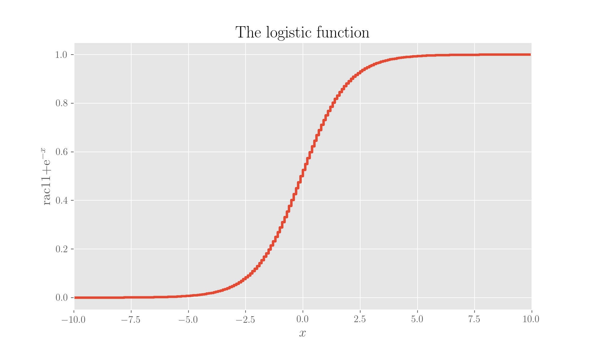

# Mathematical functions

This page will just list some common functions used in Machine Learning and Data Science in general. For the code, if you want to reproduce the plots, you just need to import Pyplot:

```python
from matplotlib import pyplot as plt
```

## Big O and little O notation

The _big O_ notation is used in mathematics to signify the limiting behaviour of a function when it goes to$$\infty$$:

$$
\lim_{x \to \infty} f
$$

The letter "O" is used as per _order of function_.

Note that in computer science, the big O notation is used to classify algorithms by how they respond to changes in the input size.

The _little O_ notation instead,

$$
f(x) = o(g(x)) \ ,
$$

means that$$g(x)$$grows much faster than$$f(x)$$.

## Convolution

The mathematical convolution of functions is the operation

$$
(f \star g)(x) =  \int_{-\infty}^{+\infty} dy f(y) g(x - y)
$$

It is a symmetric operation. In fact,

$$
(g \star f)(x)  = \int_{-\infty}^{+\infty} dy g(y)f(x-y) \ ,
$$

using$$z = x-y$$, so that$$dy = -dz$$, then

$$
(g \star f)(x) = -\int_{+\infty}^{-\infty} dz g(x-z)f(z) =\int_{-\infty}^{+\infty} dz  g(x-z)f(z)
$$

## Some functions of common use in Machine Learning/Statistics

### Heaviside step

The Heaviside step function is of common use in lots of applications. It is just a simple step:

$$
f(x) = 
\begin{cases}
1 \text{ if } x  \geq 0 \\
0 \text{ if } x < 0
\end{cases}
$$

### Softmax

The softmax is a normalised exponential used in probability theory as a generalisation of the logistic function. What it does is transforming a K-dimensional vector$$\mathbf{x}$$of arbitrary real values into a vector of the same size with elements which are still real numbers but ranging in the interval \[0,1\] and such that their sum equals 1 \(so they can represent probabilities\). The function has the form

$$
f(x_i) = \frac{e^{x_i}}{\sum_{j \in K} e^{x_j}}
$$

The softmax is also often employed in the context of neural networks. It is called this way because it represents a softening of the max function in the sense that it is larger on the max of the array. See the example.

```python
def softmax(x):
    return np.exp(x) / np.sum(np.exp(x))

x = np.arange(-6, 7)
y = softmax(x)

plt.plot(x, y)
plt.title('Softmax function')
plt.xlabel('$x$')
plt.ylabel('$y$')
plt.savefig('softmax.png', dpi=200)
plt.show();
```


## Logit and logistic functions

Given probability p, the odds are defined as$$o = \frac{p}{1-p}$$. The _logit_ function is the logarithm of the odds:

$$
L(p) = \ln{\frac{p}{1-p}}
$$

A negative logit is for p &lt; 0.5.

```python
p = np.arange(0.1, 1.1, 0.1)
y = np.log(p/(1-p))

plt.plot(p, y)
plt.grid()
plt.title('Logit function')
plt.ylabel('$y$')
plt.xlabel('$p$')
plt.show();
```


Now, the probability expressed as a function of the logit creates the _logistic_ function:

$$
L = \ln{\frac{p}{1-p}} \Leftrightarrow -L = \ln{\frac{1}{p} - 1} \Leftrightarrow \frac{1}{p} = 1 + e^{-L} \Leftrightarrow p = \frac{1}{1+e^{-L}}
$$

```python
L = np.arange(-5, 5, 0.2)
p = 1/(1 + np.exp(-L))

plt.plot(L, p)
plt.title('Logistic function')
plt.xlabel('logit')
plt.ylabel('$p$')
plt.show();
```



