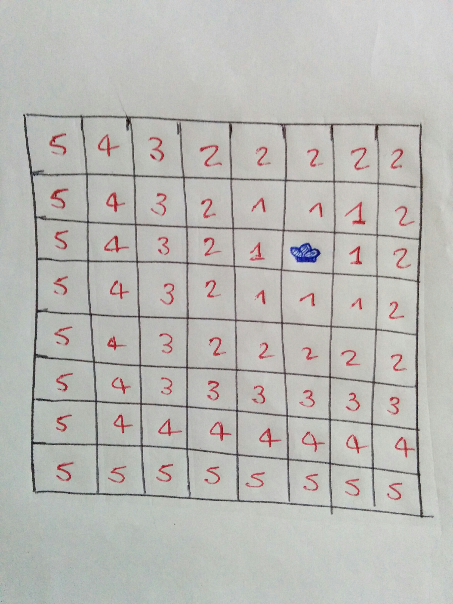

# \(Some\) mathematical measures

This page outlines, mainly for convenience, some useful measures/metrics utilised for several purposes.

## The harmonic mean

It is the reciprocal of the mean of reciprocals:

$$
h = \frac{n}{\sum_{i=1}^{i=n} \frac{1}{x_i}}
$$

## Common measures of distance/similarity

### Euclidean

The euclidean distance of two vectors$$v_a = (x^i)_a$$and$$v_b = (x^i)_b$$is the norm$$l_2$$of the vector connecting them \(it measures its length\):

$$
d = \sqrt{\sum_i (x^i_a - x^i_b)^2} = ||v_A - v_B||_2
$$

### Hamming

The Hamming distance expresses the number of different elements in two lists/strings:

$$
A = 110101; B = 111001; d_{AB} = 2
$$

### Jaccard \(index\)

Given two finite sets A and B, the Jaccard index gives a measure of how much they overlap, as

$$
J_{AB} = \frac{|A \cap B|}{|A \cup B|}
$$

### Manhattan

Also called _cityblock_, the Manhattan distance between two points is the norm$$l_1$$of the shortest path a car would take between these two points in Manhattan \(which has a grid layout\):

$$
d = \sum_i |u_i - v_i|
$$

### Minkowski

The Minkowski distance is a generalisation of both the euclidean and the Manhattan to a generic p:

$$
d = \left(\sum_i |x_i - y_i|^p\right)^{1/p}
$$

### Cosine

The cosine similarity is given by the cosine of the angle$$\theta$$spanned by the two vectors

$$
d = \cos \theta = \frac{\bar u \cdot \bar v}{|\bar u| |\bar v|}
$$

So two perfectly overlapping vectors would have a cosine similarity of 1 and vectors at $$90^{\circ}$$would have a cosine similarity of 0.

### Chebyshev

 

It is also called _chessboard distance_. In the game of chess, the Chebyshev distance between the centers of the squares is the minimum number of moves a king needs to go from a square to another one.

$$
\max_i |u_i - v_i|
$$

See the figure here, it reports in red all the Chebyshev distance value from where the king \(well, there's a drawing for it ...\) sits to cell; note that the king can move horizontally, vertically and diagonally.

