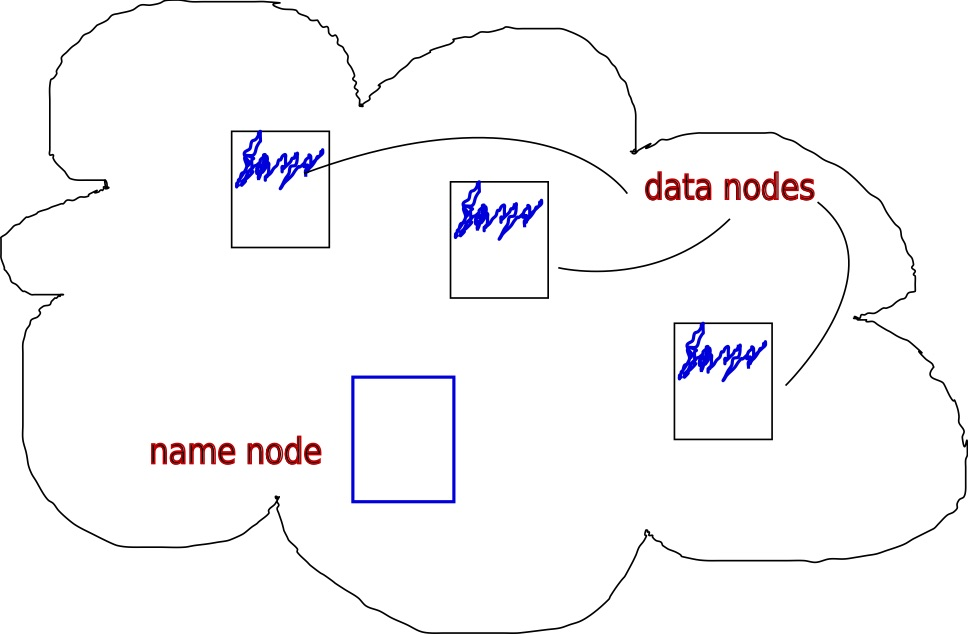
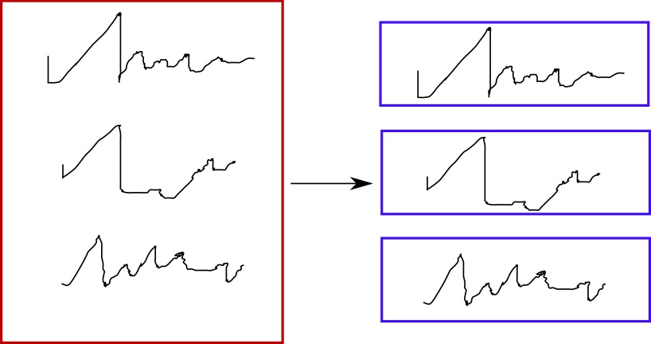
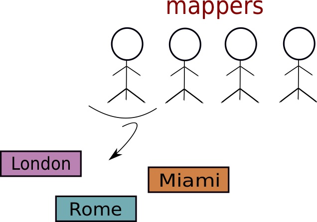

# Apache Hadoop

## What is it

Hadoop is an open source framework to store data and run applications. The original idea came to D. Cutting and M. Cafarella around 2002 after reading a paper by Google on MapReduce \(see [ref](apache-hadoop.md#references)\).

Hadoop consists of its own file system, the _HDFS_, and its computation framework, _MapReduce_. We shall now briefly describe them both.

## The HDFS

For data storage, Hadoop uses the _HDFS_ \(Hadoop Distributed File System\), which splits data into blocks. A cluster is composed by several nodes and the HDFS manages their relations. The figure illustrates how the HDFS works. Each block of data, whose maximum size is 64 MB, is stored in a node in the cluster \(_data nodes_\), plus there is a _name node_ which keeps the metadata, knowing what is in each block.

Now, because nodes may fail, Hadoop replicates each block of data 3 times and places blocks of data in different nodes, so that effectively each node contains multiple blocks, each block then appearing thrice in total and over 3 nodes \(_e.g._, node 1 contains blocks 1, 3 and 7\), by randomly assigning them. The name node knows what is in each block and that blocks are replicated and is copied on a NFS \(_Network File System_\) in order to have a copy in case of failure of the name node.

Note that the HDFS as a file system is used way beyond Hadoop alone, for example in Spark, which is usually placed on top of it.

## Processing: the MapReduce paradigm

This programming model was originally proprietary of Google, now used extensively in the world of computation over large datasets. It consists of the two main complementary operations of _map_ and _reduce_, linked together by the intermediate state of _shuffle & sort_.

A large file is broken into chunks, to be processed in parallel

1. _map_:  the _mappers_ are small programs which work in parallel, producing intermediate records as \(key, value\) pairs;
2. _shuffle & sort_:  the shuffle operation moves the intermediate records produced by the mappers to the reducers, which will organise the values into sorted records;
3. _reduce_: the _reducers_ take one pile or records at a time and list all the values for each key, writing the results.

### An example

This example has been inspired and reworked from the [Udacity course](apache-hadoop.md#references), the full course is warmly recommended.

A retailer has an inventory of all sales it makes, and wants to know the total sales for each of its stores. One record in the inventory/database contains this information:

* the date of the sale
* the store where the sale happened
* the item sold
* the amount item has been sold at

**The map phase**: the mappers take some rows each and create cards with \(key, value\) pairs where a key is the store and a value is the amount. They create a pile of values for each same key \(same store\), see figure. This obviously means that different mappers can create piles for the same stores.

**The shuffle & sort phase**: records \(stores\) are alphabetically sorted and assigned to reducers.

**The reduce phase**: now, each reducer will be responsible for a specific store. Reducers will read all the piles of values for their assigned store and will create a big pile for it. At that point, they will go through the pile and add u all the amounts.

## References

1.  J Dean, S Ghemawat, [MapReduce: Simplified Data Processing on Large Clusters](http://static.googleusercontent.com/media/research.google.com/en/us/archive/mapreduce-osdi04.pdf), _Communications of the ACM_, 51.1, 2008.
2.  [A Udacity fun and practical course on Hadoop and MapReduce](https://www.udacity.com/course/intro-to-hadoop-and-mapreduce--ud617)

