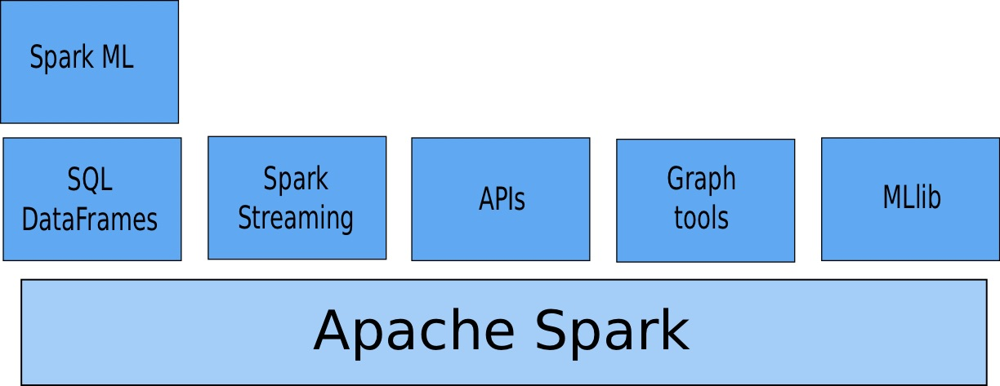
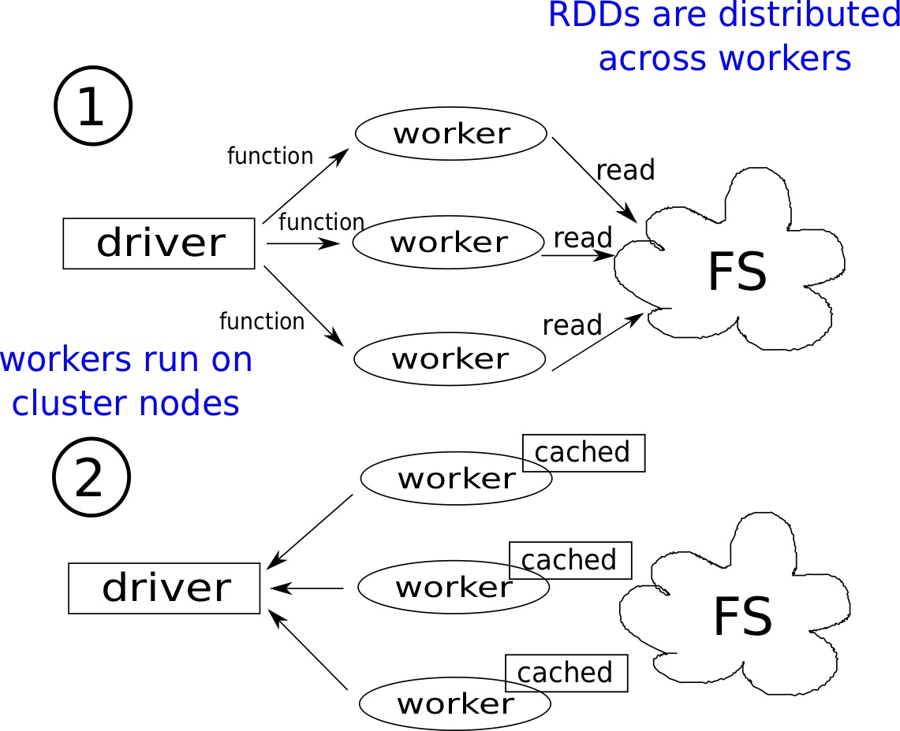
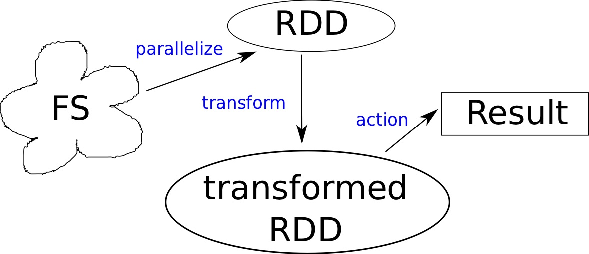

# Apache Spark

### What is

Apache Spark is a general purpose open source distributed system for cluster computing on large datasets. It is natively written in Scala but has API's for other languages. It was originally developed at the University of California at Berkeley in 2009 and then donated to the [Apache Foundation](https://www.apache.org).

The figure above illustrates in a very rough way what the Apache Spark environment consists of. Spark ML and MLlib are the libraries for Machine Learning: the first, newer, works with DataFrames; the second with RDDs \(_Resilient Distributed Datasets_, see below\). API's exist in Scala \(Spark native language\), Java, R and Python.

The concepts illustrated briefly here in this note are reworked from the the [refs](apache-spark.md#references), which is full of great material, including tutorials.

### Distributed Data Model: RDDs and DataFrames

The core of the computation in Spark lies in the use of RDDs \(_Resilient Distributed Datasets_\). An RDD is a partitioned collection of elements that can be operated in parallel; it is recomputed on node failures and is created by the so-called _SparkContext_ from input sources \(local file system, the HDFS - see the Hadoop page - , ...\)



RDDs have these features:

* are immutable once constructed;
* enable operators to run in parallel;
* are able to track info to recompute potential lost data;
* the more the partitions, the more parallelism
* are lazily evaluated

A \(distributed\) DataFrame can be built from an RDD and is conceptually similar to the corresponding R and Pandas ones.

The fact that RDDs are lazily evaluated means that no operation is actually executed until an _action_ is called, and this allows to skip intermediate big results.

## The Spark programming model

The _SparkContext_ tells Spark how and where to access the cluster and is used to create the RDDs. Its _master_ parameter sets the type and size of the cluster:

* _local_: run locally with a single worker
* _local\[4\]_: run locally with 4 workers \(ideally to be set to the number of cores\)
* _spark://host:port_: run on an external specified cluster

The figure above illustrates the relation between drivers and workers in Spark, FS is the file system.

### Transformations and Actions

_Transformations_ are meant to transform the RDD, creating a new dataset, are lazily applied, and the execution takes place only when an _action_ is called. Actions cause all transformations to be executed.

Examples of transformation are _map_, _filter_, _distinct_; examples of actions are _reduce_, _take,_ collect\*.

The Spark programming model follows these steps:

* Create RDD from data by parallelisation
* Transform into a new RDD
* Cache some RDDs for reuse \(\textit{persist}\)
* Use action to execute parallel computation and produce results

The problem with large global variables is that it is inefficient to send large data to each worker. To solve this, Spark has shared variables: _broadcasts_ \(send large, read-only values to the workers who save them\) and _accumulators_ \(aggregate the values from the workers back to the driver and are write-only\).

## Comparison to Hadoop

Generally speaking, Spark is faster: the use of memory guarantees it is roughly$$~O(10^2)$$faster. The use of disk in Hadoop is slow for complex jobs and interactive queries. Spark leverages the idea of keeping more data into memory.

|  | Hadoop | Spark |
| :--- | :---: | ---: |
| **Storage** | Disk-only | Disk or Memory |
| **Operations** | Map & Reduce | Map, Reduce, Join , Sample, ... |
| **Execution model** | Batch | Batch, interactive, streaming |
| **Programming** | Java | Java, Scala, R, Python |

## References

1.  [The Apache Spark docs](http://spark.apache.org/documentation.html)

