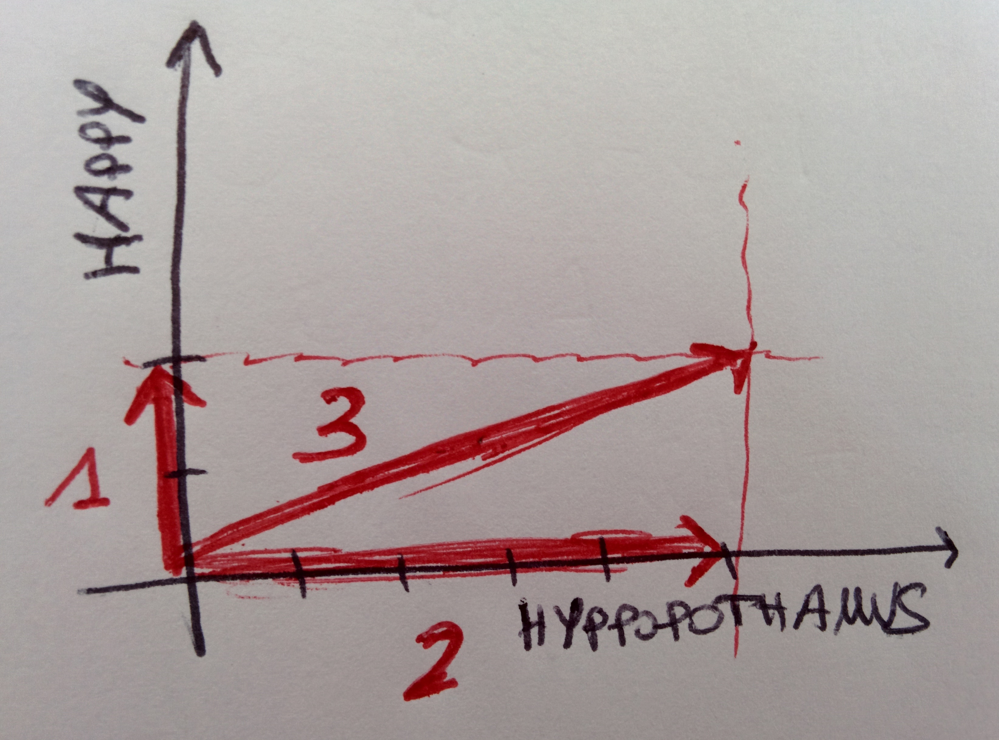

# Elasticsearch

## What is

Elasticsearch is a text search and analytics engine, open-source, written in Java and built on top of [_Apache Lucene_](http://lucene.apache.org/core/), an information retrieval library. What is presented here is reworked from [the official docs](https://www.elastic.co).

The components of Elasticsearch are components are

* a _cluster_: the collection of _nodes_ \(single servers\)
* an _index_: the collection of _documents_ \(sort of a database\)
* a _type_: sort of tables



Elasticsearch is meant to be used to query for documents matching a given custom query. At the core of its model it uses TF-IDF features \(see page\) and a boolean model where retrieval is based on whether the document contains or not the search query. It employs a practical _scoring function_ \(from Lucene, the scores of each matching term are combined\) to calculate relevance, so that, for query q and document d \(t is a term in the query\),

$$
\text{score}(q, d) = \mathcal{N} c(q, d) \sum_{t \in q} [\text{tf}(t, d) \ \text{idf}(t)^2 \ b \  n(t, d)] \ ,
$$

where

* $$c(q, d)$$is used to reward documents that contain a higher percentage of the query terms, it multiplies the score with the number of matching terms, divided by the total number of terms in the query
* $$\text{tf}$$ and $$\text{idf}$$ are the term-frequency and the inverse document frequency, respectively;$$\text{idf}$$is squared because it appears both in q and in d for term t
* b is a boost factor applied to the query
* $$n(t, d)$$is the field-length norm: the shorter the field in which the term appears, the higher the weight, so that it is based on the number of terms in the field:

$$
n(t, d) = \frac{1}{\sqrt{n_t}} \ , \ n_t \ \ \text{being the number of terms}
$$

* $$\mathcal{N}$$is a normalisation factor:

$$
\mathcal{N} = \frac{1}{[\sum_{t \in q} [\text{idf}(t)^2 b]]^2} \ ,
$$

Elasticsearch implements the practical scoring function in a vector space model to compute similarities between the query and the documents, so to retrieve the most relevant ones.

## An example

 

Suppose we have the query "happy hippopotamus" \(pardon the misspelling in the figure\) and a corpus of three documents which we want to score against the it to retrieve the best matching one. The query string has term weights \(the TF-IDF features\) \[2,5\] and the documents are

1. I am happy in the summer, \[2, 0\]
2. After summer I am a hippopotamus, \[0,5\]
3. The happy hippopotamus laughs, \[2, 5\]

The figure illustrates each document in the space of the two terms of query. Obviously, the document matching the query better is the third one, as it simply contains both terms.

We've seen above how the mechanism of scoring works in theory. In practice, Lucene uses the conceptual scoring formula, which sort of embeds a cosine similarity to score the match between a query and a document:

$$
\text{score}(q, d) = c(q, d) b_q(q) \frac{\bar v(q) \bar v(d)}{|\bar v(q)|} \mathcal{N}_l(d) b_d(d) \ ,
$$

where

* $$b_q$$is the boost for the query, set from the start
* $$\mathcal{N}_l$$is the normalisation by the document length
* $$b_d$$is the boost for the document, known from the start
* c\(q, d\) as described above

In the vector space model, the cosine similarity between the query and the document would be

$$
\frac{\bar v(q) \bar v(d)}{|\bar v(q)| |\bar v(d)|} \ ,
$$

but instead of$$|\bar v(q)| $$, the normalisation factor is used, which normalises the document by its length. This is because otherwise you would lose information on the length of the document and this would be a problem for those documents containing no duplicated paragraphs.

The vectors$$\bar v$$are built from the weights, which are the TF-IDF values \(see figure\). The conceptual scoring function from above is efficiently implemented through the practical scoring function.

